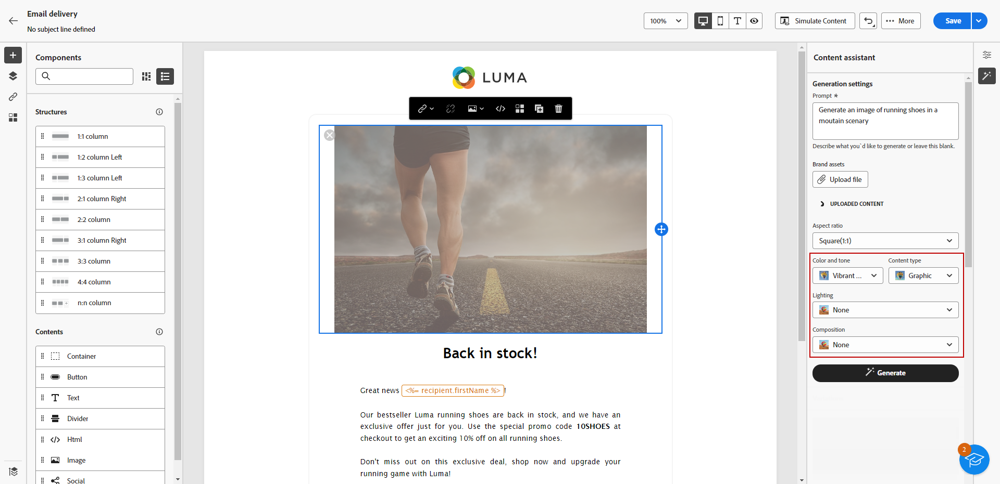
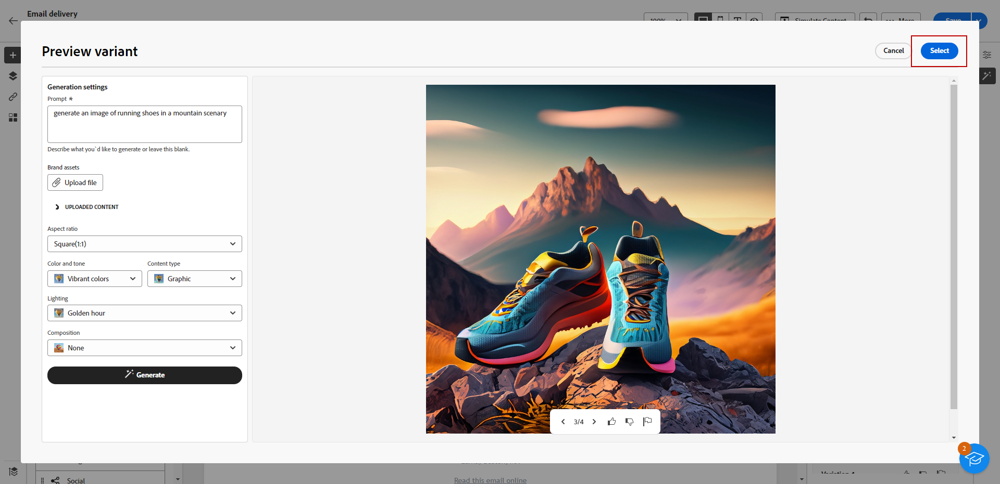

# Geração de imagens com o Assistente de conteúdo {#generative-image}

Depois de criar e personalizar seus emails, você pode aprimorar seu conteúdo usando o Assistente de conteúdo, viabilizado pela IA gerativa. Esse recurso simplifica o processo de personalização e melhoria de conteúdo.

Para gerar e melhorar imagens em seus emails com o Assistente de conteúdo, siga as etapas abaixo. Você também pode criar o conteúdo de HTML completo com o Assistente de conteúdo, conforme detalhado em [esta página](generative-email.md), ou gerar um conteúdo de texto, conforme explicado em [esta página](generative-content.md).

>[!NOTE]
>
>Antes de começar a usar esse recurso, leia as informações relacionadas [Medidas de proteção e limitações](generative-gs.md#guardrails-and-limitations).

No exemplo abaixo, saiba como usar o Assistente de conteúdo para otimizar e melhorar o conteúdo, garantindo uma experiência mais amigável. Siga estas etapas:

1. Depois de criar e configurar o delivery de email, clique em **[!UICONTROL Editar conteúdo]**.

   Para obter mais informações sobre como configurar o delivery de email, consulte [esta página](../content/create-email-content.md).

1. Preencha o **[!UICONTROL Detalhes básicos]** para o seu delivery. Depois de concluído, clique em **[!UICONTROL Editar conteúdo de email]**.

1. Selecione o ativo que deseja alterar com o Assistente de conteúdo.

1. No menu à direita, selecione **[!UICONTROL Geração de experiência]**.

   

1. Adicione um prompt para ajustar melhor os resultados.

   

1. Selecionar **[!UICONTROL Carregar arquivo]** se quiser adicionar qualquer ativo de marca com conteúdo que possa fornecer contexto adicional ao Assistente de conteúdo.

   Você também pode clicar em **[!UICONTROL Conteúdo carregado]** para localizar arquivos atualizados anteriormente. Observe que o conteúdo carregado está disponível exclusivamente para reutilização pelo usuário atual.

1. Selecione o **[!UICONTROL Taxa de proporção]** do seu ativo. Isso determina a largura e a altura do ativo.

   Você tem a opção de escolher entre taxas comuns, como 16:9, 4:3, 3:2 ou 1:1, ou pode inserir um tamanho personalizado.

1. Personalize o **[!UICONTROL Cor e tom]**, **[!UICONTROL Tipo de conteúdo]**, **[!UICONTROL Iluminação]** e **[!UICONTROL Composição]** para corresponder às características desejadas do ativo.

   

1. Quando estiver satisfeito com a configuração do prompt, clique em **[!UICONTROL Gerar]**.

1. Navegue pelo **[!UICONTROL Sugestões de variação]** para encontrar o ativo desejado. Clique em **[!UICONTROL Visualizar]** para exibir uma versão em tela cheia da variação selecionada.

   

1. Clique em **[!UICONTROL Selecionar]** depois de encontrar o conteúdo apropriado.

   

1. Depois de definir o conteúdo da mensagem, clique no link **[!UICONTROL Simular conteúdo]** botão para controlar a renderização e verificar as configurações de personalização com perfis de teste.  [Saiba mais](../preview-test/preview-content.md)

   

1. Depois de definir seu conteúdo, público-alvo e agendamento, você estará pronto para preparar seu delivery de email. [Saiba mais](../monitor/prepare-send.md)