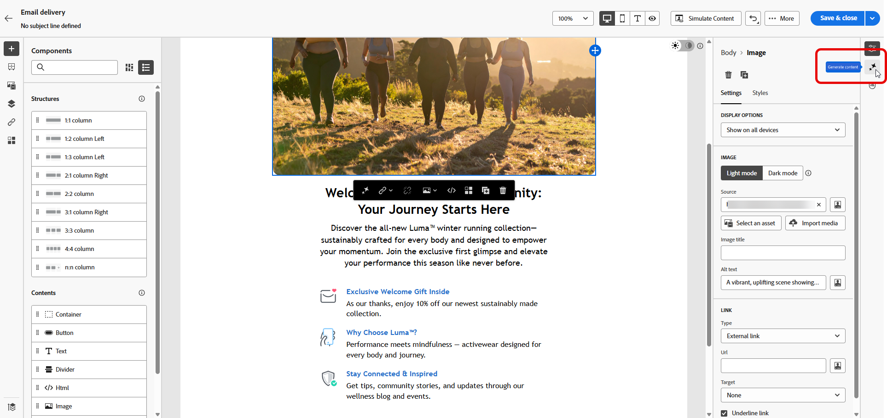
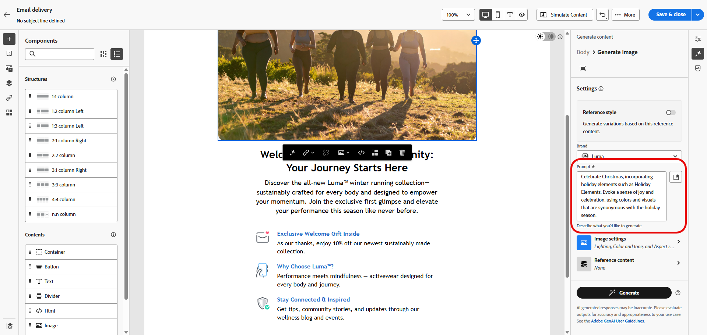
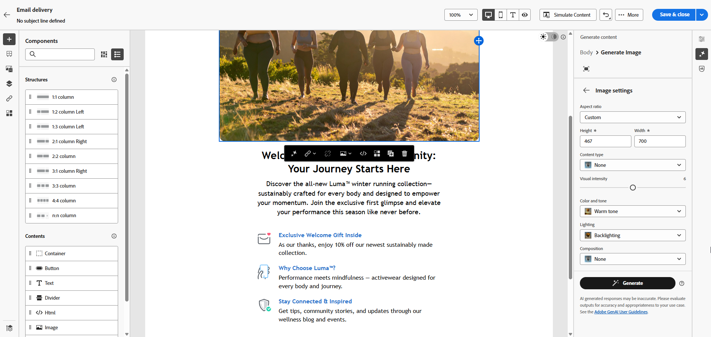
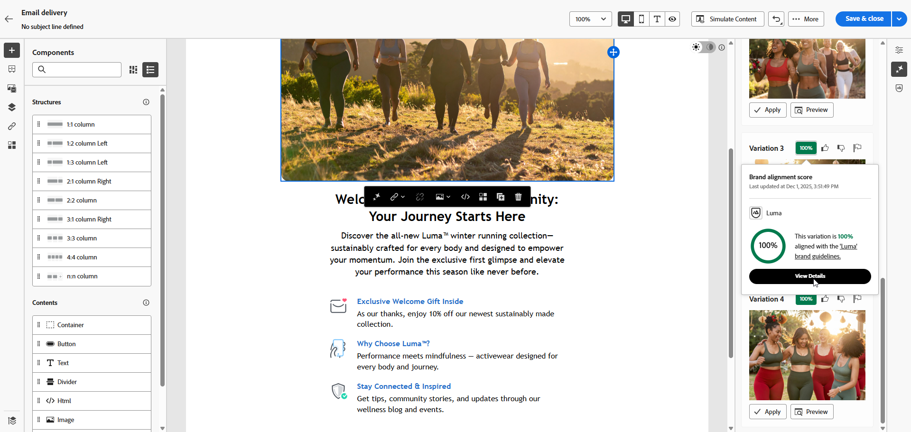
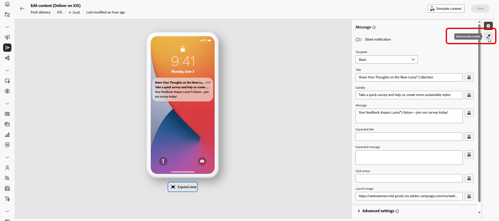
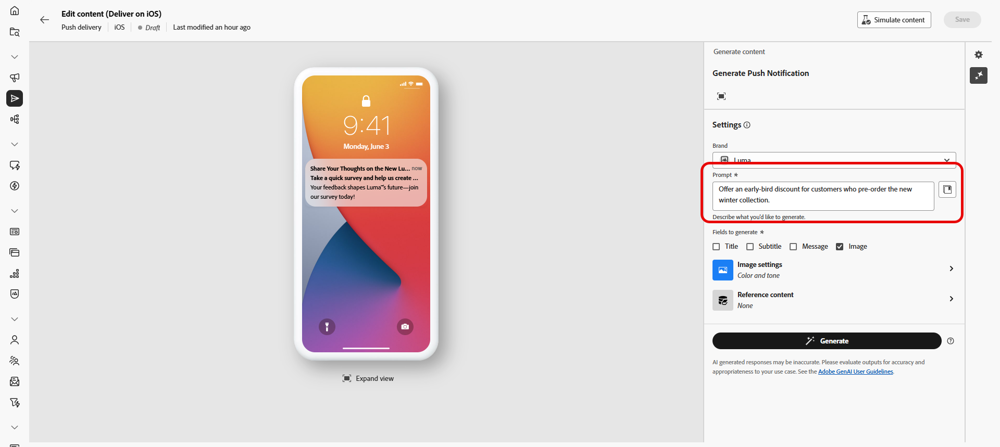
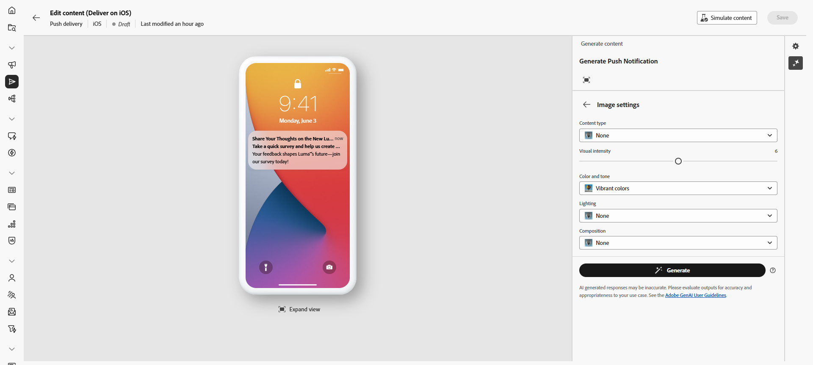
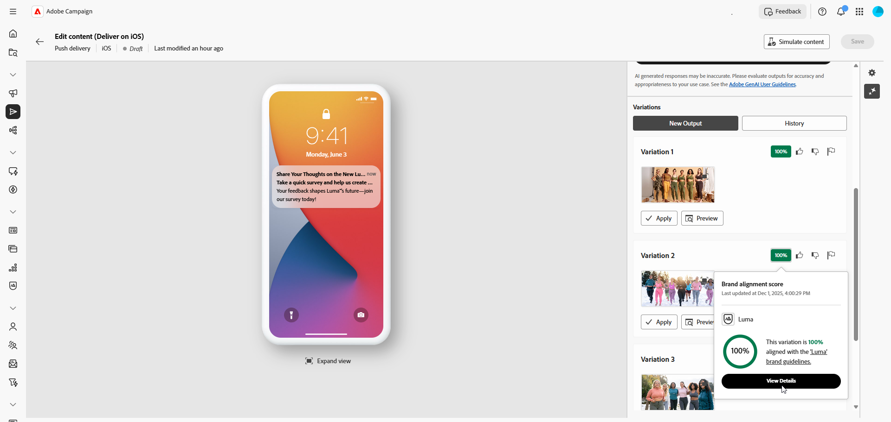

# Gerar imagens {#generative-image}

>[!IMPORTANT]
>
>Antes de começar a usar este recurso, leia as [Medidas de Proteção e Limitações](generative-gs.md#generative-guardrails) relacionadas.
> 
>
>Você deve concordar com um [contrato de usuário](https://www.adobe.com/legal/licenses-terms/adobe-dx-gen-ai-user-guidelines.html){target="_blank"} antes de usar a IA para gerar conteúdo na Adobe Campaign Web. Para mais informações, entre em contato com o seu representante da Adobe.

Use a IA no Adobe Campaign Web para criar conteúdo visual atraente que aprimore suas mensagens de email, páginas de aterrissagem e notificações por push. A IA ajuda a gerar e otimizar imagens, garantindo que seu conteúdo seja visualmente envolvente e alinhado à sua marca.

## Para emails e landing pages {#email-web-channels}

Use a IA para gerar experiências visuais completas para seus deliveries de email e landing pages. Esse recurso permite produzir imagens atraentes na marca que repercutem com seu público em pontos de contato digitais.

### Acessar e configurar {#access-configure}

Para começar a gerar imagens com IA, primeiro configure seu delivery e abra o editor de conteúdo. Siga as etapas abaixo para preparar seu espaço de trabalho e acessar o painel Gerar conteúdo.

1. Criar e configurar o delivery:

   * **Email**: depois de criar e configurar sua entrega de email, clique em **[!UICONTROL Editar conteúdo]**. [Saiba mais](../email/create-email-content.md)
   * **Página de aterrissagem**: depois de criar e configurar sua página de aterrissagem, clique em **[!UICONTROL Editar conteúdo]**. [Saiba mais](../landing-pages/create-lp.md)

1. Selecione o ativo que deseja alterar e acesse o menu **[!UICONTROL Gerar conteúdo]**.

   {zoomable="yes"}

### Gerar imagem {#generate-content}

Saiba como criar prompts eficazes e definir configurações de imagem para gerar imagens visualmente atraentes usando IA. Personalize parâmetros como proporção, intensidade visual e iluminação para criar imagens que se alinhem aos objetivos da sua marca e campanha.

1. Habilite a opção **[!UICONTROL Estilo de referência]** para usar a IA para personalizar o novo conteúdo com base no conteúdo selecionado.

1. Selecione sua **[!UICONTROL Marca]** para garantir que o conteúdo gerado por IA esteja alinhado às especificações da sua marca. [Saiba mais](brands.md) sobre marcas.

1. Ajuste o conteúdo descrevendo o que você deseja gerar no campo **[!UICONTROL Prompt]**.

   Se precisar de ajuda para criar seu prompt, acesse a **[!UICONTROL Biblioteca de Prompts]**, que fornece diversas ideias de prompt para melhorar suas entregas. [Saiba mais sobre as práticas recomendadas do prompt](ai-assistant-prompting-guide.md)

   {zoomable="yes"}

1. Personalize seu prompt usando a opção **[!UICONTROL Configurações de imagem]**:

   * **[!UICONTROL Modelo gerativo]**: selecione entre o **[!UICONTROL modelo Adobe]** pronto para uso, o **[!UICONTROL modelo Parceiro]** para recursos especializados ou os **[!UICONTROL modelos personalizados]** treinados nos ativos da sua marca. [Saiba mais](generative-models.md)
   * **[!UICONTROL Taxa de proporção]**: determine a largura e a altura do ativo. Escolha entre as taxas comuns, como 16:9, 4:3, 3:2 ou 1:1, ou insira um tamanho personalizado.
   * **[!UICONTROL Tipo de conteúdo]**: categorize a natureza do elemento visual, distinguindo entre diferentes formas de representação visual, como fotos, gráficos ou arte.
   * **[!UICONTROL Intensidade visual]**: controle o impacto da imagem ajustando sua intensidade. Uma configuração mais baixa (2) cria uma aparência mais suave, enquanto uma configuração mais alta (10) torna a imagem mais vibrante.
   * **[!UICONTROL Cor e tom]**: ajuste a aparência geral das cores e o humor ou atmosfera transmitidos.
   * **[!UICONTROL Iluminação]**: modifique a iluminação na imagem para moldar sua atmosfera e destacar elementos específicos.
   * **[!UICONTROL Composição]**: organizar elementos dentro do quadro da imagem.

     {zoomable="yes"}

1. No menu **[!UICONTROL Conteúdo de referência]**, clique em **[!UICONTROL Carregar arquivo]** para adicionar qualquer ativo de marca que contenha conteúdo que possa fornecer IA de contexto adicional ou selecione um carregado anteriormente.

   Os arquivos carregados anteriormente estão disponíveis no menu suspenso **[!UICONTROL Conteúdo de referência carregado]**. Basta alternar os ativos que deseja incluir na geração.

1. Quando estiver satisfeito com a configuração do prompt, clique em **[!UICONTROL Gerar]**.

### Refinar e finalizar {#refine-finalize}

Depois de gerar variações de imagem, você pode revisar os resultados, verificar o alinhamento da marca e selecionar a melhor opção para o seu conteúdo.

1. Navegue pelas **[!UICONTROL Variações]** geradas.

1. Clique no ícone de porcentagem para exibir sua **[!UICONTROL Pontuação de alinhamento da marca]** e identificar quaisquer desalinhamentos com sua marca.

   Saiba mais sobre [Pontuação de alinhamento da marca](../content/brands-score.md).

   {zoomable="yes"}

1. Clique em **[!UICONTROL Visualizar]** para exibir uma versão em tela inteira da variação selecionada ou em **[!UICONTROL Aplicar]** para substituir o conteúdo atual.

1. Escolha **[!UICONTROL Gerar Semelhante]** se desejar exibir imagens relacionadas a essa variante.

1. Abra a guia **[!UICONTROL Alinhamento da marca]** para ver como o seu conteúdo se alinha às suas [diretrizes da marca](../content/brands.md).

1. Clique em **[!UICONTROL Selecionar]** depois de encontrar o conteúdo apropriado.

1. Após definir o conteúdo da mensagem, clique no botão **[!UICONTROL Simular conteúdo]** para controlar a renderização e verificar as configurações de personalização com perfis de teste. [Saiba mais](../preview-test/preview-content.md)

1. Revise e ative o conteúdo:
   * **Email**: quando tiver definido seu conteúdo, público-alvo e agendamento, você estará pronto para preparar sua entrega de email. [Saiba mais](../monitor/prepare-send.md)
   * **Página de aterrissagem**: quando a página de aterrissagem estiver pronta, você poderá publicá-la para disponibilizá-la para uso em uma mensagem. [Saiba mais](../landing-pages/create-lp.md)

## Para canais móveis {#mobile-channels}

Use a IA para gerar imagens envolventes para notificações por push, ajudando você a criar comunicações móveis visualmente atraentes que capturem atenção e repercutam em seu público.

### Acessar e configurar {#mobile-access-configure}

Para começar a gerar imagens para notificações por push com IA, primeiro configure o delivery e abra Gerar conteúdo.

1. Depois de criar e configurar a entrega de notificação por push, clique em **[!UICONTROL Editar conteúdo]**. [Saiba mais](../push/create-push.md)

1. Acesse o menu **[!UICONTROL Mostrar conteúdo gerado]**.

   {zoomable="yes"}

### Gerar imagem {#mobile-generate-content}

Depois de acessar Gerar conteúdo, você pode ajustar as configurações de geração para criar imagens que se alinhem à sua marca e sejam compatíveis com seus objetivos de notificação por push. Configure os parâmetros de prompt e imagem para gerar visuais otimizados para exibições móveis.

1. Selecione sua **[!UICONTROL Marca]** para garantir que o conteúdo gerado por IA esteja alinhado às especificações da sua marca. [Saiba mais](brands.md) sobre marcas.

1. Ajuste o conteúdo descrevendo o que você deseja gerar no campo **[!UICONTROL Prompt]**.

   Se você estiver procurando ajuda para criar seu prompt, acesse a **[!UICONTROL Biblioteca de Prompts]**, que fornece diversas ideias de prompt para melhorar suas campanhas. [Saiba mais sobre as práticas recomendadas do prompt](ai-assistant-prompting-guide.md)

   {zoomable="yes"}

1. Selecione **[!UICONTROL Imagem]** para gerar apenas ativos.

1. Escolha suas **[!UICONTROL configurações de imagem]**:

   * **[!UICONTROL Modelo gerativo]**: selecione entre o **[!UICONTROL modelo Adobe]** pronto para uso, o **[!UICONTROL modelo Parceiro]** para recursos especializados ou os **[!UICONTROL modelos personalizados]** treinados nos ativos da sua marca. [Saiba mais](generative-models.md)
   * **[!UICONTROL Tipo de conteúdo]**: categorize a natureza do elemento visual, distinguindo entre diferentes formas de representação visual, como fotos, gráficos ou arte.
   * **[!UICONTROL Intensidade visual]**: controle o impacto da imagem ajustando sua intensidade. Uma configuração mais baixa (2) cria uma aparência mais suave e mais restrita, enquanto uma configuração mais alta (10) torna a imagem mais vibrante e visualmente poderosa.
   * **[!UICONTROL Iluminação]**: Ajuste a iluminação na imagem para moldar sua atmosfera e destacar elementos específicos.
   * **[!UICONTROL Composição]**: organizar elementos dentro do quadro da imagem.

     {zoomable="yes"}

1. No menu **[!UICONTROL Conteúdo de referência]**, clique em **[!UICONTROL Carregar arquivo]** para adicionar qualquer ativo de marca que contenha conteúdo que possa fornecer IA de contexto adicional ou selecione um carregado anteriormente.

   Os arquivos carregados anteriormente estão disponíveis no menu suspenso **[!UICONTROL Conteúdo de referência carregado]**. Basta alternar os ativos que deseja incluir na geração.

1. Quando o prompt estiver pronto, clique em **[!UICONTROL Gerar]**.

### Refinar e finalizar {#mobile-refine-finalize}

Depois de gerar variações de imagem para suas mensagens móveis, você pode ajustar os resultados para garantir que eles atendam aos seus requisitos exatos.

1. Após a geração, navegue pelas **[!UICONTROL Variações]**.

1. Clique no ícone de porcentagem para exibir sua **[!UICONTROL Pontuação de alinhamento da marca]** e identificar quaisquer desalinhamentos com sua marca.

   Saiba mais sobre [Pontuação de alinhamento da marca](../content/brands-score.md).

   {zoomable="yes"}

1. Clique em **[!UICONTROL Visualizar]** para navegar pelas **[!UICONTROL Variações]**.

1. Abra a guia **[!UICONTROL Alinhamento da marca]** para ver como o seu conteúdo se alinha às suas [diretrizes da marca](brands.md).

1. Clique em **[!UICONTROL Selecionar]** depois de encontrar o conteúdo apropriado.

Depois de definir o conteúdo, o público-alvo e o cronograma, prepare a entrega por push. [Saiba mais](../monitor/prepare-send.md)
