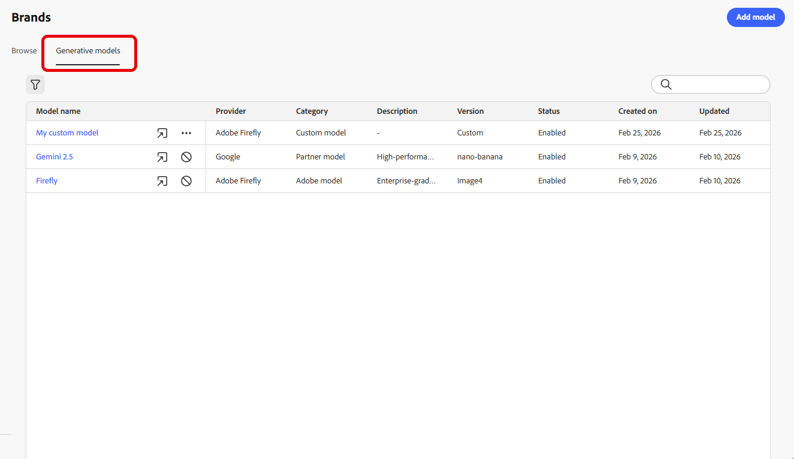
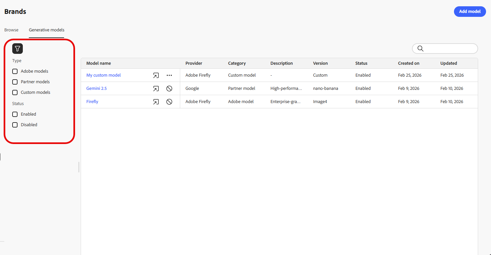
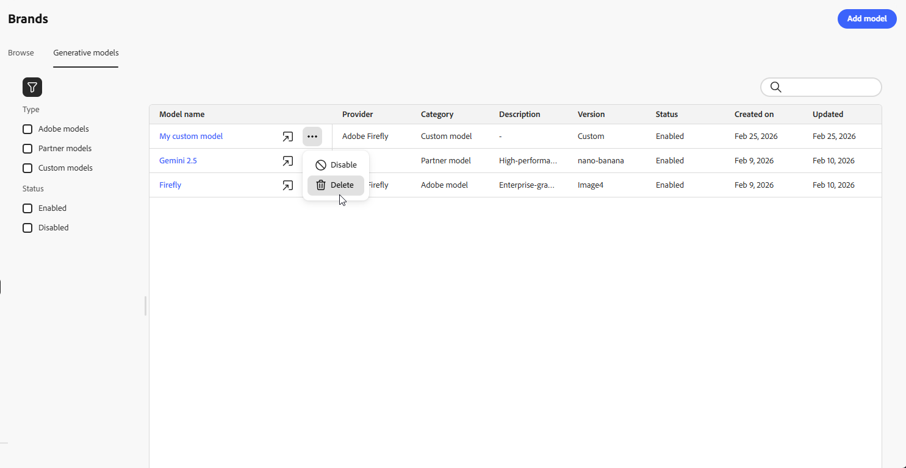
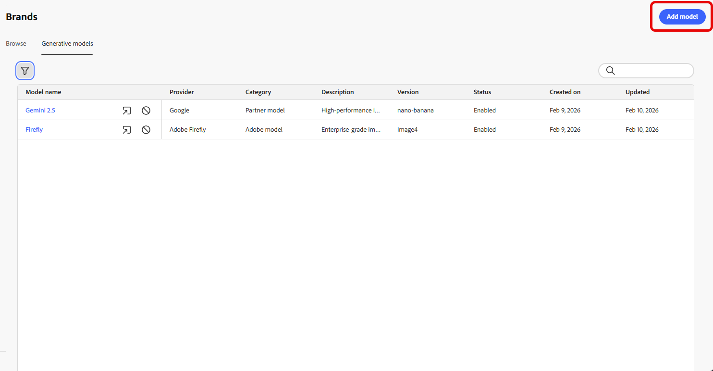
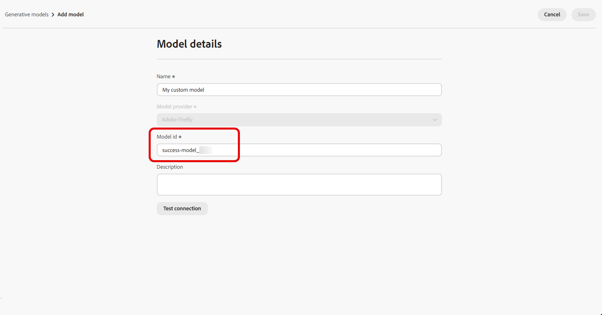
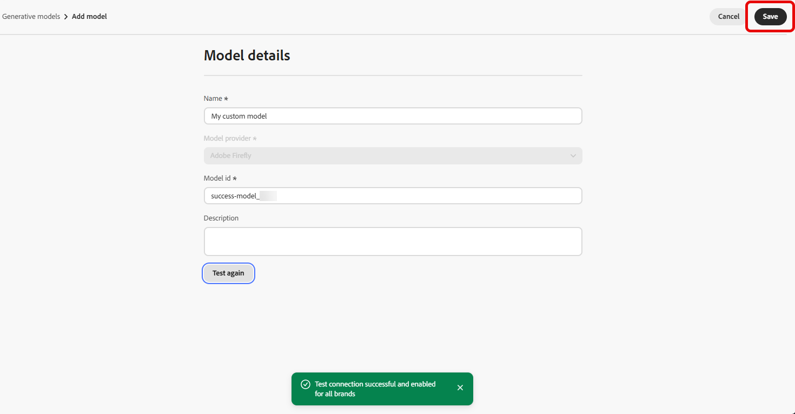
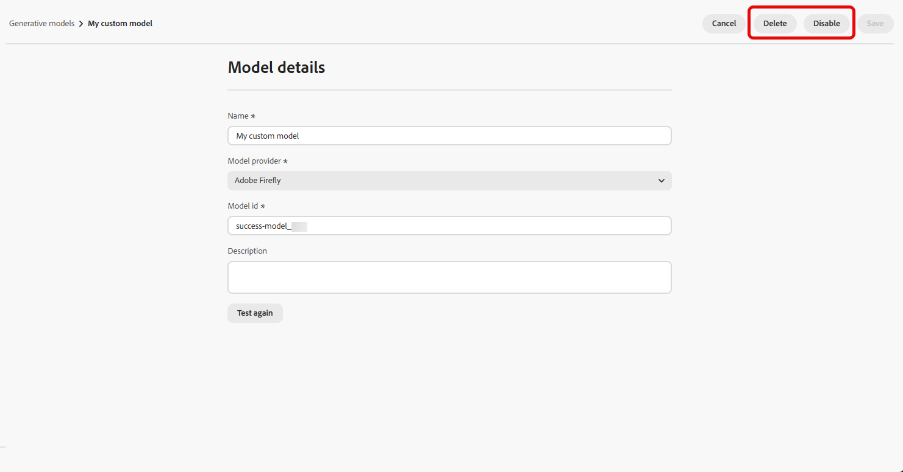
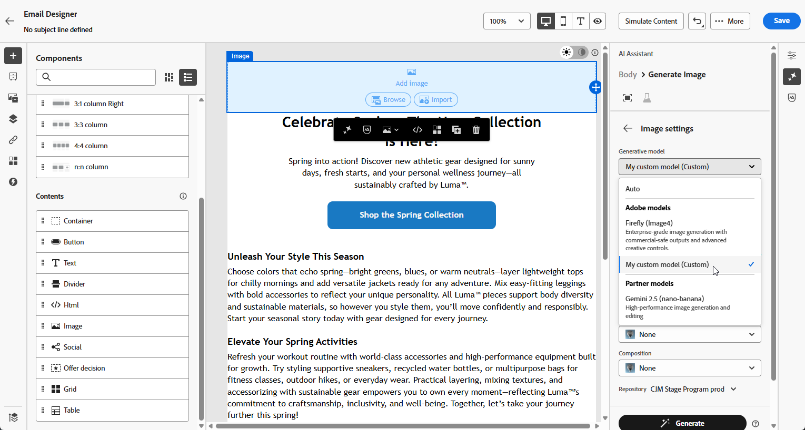

# Criar e gerenciar modelos generativos {#generative-models}

>[!CONTEXTUALHELP]
>id="acw_homepage_welcome_rn3"
>title="Integração de modelos de geração de imagens"
>abstract="Permita a integração perfeita de modelos padrão e personalizados do Firefly, bem como de modelos de imagem de terceiros aprovados, para oferecer maior flexibilidade, controle e alinhamento com a marca na geração de imagens."
>additional-url="https://experienceleague.adobe.com/docs/campaign-web/v8/release-notes/release-notes.html?lang=pt-BR" text="Consulte as notas de versão"

Expanda os recursos de criação de imagens de IA com modelos integrados, modelos personalizados de Firefly e provedores de geração de imagens de terceiros para atender às suas necessidades específicas e melhorar o alinhamento da marca.

Escolha o modelo certo para suas necessidades:

- O **[!UICONTROL Adobe model]**, desenvolvido pela Firefly Image Model 4, é fornecido imediatamente e está pronto para uso para geração imediata de imagem sem configuração adicional.
- O **[!UICONTROL Partner model]**, desenvolvido pelo Gemini 2.5 Flash, oferece recursos especializados para casos de uso específicos.
- **[!UICONTROL Os modelos personalizados]** são modelos específicos da marca treinados em seus próprios ativos e adicionados pela sua organização.

  Saiba mais sobre **[!UICONTROL Modelos personalizados]** em [Documentação do Adobe Firefly](https://helpx.adobe.com/firefly/web/work-with-enterprise-features/train-custom-models/custom-models-overview.html)

Após a configuração, você pode selecionar qualquer um dos modelos geradores ao criar imagens em seu conteúdo. [Saiba mais sobre a geração de imagens](generative-image.md).

## Gerenciar modelos gerativos

Gerencie seus modelos geradores de um local centralizado. Exiba todos os modelos disponíveis, filtre e pesquise para encontrar modelos específicos e defina as configurações para suas marcas.

1. No menu **[!UICONTROL Marcas]**, selecione a guia **[!UICONTROL Modelos gerativos]**.

   {zoomable="yes"}

1. Clique no ícone  para acessar o menu de filtro. Filtrar modelos por **[!UICONTROL Tipo]** ou **[!UICONTROL Status]**.

   {zoomable="yes"}

1. Use a barra de pesquisa para localizar um modelo generativo específico por nome.

1. Clique no ícone  para acessar o menu avançado, no qual você pode habilitar, desabilitar ou excluir seu modelo.

   Observe que somente **[!UICONTROL Modelos personalizados]** podem ser excluídos.

   {zoomable="yes"}

1. Clique em **[!UICONTROL Adicionar modelo]** para criar um novo modelo generativo do zero.

Agora é possível selecionar qualquer um dos modelos gerativos ao criar imagens em seu conteúdo. [Saiba mais sobre a geração de imagens](generative-image.md).

## Adicionar um modelo generativo

>[!IMPORTANT]
>
>A criação de modelos personalizados do Firefly requer um contrato do Firefly ETLA.

Os modelos personalizados do Firefly são modelos de IA específicos da marca treinados em seus próprios ativos, permitindo gerar imagens que se alinham precisamente à identidade, ao estilo e às diretrizes visuais da marca.

Ao criar provedores de modelos personalizados do Firefly, você pode expandir seus recursos de IA para além dos modelos padrão e garantir que o conteúdo gerado reflita de forma consistente a estética e os requisitos exclusivos de sua marca.

➡️ [Saiba como treinar seu modelo personalizado](https://helpx.adobe.com/firefly/web/work-with-enterprise-features/train-custom-models/train-firefly-custom-models.html)

1. No menu **[!UICONTROL Marcas]**, acesse a guia **[!UICONTROL Modelos Gerativos]** e clique em **[!UICONTROL Adicionar modelo]**.

   {zoomable="yes"}

1. Insira um **[!UICONTROL Nome]** para seu modelo.

1. Insira sua **[!UICONTROL ID do Modelo]**.

   Para encontrar sua ID de modelo do Firefly, acesse o site da Firefly e navegue até os modelos treinados. O identificador exclusivo está disponível na seção de gerenciamento do modelo depois de publicado. Para obter mais informações, consulte a [documentação de modelos personalizados do Firefly](https://helpx.adobe.com/firefly/web/work-with-enterprise-features/train-custom-models/manage-custom-models.html).

   {zoomable="yes"}

1. Opcionalmente, insira uma **[!UICONTROL Descrição]** para ajudar a identificar o modelo.

1. Clique em **[!UICONTROL Testar conexão]** para verificar a configuração do modelo.

1. Depois que o teste de conexão for bem-sucedido, clique em **[!UICONTROL Salvar]** para salvar sua configuração de modelo.

   {zoomable="yes"}

1. Depois de salvar, o modelo personalizado é adicionado à lista de modelos. Você pode desativá-la ou excluí-la a qualquer momento.

   {zoomable="yes"}

<!--
1. Once the connection test is successful, choose whether to enable the model for selected brands.

1. Enable or disable the option to connect the model to all brands.

    If disabled, select which brands this model should be applied to.
-->

Após a configuração, é possível selecionar qualquer um dos modelos gerativos personalizados ao criar imagens em seu conteúdo. [Saiba mais sobre a geração de imagens](generative-image.md).

{zoomable="yes"}
