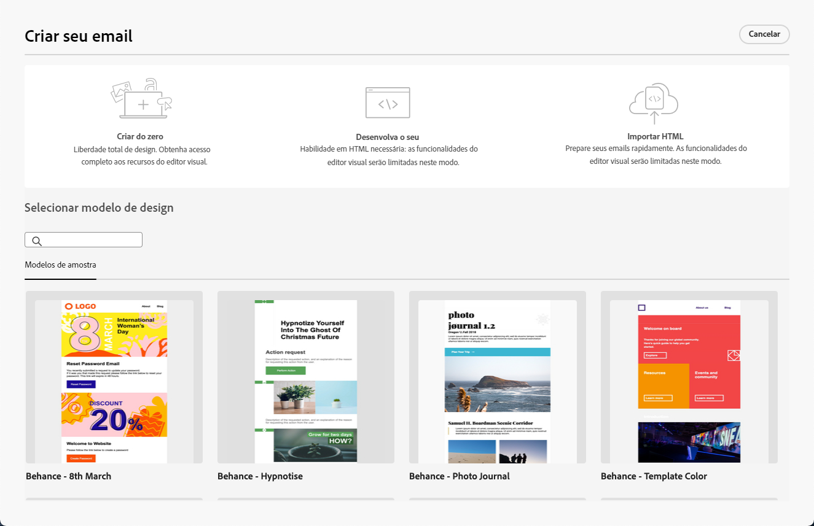

# Introdução ao Designer de email {#get-started-email-designer}

Após a criação de um email no Adobe Campaign, é necessário definir seu conteúdo.

O Designer de email permite criar emails atraentes e personalizados por meio de uma interface intuitiva de arrastar e soltar. Esteja você iniciando do zero, importando um conteúdo existente ou aproveitando modelos existentes, projete e refine todo o conteúdo para cada email, seja ele promocional ou transacional.

<!--Built to deliver HTML optimized for responsive design, the Email Designer allows you to easily define and apply visibility conditions and dynamic content to an email, template, or fragment directly through the user interface. You can seamlessly switch between the drag and drop interface and HTML code at the click of a button.

The Email Designer allows you to create email content and email content templates. It is compatible with simple emails, transactional emails, A/B test emails, multilingual emails, and recurring emails.-->

* Uso [!DNL Campaign] recursos de design de email para criar e-mails responsivos com facilidade. [Saiba mais](create-email-content.md)

* Melhorar a experiência dos clientes criando produtos personalizados com base em seus atributos de perfil. [Saiba mais](../personalization/personalize.md)

* Configure campos de conteúdo condicional para criar personalização dinâmica com base no perfil do recipient. [Saiba mais](../personalization/conditions.md)

## Práticas recomendadas de design de email {#best-practices}

Ao enviar emails, é importante considerar que os recipients podem encaminhá-los, o que às vezes pode causar problemas na renderização do email. Isso é particularmente verdadeiro ao usar classes CSS que podem não ser suportadas pelo provedor de email usado para encaminhamento, por exemplo, se você estiver usando a classe CSS &quot;is-desktop-hidden&quot; para ocultar uma imagem em dispositivos móveis.

Para minimizar esses problemas de renderização, recomendamos manter a estrutura de design de email a mais simples possível. Tente usar um único design que funcione bem para dispositivos móveis e de desktop, e evite usar classes CSS complexas ou outros elementos de design que possam não ser totalmente compatíveis com todos os clientes de email. Seguindo essas práticas recomendadas, você pode ajudar a garantir que seus emails sejam renderizados de forma consistente corretamente, independentemente de como são visualizados ou encaminhados pelos destinatários.

## Comece a criar seu conteúdo {#start-authoring}

No painel de delivery de email, passe pelo link [Editar conteúdo](edit-content.md) para abrir a página inicial do Designer de email. A partir daí, escolha como deseja criar seu email a partir das seguintes opções:

* **Projetar o email do zero** por meio da interface do designer de email. Saiba como projetar seu conteúdo de email no [nesta seção](create-email-content.md).

* **Codificar ou colar HTML bruto** diretamente no designer de email. Saiba como codificar seu próprio conteúdo no [nesta seção](code-content.md).

* **Importar conteúdo de HTML existente** de um arquivo ou de uma pasta .zip. Saiba como importar um conteúdo de email no [nesta seção](existing-content.md).

* **Selecionar um conteúdo existente** de uma lista de modelos incorporados ou personalizados. Saiba como trabalhar com modelos de email [nesta seção](email-sample-templates.md).

  

