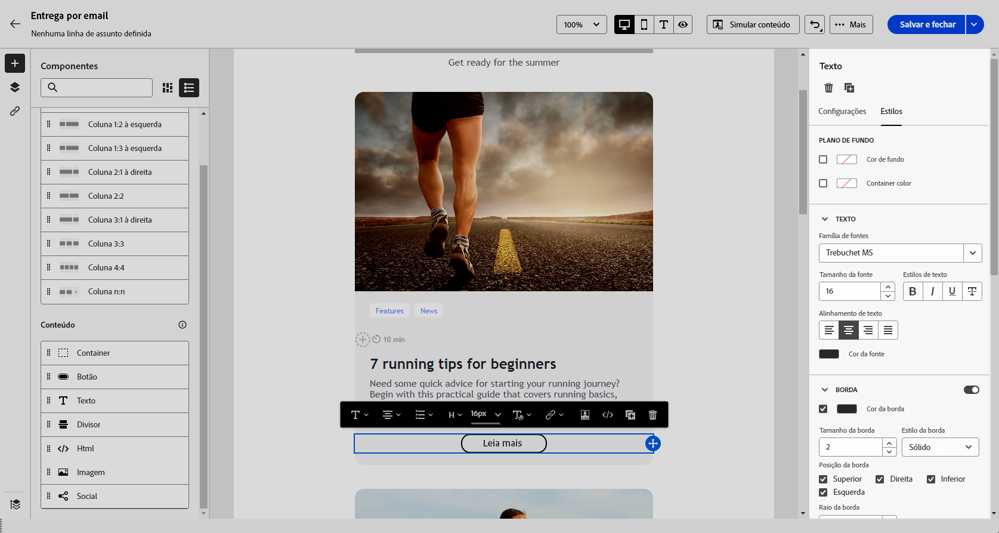

# Introdução ao estilo de email {#get-started-email-style}

Após começar a criar o conteúdo de email no [!DNL Adobe Campaign], é possível ajustar diversos parâmetros e atributos de estilo no painel de configurações do Designer de email.

Você pode aplicar as alterações ao corpo do email, a um componente de estrutura ou a um componente de conteúdo.

Siga os links abaixo para descobrir como ajustar algumas das configurações de estilo no seu email.

* Saiba como [personalizar o plano de fundo do email](backgrounds.md)
* Saiba como [ajustar o alinhamento vertical e o preenchimento](alignment-and-padding.md)
* Saiba como [definir um estilo para os links do email](styling-links.md)
* Saiba como [personalizar atributos de estilo em linha](inline-styling.md)
