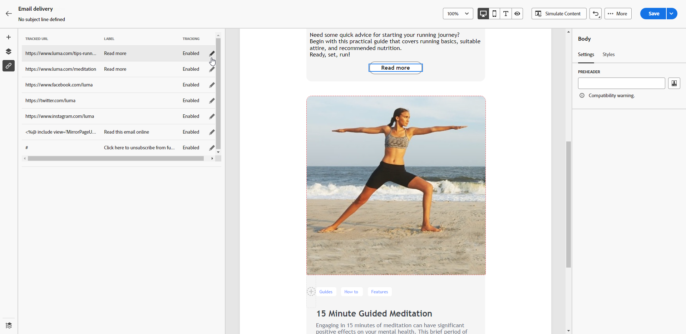

# Adicionar links e rastrear mensagens {#tracking}

Use o Designer de email para adicionar links ao seu conteúdo e rastrear as mensagens enviadas para monitorar o comportamento dos recipients.

## Inserir links {#insert-links}

Ao criar uma mensagem, você pode adicionar links ao seu conteúdo.

>[!NOTE]
>
>Quando o rastreamento é ativado, todos os links incluídos no conteúdo da mensagem são rastreados.

Para inserir links no seu conteúdo de email, siga as etapas abaixo:

1. Selecione um elemento e clique em **[!UICONTROL Inserir link]** na barra de ferramentas contextual.

   

1. Adicione um **[!UICONTROL Rótulo]** e **[!UICONTROL Link]**.

1. Salve as alterações.

1. Depois que o link for criado, você ainda poderá modificá-lo da variável **[!UICONTROL Configurações do componente]** painel à direita.

   * Você pode editar o link e alterar seu **[!UICONTROL Target]**.
   * Você pode optar por sublinhar o link ou não, marcando a opção correspondente.

   

>[!NOTE]
>
>As mensagens de email de tipo de marketing devem incluir um link para opção de não participação, que não é necessário para mensagens transacionais. A categoria da mensagem (**[!UICONTROL Marketing]** ou **[!UICONTROL Transacional]**) é definida no nível da superfície do canal (ou seja, predefinição de mensagem) e ao criar a mensagem.

Um link específico para a mirror page deve ser adicionado em todas as suas mensagens de email. Saiba mais sobre a mirror page em [esta seção](mirror-page.md).

## Gerenciar rastreamento {#manage-tracking}

O [Email Designer](create-email-content.md) permite gerenciar os URLs rastreados, como editar o tipo de rastreamento para cada link.

1. Clique no botão **[!UICONTROL Links]** ícone do painel esquerdo para exibir a lista de todos os URLs do seu conteúdo a ser rastreado.

   Essa lista permite que você tenha uma visualização centralizada e localize cada URL no conteúdo do email.

1. Para editar um link, clique no ícone de lápis correspondente.

   

1. Você pode modificar o **[!UICONTROL Tipo de rastreamento]** se necessário:

   

   Para cada URL rastreado, é possível definir o modo de rastreamento para um destes valores:

   * **[!UICONTROL Rastreado]**: Ativa o rastreamento nesse URL.
   * **[!UICONTROL Recusar]**: Considera esse URL como recusa ou cancelamento de subscrição.
   * **[!UICONTROL Mirror page]**: Considera esse URL como sendo de mirror page.
   * **[!UICONTROL Nunca]**: Nunca ativa o rastreamento desse URL. <!--This information is saved: if the URL appears again in a future message, its tracking is automatically deactivated.-->

1. Adicione um **[!UICONTROL Categoria]** ao link para agrupar links rastreados e clicar em **[!UICONTROL Salvar]**.

   

1. Após enviar o delivery, acesse o relatório do delivery. Em **[!UICONTROL Rastreamento]** , o **[!UICONTROL Fluxos de clique e URLs]** exibe quais URLs do seu delivery são os mais visitados. [Saiba mais](../reporting/reports.md)
