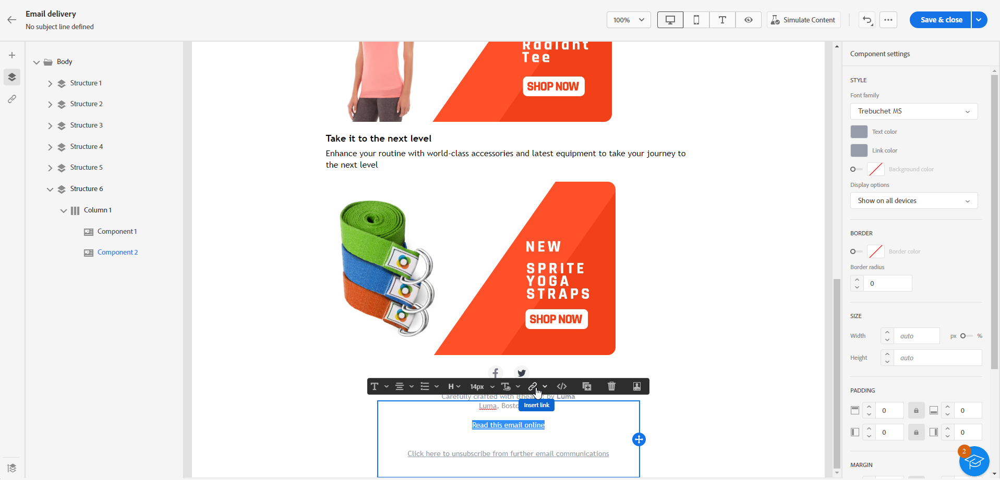

# Adicionar um link à mirror page{#mirror-page}

## Sobre a mirror page{#about-mirror-page}

A mirror page é uma versão online do seu email.

Embora a maioria dos clientes de email renderize imagens sem problemas, algumas predefinições podem evitar a exibição de imagens por motivos de segurança. Os usuários podem navegar até a mirror page de um email, por exemplo, se estiverem enfrentando problemas de renderização ou imagens quebradas ao tentar exibi-lo em sua caixa de entrada. Também é recomendável fornecer uma versão online por motivos de acessibilidade ou incentivar o compartilhamento em redes sociais.

A mirror page gerada pelo Adobe Campaign contém todos os dados de personalização.

{width="600" align="left"}

## Adicionar um link à mirror page{#link-to-mirror-page}

Inserir um link para a mirror page é uma boa prática. Esse link pode ser, por exemplo, &quot;Exibir este email em seu navegador&quot; ou &quot;Leia online&quot;. Geralmente, ela está localizada no cabeçalho ou no rodapé do email.

No Adobe Campaign, você pode inserir um link para a mirror page no conteúdo do email usando o **bloco de personalização**. O **Link para mirror page** o bloco de personalização insere o seguinte código no conteúdo do email: `<%@ include view='MirrorPage' %>`.

Para adicionar um link a uma mirror page no seu email:

1. Selecione um elemento e clique em **[!UICONTROL Inserir link]** na barra de ferramentas contextual.

   

1. Selecione o **[!UICONTROL Inserir link]** para acessar o menu de personalização.

   

1. No **[!UICONTROL Bloco de conteúdo]** selecione **[!UICONTROL Mirror page URL]** e clique em **[!UICONTROL Adicionar]**.

   

   Para obter mais informações sobre a inserção de blocos de conteúdo personalizados, consulte [esta seção](../personalization/personalize.md#personalize-emails).

A mirror page é criada automaticamente.

>[!IMPORTANT]
>
>Os links de mirror pages são gerados automaticamente e não podem ser editados. Eles contêm todos os dados personalizados criptografados necessários para renderizar o email original. Como resultado, o uso de atributos personalizados com valores grandes pode gerar URLs de mirror pages longas, o que pode impedir que o link funcione em navegadores da Web com tamanho máximo de URLs.

Depois que o email for enviado, quando os recipients clicarem no link da mirror page, o conteúdo do email será exibido no navegador padrão.

>[!NOTE]
>
>No email de teste enviado aos perfis de teste, o link para a mirror page não está ativo. Ela só é ativada nas mensagens finais.

Por padrão, o período de retenção de uma mirror page é de 60 dias. Após esse atraso, a mirror page não estará mais disponível.

## Geração de mirror page{#mirror-page-generation}

Por padrão, a mirror page é gerada automaticamente pelo Adobe Campaign se o conteúdo do email não estiver vazio e se contiver um link para a mirror page (também conhecido como Mirror link).

Você pode controlar o modo de geração da mirror page de email. As opções estão disponíveis nas propriedades de delivery. [Saiba mais](../advanced-settings/delivery-settings.md#mirror)
