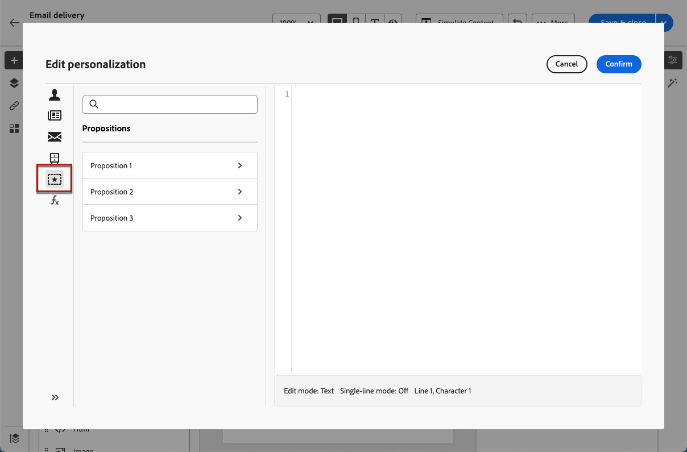
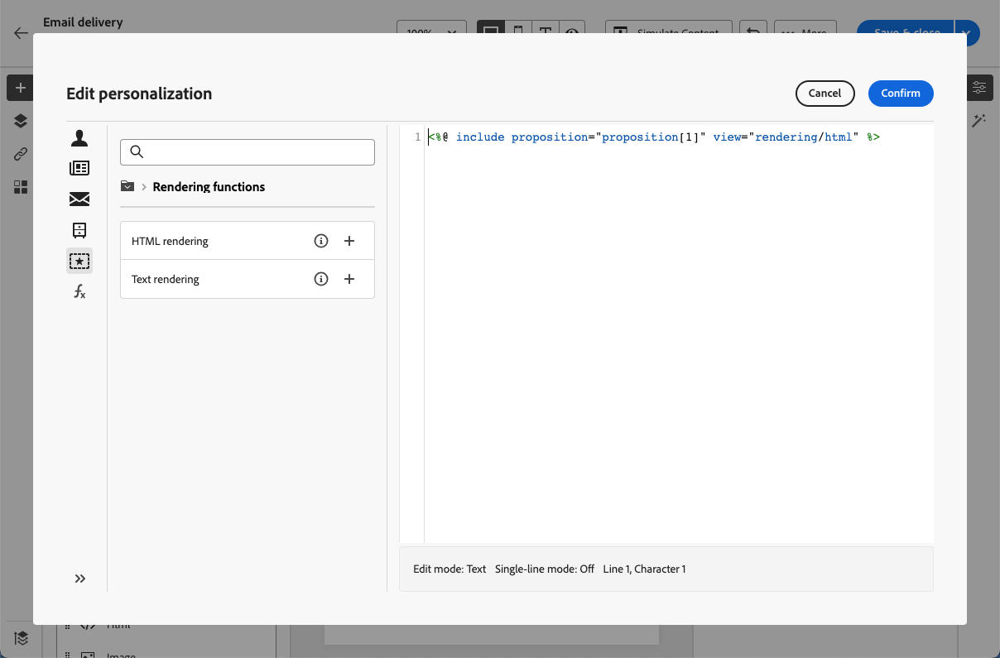

# Adicionar ofertas em suas mensagens {#offers-content}

O Adobe Campaign v8 Web permite enviar com seus deliveries ofertas que foram criadas no console usando o **[!UICONTROL Interação]** módulo. Para obter mais informações sobre interação e como gerenciar um catálogo de ofertas no console, consulte [Documentação do Campaign v8 (console do cliente)](https://experienceleague.adobe.com/docs/campaign/campaign-v8/offers/interaction.html?lang=pt-BR){target="_blank"}.

As etapas para enviar ofertas com um delivery são as seguintes:

1. [Configurar as ofertas a serem propostas](#configure)
1. [Inserir as ofertas no delivery](#insert)

## Configurar as ofertas a serem propostas {#configure}

>[!CONTEXTUALHELP]
>id="acw_deliveries_email_offers_settings"
>title="Defina os parâmetros das ofertas"
>abstract="Configure quais ofertas devem ser propostas aos destinatários, definindo um espaço de ofertas, opcionalmente uma categoria e um tema, e especifique o número de ofertas que deseja inserir na entrega."

>[!CONTEXTUALHELP]
>id="acw_deliveries_email_offers_advanced_settings"
>title="Defina as configurações avançadas de ofertas"
>abstract="É possível habilitar a exclusão de destinatários para os quais não há ofertas elegíveis suficientes e escolher como a mensagem será processada caso uma das proposições não exista."

O Adobe Campaign permite propor uma ou várias ofertas específicas para um determinado contato. Módulo de interação que permite responder em tempo real durante uma interação com um determinado contato, propondo a ele uma ou várias ofertas específicas. Essas ofertas podem ser mensagens de comunicação simples, ofertas especiais de um ou vários produtos ou um serviço.

Para selecionar as ofertas a serem adicionadas ao delivery, siga as etapas abaixo.

1. Clique em **[!UICONTROL Configurar ofertas]** na tela de edição de conteúdo de delivery.

   

1. Configurar quais ofertas devem ser propostas para os recipients.

   Primeiro, selecione o **[!UICONTROL Espaço de ofertas]** que corresponda ao seu ambiente de oferta. Saiba como criar um espaço de ofertas no [Documentação do Campaign v8 (console do cliente)](https://experienceleague.adobe.com/docs/campaign/campaign-v8/offers/interaction-settings/interaction-offer-spaces.html){target="_blank"}

   

1. Para refinar a escolha de ofertas do mecanismo, selecione uma **[!UICONTROL Categoria de oferta]** específica em que as ofertas são classificadas.

   Ao selecionar uma pasta, todas as subpastas são incluídas automaticamente e não podem ser removidas. Observe que [!DNL Campaign] não reflete esse comportamento.

   >[!NOTE]
   >
   >Se nenhuma categoria for especificada, todas as ofertas contidas no ambiente serão consideradas pelo Mecanismo de oferta, a menos que um **[!UICONTROL Tema de oferta]** seja selecionado.

1. (opcional) Insira um tema para filtrar categorias. Os temas são palavras-chave definidas de forma ascendente nas categorias. Elas funcionam como um filtro e permitem refinar o número de ofertas que serão apresentadas ao selecioná-las em um conjunto de categorias.

1. Use o **[!UICONTROL Apresentações]** para especificar o número de ofertas que deseja inserir no delivery.

1. Selecione a opção **[!UICONTROL Excluir recipients não qualificados]** se necessário.

   Essa opção permite ativar ou desativar a exclusão de recipients para os quais não há ofertas elegíveis suficientes.

   * Se a opção estiver ativada, os recipients que não tiverem proposições suficientes serão excluídos da entrega.
   * Se a opção estiver desativada, esses recipients não serão excluídos, mas não poderão ter o número solicitado de proposições.

1. Se necessário, selecione a opção **[!UICONTROL Ocultar tudo se nenhuma oferta estiver selecionada]**.

   Essa opção permite escolher como a mensagem será processada caso uma das proposições não exista.

   * Quando a opção estiver habilitada, a representação da proposição ausente não é exibida e nenhum conteúdo aparece na mensagem para essa proposição.
   * Se a opção estiver desabilitada, a mensagem propriamente dita será cancelada durante o envio e os receipients não receberão nenhuma mensagem.

Depois de configurar as ofertas a serem propostas no delivery, você pode inseri-las no conteúdo do delivery usando o Editor de expressão.

## Inserir ofertas no delivery {#insert}

As ofertas podem ser adicionadas ao delivery usando o [Editor de expressão](../personalization/gs-personalization.md#access). Eles podem ser inseridos na linha de assunto ou no corpo do delivery.

>[!CAUTION]
>
>Antes de inserir uma oferta em um delivery, verifique se [configurado quais ofertas devem ser propostas com esse delivery](#configure).

Para inserir uma oferta usando o Editor de expressão, siga as etapas abaixo.

1. Acesse a linha de assunto ou o conteúdo de qualquer delivery.

1. Coloque o cursor do mouse onde deseja inserir a oferta e abra o Editor de expressão usando o ícone de personalização.

1. Selecione o **[!UICONTROL Apresentações]** menu. As apresentações disponíveis são exibidas na lista.

   >[!NOTE]
   >
   >O número de apresentações é definido quando [configuração de ofertas](#configure) para o delivery atual.

   

1. Adicione as apresentações à linha de assunto ou ao corpo do delivery usando os campos de personalização, funções de renderização ou atributos de oferta disponíveis para cada apresentação.

   

   >[!NOTE]
   >
   >O número de apresentações disponíveis depende da forma como a chamada do motor é configurada e sua ordem depende da prioridade das ofertas. Saiba mais na [Documentação do Campaign v8 (console do cliente)](https://experienceleague.adobe.com/docs/campaign/campaign-v8/offers/interaction-best-practices.html){target="_blank"}.

1. Salve as alterações.

1. Finalize o conteúdo, teste e envie seu delivery.

Agora, quando um recipient recebe o delivery, a oferta certa é exibida para esse perfil específico.
