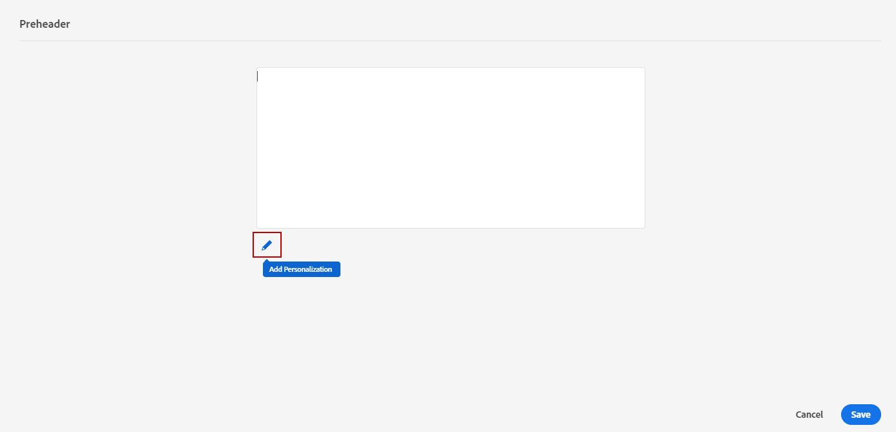

# Adicionar um precabeçalho {#preheader}

>[!CONTEXTUALHELP]
>id="ac_edition_preheader"
>title="Adição de um precabeçalho"
>abstract="Um precabeçalho é um texto resumido curto que segue a linha de assunto ao visualizar um email do seu cliente de email. Em muitos casos, ele fornece um breve resumo do email e, normalmente, tem uma frase de duração."

Um precabeçalho é um texto resumido curto que segue a linha de assunto ao visualizar um email do seu cliente de email.

Em muitos casos, ele fornece um breve resumo do email e, normalmente, tem uma frase de duração.

>[!NOTE]
>
>Os pré-cabeçalhos não são suportados por todos os clientes de email. Quando não é suportado, o precabeçalho não é exibido.

Para definir o pré-cabeçalho de email, siga as etapas abaixo:

1. No Designer de email, adicione pelo menos um **[!UICONTROL Componentes da estrutura]** para começar a criar seu email.

1. Clique no botão **[!UICONTROL Árvore de navegação]** ícone no painel esquerdo e selecione **[!UICONTROL Corpo]**.

   

1. No **[!UICONTROL Configurações de corpo]** no painel direito, clique no ícone de edição ao lado do **[!UICONTROL Preheader]** para adicionar conteúdo.

   

1. Adicione o pré-cabeçalho. Você pode personalizá-la ainda mais clicando no botão **[!UICONTROL Adicionar personalização]** ícone .

   

1. No **[!UICONTROL Editar personalização]** , é possível adicionar **[!UICONTROL Bloco de conteúdo]**, **[!UICONTROL Conteúdo dinâmico]** ou **[!UICONTROL Campos de personalização]**.

1. Clique em **[!UICONTROL Validar]** para verificar a sintaxe de personalização.

1. Clique em **[!UICONTROL Save]**.

O pré-cabeçalho agora está configurado para o email.
