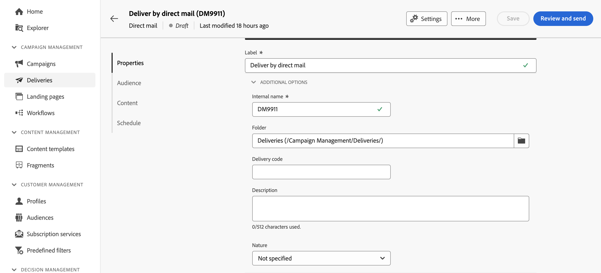

# Criar uma entrega de correspondência direta {#create-direct-mail}

Você pode criar um delivery de correspondência direta independente ou criar um delivery de correspondência direta no contexto de um fluxo de trabalho da campanha. As etapas abaixo detalham o procedimento para um delivery de mala direta independente (único). Se você estiver trabalhando no contexto de um fluxo de trabalho de campanha, as etapas de criação serão detalhadas em [esta seção](../workflows/activities/channels.md#create-a-delivery-in-a-campaign-workflow).

Para criar um novo delivery de correspondência direta independente, siga estas etapas:

1. Navegue até o menu **[!UICONTROL Entregas]** no painel esquerdo e clique no botão **[!UICONTROL Criar entrega]**.

1. Na seção **[!UICONTROL Canal]**, escolha **[!UICONTROL Correspondência direta]** como canal e selecione um modelo. [Saiba mais sobre modelos](../msg/delivery-template.md)

1. Clique no botão **[!UICONTROL Criar entrega]** para confirmar.

   {zoomable="yes"}

1. Insira um **[!UICONTROL Rótulo]** para a entrega e acesse o menu suspenso **[!UICONTROL Opções adicionais]**. Se a sua entrega for baseada em um esquema estendido, campos específicos de **Opções personalizadas** estarão disponíveis.

   {zoomable="yes"}

   +++Defina as seguintes configurações com base nos seus requisitos.
   * **[!UICONTROL Nome interno]**: atribua um identificador exclusivo à entrega.
   * **[!UICONTROL Pasta]**: armazene a entrega em uma pasta específica.
   * **[!UICONTROL Código de entrega]**: organize suas entregas usando sua própria convenção de nomeação.
   * **[!UICONTROL Descrição]**: forneça uma descrição da entrega.
   * **[!UICONTROL Natureza]**: especifique a natureza da entrega para fins de classificação.

   +++

1. Clique no botão **[!UICONTROL Selecionar público-alvo]** para direcionar um público-alvo existente ou criar o seu próprio.

   * [Saiba como selecionar um público existente](../audience/add-audience.md)
   * [Saiba como criar um novo público-alvo](../audience/one-time-audience.md)

   {zoomable="yes"}

   >[!NOTE]
   >
   >Os destinatários da correspondência direta devem conter pelo menos seus nomes e endereços postais. Um endereço será considerado completo se o nome, o CEP/código postal e a cidade não estiverem em branco. Quaisquer destinatários com endereços incompletos serão excluídos das entregas de correspondência direta.

1. Ative a opção **[!UICONTROL Habilitar grupo de controle]** para definir um grupo de controle e medir o impacto da sua entrega. As mensagens não são enviadas para esse grupo de controle, portanto, você pode comparar o comportamento da população que recebeu a mensagem com o comportamento dos contatos que não receberam. [Saiba como trabalhar com grupos de controle](../audience/control-group.md)

1. Clique em **[!UICONTROL Editar conteúdo]** para definir as informações (colunas) a serem exportadas para o arquivo de extração. [Saiba mais](content-direct-mail.md)

   {zoomable="yes"}

1. Para programar sua entrega para uma data e hora específicas, ative a opção **[!UICONTROL Habilitar agendamento]**. Após iniciar o delivery, o arquivo de extração é gerado automaticamente na data e hora exatas que você definir. [Saiba como agendar entregas](../msg/gs-deliveries.md#gs-schedule).

   >[!NOTE]
   >
   >Quando uma entrega é enviada no contexto de um fluxo de trabalho, você deve usar a atividade **Scheduler**. Saiba mais sobre [esta página](../workflows/activities/scheduler.md).

1. Clique em **[!UICONTROL Configurações]** para acessar as opções avançadas relacionadas ao seu modelo de entrega. [Saiba mais](../advanced-settings/delivery-settings.md)

   {zoomable="yes"}

1. Quando a entrega da correspondência direta estiver pronta, clique no botão **[!UICONTROL Revisar e enviar]** para validar e enviar a entrega e gerar o arquivo de extração. [Saiba como visualizar e enviar uma entrega de correspondência direta](send-direct-mail.md)