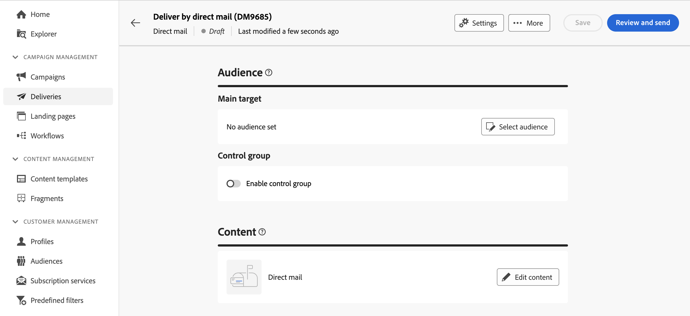

# Criar uma entrega de correspondência direta {#create-direct-mail}

Você pode criar um delivery de correspondência direta independente ou criar um delivery de correspondência direta no contexto de um fluxo de trabalho da campanha. As etapas abaixo detalham o procedimento para um delivery de mala direta independente (único). Se estiver trabalhando no contexto de um workflow da campanha, as etapas de criação são detalhadas em [nesta seção](../workflows/activities/channels.md#create-a-delivery-in-a-campaign-workflow).

Para criar um novo delivery de correspondência direta independente, siga estas etapas:

1. Navegue até o **[!UICONTROL Entregas]** no painel à esquerda e clique no botão  **[!UICONTROL Criar entrega]** botão.

1. No **[!UICONTROL Canal]** escolha **[!UICONTROL Correspondência direta]** como canal e selecione um modelo. [Saiba mais sobre modelos](../msg/delivery-template.md)

1. Clique no botão **[!UICONTROL Criar entrega]** para confirmar.

   {zoomable=&quot;yes&quot;}

1. Insira um **[!UICONTROL Rótulo]** para o delivery e acesse o **[!UICONTROL Opções adicionais]** menu suspenso. Se o seu delivery for baseado em um schema estendido, **Opções personalizadas** campos estão disponíveis.

   {zoomable=&quot;yes&quot;}

   +++Defina as seguintes configurações com base nos seus requisitos.
   * **[!UICONTROL Nome interno]**: atribua um identificador exclusivo à entrega.
   * **[!UICONTROL Pasta]**: armazene a entrega em uma pasta específica.
   * **[!UICONTROL Código de entrega]**: organize suas entregas usando sua própria convenção de nomeação.
   * **[!UICONTROL Descrição]**: forneça uma descrição da entrega.
   * **[!UICONTROL Natureza]**: especifique a natureza do delivery para fins de classificação.
+++

1. Clique em **[!UICONTROL Selecionar público]** botão para direcionar um público-alvo existente ou criar o seu próprio.

   * [Saiba como selecionar um público existente](../audience/add-audience.md)
   * [Saiba como criar um novo público-alvo](../audience/one-time-audience.md)

   {zoomable=&quot;yes&quot;}

   >[!NOTE]
   >
   >Os destinatários da correspondência direta devem conter pelo menos seus nomes e endereços postais. Um endereço será considerado completo se o nome, o CEP/código postal e a cidade não estiverem em branco. Quaisquer destinatários com endereços incompletos serão excluídos das entregas de correspondência direta.

1. Ligue o **[!UICONTROL Ativar grupo de controle]** opção para definir um grupo de controle para medir o impacto do delivery. As mensagens não são enviadas para esse grupo de controle, para que você possa comparar o comportamento da população que recebeu a mensagem com o comportamento dos contatos que não receberam. [Saiba como trabalhar com grupos de controle](../audience/control-group.md)

1. Clique em **[!UICONTROL Editar conteúdo]** para definir as informações (colunas) a serem exportadas para o arquivo de extração. [Saiba mais](content-direct-mail.md)

   {zoomable=&quot;yes&quot;}

1. Para programar sua entrega para uma data e hora específicas, ative a opção **[!UICONTROL Habilitar agendamento]**. Após iniciar o delivery, o arquivo de extração será gerado automaticamente na data e hora exatas definidas. [Saiba como agendar entregas](../msg/gs-messages.md#gs-schedule).

   >[!NOTE]
   >
   >Quando um delivery é enviado no contexto de um workflow, você deve usar o **Scheduler** atividade. Saiba mais [nesta página](../workflows/activities/scheduler.md).

1. Clique em **[!UICONTROL Configurações]** para acessar opções avançadas relacionadas ao seu template do delivery. [Saiba mais](../advanced-settings/delivery-settings.md)

   {zoomable=&quot;yes&quot;}

1. Quando o delivery de mala direta estiver pronto, clique no link **[!UICONTROL Revisar e enviar]** botão para validar e enviar o delivery e gerar o arquivo de extração. [Saiba como visualizar e enviar um delivery de correspondência direta](send-direct-mail.md)
