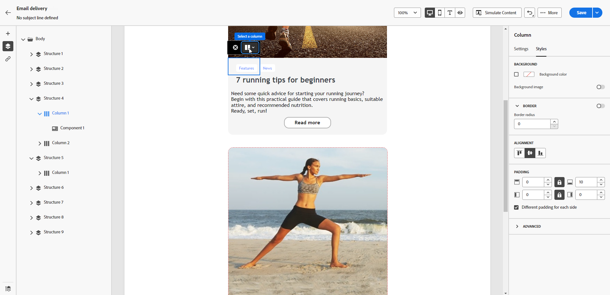

# Ajustar o alinhamento vertical e o preenchimento {#alignment-and-padding}

Neste exemplo, ajustamos o preenchimento e o alinhamento vertical em um componente de estrutura composto de três colunas.

1. Selecione o componente de estrutura diretamente no email ou usando a **[!UICONTROL Árvore de navegação]** disponível no painel esquerdo.

   {zoom=&quot;yes&quot;}

1. Na barra de ferramentas contextual, clique em **[!UICONTROL Selecionar uma coluna]** e escolha aquela que deseja editar. Também é possível selecioná-lo na árvore de estrutura à esquerda.

   {zoom=&quot;yes&quot;}

1. Os parâmetros editáveis para essa coluna são exibidos na guia **[!UICONTROL Estilos]**. Ajuste o **[!UICONTROL Alinhamento]** usando a seção dedicada.

   {zoom=&quot;yes&quot;}

   Por exemplo, selecione **[!UICONTROL Inferior]**. O componente de conteúdo se move para a parte inferior da coluna.

1. Em **[!UICONTROL Preenchimento]**, defina o preenchimento superior dentro da coluna e defina o preenchimento esquerdo e direito para essa coluna.

   >[!NOTE]
   >
   >Clique no ícone de cadeado para interromper a sincronização entre o preenchimento superior/inferior ou esquerdo/direito.

   {zoom=&quot;yes&quot;}

1. Proceda de forma semelhante para ajustar o alinhamento e o preenchimento das outras colunas.

1. Salve as alterações.
