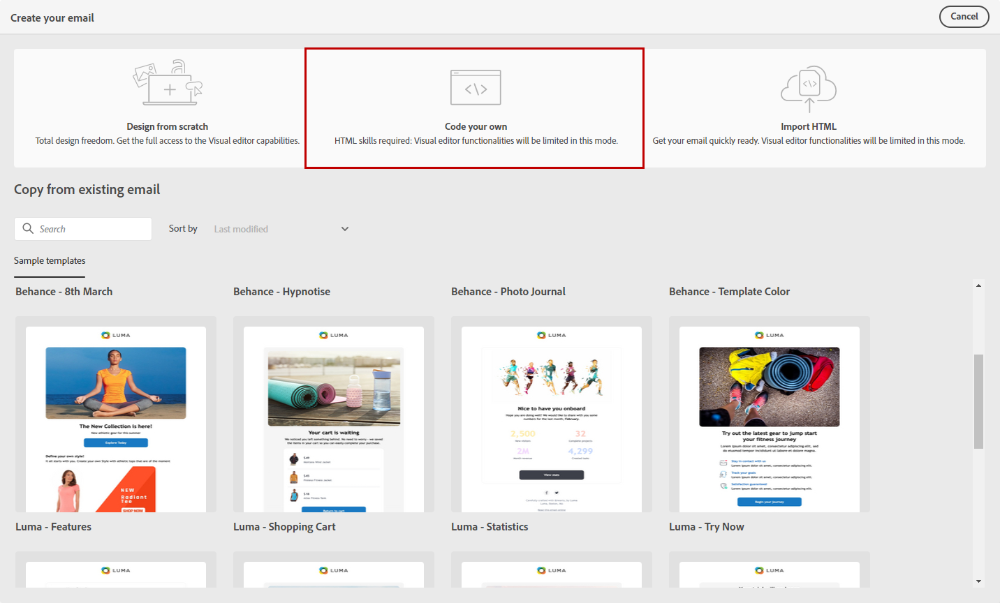

# Desenvolva seu próprio conteúdo de email {#code-content}

Use o modo **[!UICONTROL Codifique você mesmo]** para importar HTML bruto e codificar seu conteúdo de email.

>[!CAUTION]
>
>Este método requer conhecimento do HTML.

1. Na página inicial do [Designer de email](get-started-email-designer.md), selecione **[!UICONTROL Codifique o seu próprio]**.

   {zoomable="yes"}

1. Insira ou cole seu código HTML bruto na tela principal.

1. Use o painel esquerdo para acessar os recursos de personalização. [Saiba mais](../personalization/gs-personalization.md)

   {zoomable="yes"}

1. Clique no botão **[!UICONTROL Simular conteúdo]** para visualizar o design da mensagem e a personalização usando perfis de teste. [Saiba mais](../preview-test/preview-test.md)

1. Quando o código estiver concluído, clique em **[!UICONTROL Salvar e fechar]** para retornar à tela de criação da mensagem e finalizar a mensagem.