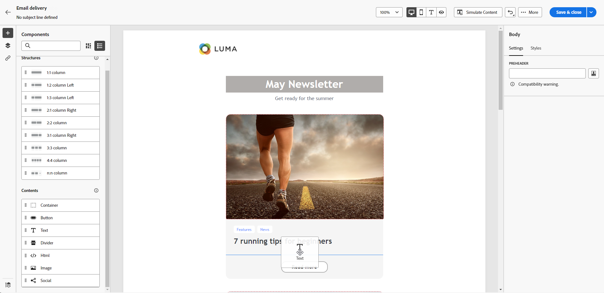
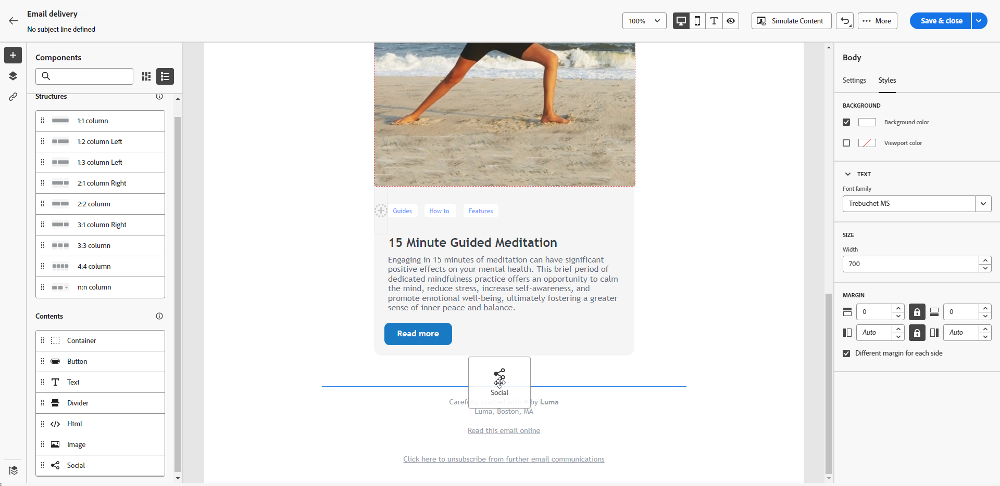

# Usar componentes de conteúdo {#content-components}

>[!CONTEXTUALHELP]
>id="ac_content_components_email"
>title="Sobre conteúdos"
>abstract="Componentes de conteúdo são espaços reservados de conteúdo vazios que podem ser usados para criar o layout de um email."

>[!CONTEXTUALHELP]
>id="ac_content_components_landing_page"
>title="Sobre conteúdos"
>abstract="Componentes de conteúdo são espaços reservados de conteúdo vazios que você pode usar para criar o layout de uma landing page."

>[!CONTEXTUALHELP]
>id="ac_content_components_fragment"
>title="Sobre conteúdos"
>abstract="Componentes de conteúdo são espaços reservados de conteúdo vazios que você pode usar para criar o layout de um fragmento de conteúdo."

>[!CONTEXTUALHELP]
>id="ac_content_components_template"
>title="Sobre conteúdos"
>abstract="Componentes de conteúdo são espaços reservados de conteúdo vazios que podem ser usados para criar o layout de um modelo."

Ao criar seu conteúdo de email, os componentes de **[!UICONTROL Conteúdo]** permitem personalizar seu email com componentes brutos e vazios que você pode usar depois de colocados em um email.

Você pode adicionar quantos **[!UICONTROL Conteúdos]** forem necessários dentro de uma **[!UICONTROL Estrutura]**, que define o layout do seu email.

## Adicionar componentes de conteúdo {#add-content-components}

Para adicionar componentes de conteúdo ao seu email e ajustá-los às suas necessidades, siga as etapas abaixo.

1. No Designer Email, use um [conteúdo existente](existing-content.md) ou arraste e solte uma **[!UICONTROL Estrutura]** no conteúdo vazio para definir o layout do seu email. [Saiba como](create-email-content.md)

1. Arraste e solte o **[!UICONTROL Conteúdo]** de sua escolha dentro das estruturas relevantes.

   {zoomable="yes"}

   >[!NOTE]
   >
   >É possível adicionar vários componentes em uma única estrutura e em cada coluna de uma estrutura.

1. Ajuste as opções de cada componente usando a guia contextual **[!UICONTROL Configurações]**. Por exemplo, escolha exibi-lo somente em dispositivos móveis ou de desktop, ou ambos. Você também pode gerenciar opções de link nesta guia. [Saiba mais sobre como gerenciar links](message-tracking.md)

1. Ajuste os atributos de estilo para cada componente usando a guia **[!UICONTROL Style]**. Por exemplo, altere o estilo do texto, o preenchimento ou a margem de cada componente. [Saiba mais sobre alinhamento e preenchimento](alignment-and-padding.md)

   {zoomable="yes"}

1. No menu avançado do seu **[!UICONTROL Conteúdo]** no painel direito, exclua ou duplique qualquer componente de conteúdo, conforme necessário.

## Container {#container}

É possível adicionar um container simples dentro do qual você adiciona outro componente de conteúdo. Isso permite aplicar um estilo específico ao contêiner, que é diferente do componente usado dentro dele.

Por exemplo, adicione um componente **[!UICONTROL Container]** e, em seguida, adicione um componente [Botão](#button) dentro desse container. Use um fundo específico para o contêiner e outro para o botão.

{zoomable="yes"}

## Botão {#buttons}

Use o componente **[!UICONTROL Botão]** para inserir um ou vários botões no email e redirecionar o público-alvo do email para outra página.

1. A partir da lista **[!UICONTROL Conteúdos]**, arraste e solte o componente **[!UICONTROL Botão]** em um componente **[!UICONTROL Estrutura]**.

   {zoomable="yes"}

1. Clique no botão recém-adicionado para personalizar o texto e acessar as guias **[!UICONTROL Configurações]** e **[!UICONTROL Estilos]**.

   {zoomable="yes"}

1. Na guia **[!UICONTROL Configurações]**, no campo **[!UICONTROL URL]**, adicione a URL para a qual redirecionar ao clicar no botão.

1. Escolha como o conteúdo será exibido usando a lista suspensa **[!UICONTROL Target]**:

   * **[!UICONTROL Nenhum]**: abre o link no mesmo quadro em que foi clicado (padrão).
   * **[!UICONTROL Branco]**: abre o link em uma nova janela ou guia.
   * **[!UICONTROL Auto]**: abre o link no mesmo quadro em que foi clicado.
   * **[!UICONTROL Principal]**: abre o link no quadro principal.
   * **[!UICONTROL Superior]**: abre o link no corpo completo da janela.

   {zoomable="yes"}

1. Personalize ainda mais seu botão alterando atributos de estilo como **[!UICONTROL Borda]**, **[!UICONTROL Tamanho]**, **[!UICONTROL Margem]** e outros da guia **[!UICONTROL Estilos]**.

## Texto {#text}

Use o componente **[!UICONTROL Texto]** para inserir texto no email e ajustar o estilo (borda, tamanho, preenchimento etc.) usando as guias **[!UICONTROL Configurações]** e **[!UICONTROL Estilos]**.

1. No menu **[!UICONTROL Conteúdo]**, arraste e solte **[!UICONTROL Texto]** em um componente **[!UICONTROL Estrutura]**.

   {zoomable="yes"}

1. Clique no componente recém-adicionado para personalizar o texto e acessar as guias **[!UICONTROL Configurações]** e **[!UICONTROL Estilos]**.

1. Altere o texto com as seguintes opções disponíveis na barra de ferramentas contextual:

   {zoomable="yes"}

   * **[!UICONTROL Alterar estilo do texto]**: aplique negrito, itálico, sublinhado ou tachado ao texto.
   * **Alterar alinhamento**: escolha entre alinhamento à esquerda, à direita, centralizado ou justificado para o texto.
   * **[!UICONTROL Criar lista]**: adicionar listas de marcadores ou números ao texto.
   * **[!UICONTROL Definir cabeçalho]**: adicione até seis níveis de cabeçalho ao texto.
   * **Tamanho da fonte**: selecione o tamanho da fonte do texto em pixels.
   * **[!UICONTROL Editar imagem]**: adicione uma imagem ou um ativo ao seu componente de texto.
   * **[!UICONTROL Mostrar o código-fonte]**: exibir o código-fonte do texto. Ele não pode ser modificado.
   * **[!UICONTROL Duplicar]**: adicione uma cópia do seu componente de texto.
   * **[!UICONTROL Excluir]**: exclua o componente de texto selecionado do seu email.
   * **[!UICONTROL Adicionar personalização]**: adicione campos de personalização para personalizar o conteúdo dos dados de seus perfis.
   * **[!UICONTROL Habilitar conteúdo condicional]**: adicione conteúdo condicional para adaptar o conteúdo do componente aos perfis direcionados.

1. Ajuste outros atributos de estilo, como cor do texto, família da fonte, borda, preenchimento, margem e outros, na guia **[!UICONTROL Estilos]**.

   {zoomable="yes"}

## Divisor {#divider}

Use o componente **[!UICONTROL Divisor]** para inserir uma linha divisória para organizar o layout e o conteúdo do email.

Você pode ajustar atributos de estilo, como cor da linha, estilo e altura, na guia **[!UICONTROL Estilos]**.

{zoomable="yes"}

## HTML {#HTML}

Use o componente **[!UICONTROL HTML]** para copiar e colar partes do HTML existente. Isso permite criar componentes modulares gratuitos do HTML para reutilizar conteúdo externo.

1. De **[!UICONTROL Componentes]**, arraste e solte o componente **[!UICONTROL HTML]** em um Componente **[!UICONTROL Estrutura]**.

   {zoomable="yes"}

1. Clique no componente recém-adicionado e selecione **[!UICONTROL Mostrar o código-fonte]** na barra de ferramentas contextual para adicionar o HTML.

   {zoomable="yes"}

>[!NOTE]
>
>Para tornar o conteúdo externo compatível com o Email Designer, a Adobe recomenda [criar uma mensagem do zero](create-email-content.md) e copiar o conteúdo do email existente para os componentes.

## Imagem {#image}

>[!IMPORTANT]
>
>O acesso ao menu do Assets é limitado aos usuários com uma licença ativa do Adobe Experience Manager as a Cloud Service. Se você não tiver essa licença, o menu do Assets não estará disponível.

Use o componente **[!UICONTROL Imagem]** para inserir um arquivo de imagem do seu computador no email.

1. No menu **[!UICONTROL Conteúdo]**, arraste e solte a **[!UICONTROL Imagem]** em um componente de **[!UICONTROL Estrutura]**.

   {zoomable="yes"}

1. Clique em **[!UICONTROL Procurar]** para escolher um arquivo de imagem de seus ativos. Você também pode optar por **[!UICONTROL Importar sua mídia]**.

   Para saber mais sobre como carregar e adicionar ativos no Adobe Experience Manager, consulte a [documentação do Adobe Experience Manager as a Cloud Service](https://experienceleague.adobe.com/docs/experience-manager-cloud-service/content/assets/manage/add-assets.html).

   {zoomable="yes"}

1. Navegue pelas pastas para localizar o ativo específico necessário ou use a barra de pesquisa para localizá-lo com eficiência.

   Depois de encontrar o ativo que você está procurando, clique em **[!UICONTROL Selecionar]**.

   {zoomable="yes"}

1. Clique no componente recém-adicionado e configure as propriedades da imagem usando a guia **[!UICONTROL Configurações]**:

   * **[!UICONTROL O título da imagem]** permite que você defina um título para a imagem.
   * **[!UICONTROL Texto alternativo]** permite definir a legenda vinculada à imagem. Isso corresponde ao atributo HTML alternativo.

   {zoomable="yes"}

1. Adicione um link para redirecionar o público-alvo para outro conteúdo. [Saiba mais](message-tracking.md)

1. Ajuste outros atributos de estilo como margem, borda e outros usando a guia **[!UICONTROL Estilos]**.

## Social {#social}

Use o componente **[!UICONTROL Social]** para inserir links às páginas de redes sociais no seu conteúdo de email.

1. A partir do menu **[!UICONTROL Componentes]**, arraste e solte o componente **[!UICONTROL Social]** em um componente **[!UICONTROL Estrutura]**.

1. Clique no componente recém-adicionado.

1. No campo **[!UICONTROL Social]** da guia **[!UICONTROL Configurações]**, escolha qual rede social deseja adicionar ou remover.

   {zoomable="yes"}

1. Escolha o tamanho dos ícones no campo **[!UICONTROL Tamanho das imagens]**.

1. Clique em cada um dos ícones de redes sociais para configurar o **[!UICONTROL URL]** para o qual o público-alvo é redirecionado.

   {zoomable="yes"}

1. Altere os ícones de cada uma de suas redes sociais, se necessário, no campo **[!UICONTROL Source]**.

1. Ajuste outros atributos de estilo, como estilo, margem, borda e outros, na guia **[!UICONTROL Estilos]**.