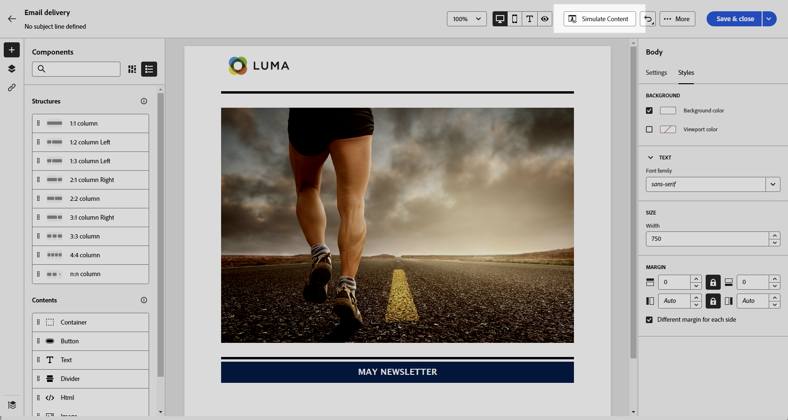

# Criar o conteúdo do email do zero {#create-email-content}

>[!CONTEXTUALHELP]
>id="ac_structure_components_email"
>title="Adicionar estruturas"
>abstract="As estruturas definem o layout do email. Arraste e solte um componente **Estrutura** na tela para iniciar a criação do conteúdo de email."

>[!CONTEXTUALHELP]
>id="ac_structure_components_landing_page"
>title="Adicionar estruturas"
>abstract="As estruturas definem o layout da página de destino. Arraste e solte um componente **Estrutura** na tela para iniciar a criação da página de destino."

>[!CONTEXTUALHELP]
>id="ac_structure_components_fragment"
>title="Adicionar estruturas"
>abstract="As estruturas definem o layout do fragmento de conteúdo. Arraste e solte um componente **Estrutura** na tela para iniciar a criação do conteúdo do fragmento."

>[!CONTEXTUALHELP]
>id="ac_structure_components_template"
>title="Adicionar estruturas"
>abstract="As estruturas definem o layout do modelo. Arraste e solte um componente **Estrutura** na tela para iniciar a criação do conteúdo do modelo."

>[!CONTEXTUALHELP]
>id="ac_edition_columns_email"
>title="Definição de colunas de email"
>abstract="O Designer de email permite definir facilmente o layout do email definindo a estrutura da coluna."

>[!CONTEXTUALHELP]
>id="ac_edition_columns_landing_page"
>title="Definir as colunas da página de destino"
>abstract="O Designer de email permite definir facilmente o layout da página de destino definindo a estrutura da coluna."

>[!CONTEXTUALHELP]
>id="ac_edition_columns_fragment"
>title="Definição de colunas do fragmento de conteúdo"
>abstract="O Designer de email permite definir facilmente o layout do fragmento de conteúdo definindo a estrutura da coluna."

>[!CONTEXTUALHELP]
>id="ac_edition_columns_template"
>title="Definição de colunas de modelo"
>abstract="O Designer de email permite definir facilmente o layout do modelo definindo a estrutura da coluna."

O Designer de email permite definir a estrutura do email com facilidade. Ao adicionar e mover elementos estruturais com ações simples de arrastar e soltar, você projeta o corpo do email em segundos.

➡️ [Conheça este recurso no vídeo](#video)

Para começar a criar o conteúdo de email, siga as etapas abaixo.

1. Na página inicial do [Email Designer](get-started-email-designer.md#start-authoring), selecione a opção **[!UICONTROL Design do zero]**.

   {zoomable="yes"}

1. Comece a criar seu conteúdo de email arrastando e soltando **[!UICONTROL Estruturas]** na tela para definir o layout do seu email.

   >[!NOTE]
   >
   >O empilhamento de colunas não é compatível com todos os programas de email. Se o recurso não for compatível, as colunas não serão empilhadas.

1. Adicione quantas **[!UICONTROL Estruturas]** forem necessárias e edite suas configurações no painel dedicado à direita.

   {zoomable="yes"}

1. Selecione o componente **[!UICONTROL n:n coluna]** para definir o número de colunas de sua escolha (entre 3 e 10). Defina a largura de cada coluna movendo as setas na parte inferior de cada coluna.

   >[!NOTE]
   >
   >O tamanho de cada coluna não pode ser inferior a 10% da largura total do componente de estrutura. Não é possível remover uma coluna que não esteja vazia.

1. Na seção **[!UICONTROL Componentes]**, arraste e solte quantos elementos forem necessários em uma ou mais estruturas. [Saiba mais sobre componentes de conteúdo](content-components.md)

1. Personalize cada componente usando as guias **[!UICONTROL Configurações]** ou **[!UICONTROL Estilo]** à direita. Por exemplo, altere o estilo do texto, o preenchimento ou a margem de cada componente. [Saiba mais sobre alinhamento e preenchimento](alignment-and-padding.md)

   {zoomable="yes"}

1. Insira campos de personalização para personalizar seu conteúdo de email com base nos dados do perfil. [Saiba mais sobre a personalização de conteúdo](../personalization/personalize.md)

1. Adicione links ao seu conteúdo.

   Clique na guia **[!UICONTROL Links]** no painel esquerdo para exibir todas as URLs do seu conteúdo que serão rastreadas. Modifique o **[!UICONTROL Tipo de Acompanhamento]** ou **[!UICONTROL Rótulo]** e adicione **[!UICONTROL Categorias]**, se necessário.

[Saiba mais sobre links e rastreamento de mensagens](message-tracking.md)

   {zoomable="yes"}

1. Se necessário, personalize seu email clicando em **[!UICONTROL Alternar para o editor de código]** no menu avançado. Isso permite editar o código fonte do email, por exemplo, para adicionar rastreamento ou tags personalizadas do HTML. [Saiba mais sobre o editor de código](code-content.md)

   >[!CAUTION]
   >
   >Não é possível reverter para o designer visual desse email após alternar para o editor de código.

1. Quando o conteúdo estiver pronto, clique em **[!UICONTROL Simular conteúdo]** para verificar o e-mail rendering. Escolha a exibição para desktop ou dispositivos móveis. [Saiba mais sobre como visualizar seu email](../preview-test/preview-test.md)

   {zoomable="yes"}

1. Você também pode validar a qualidade do conteúdo para avaliar a legibilidade, a eficácia do CTA, a qualidade da linha de assunto e muito mais. [Saiba mais sobre a validação de qualidade do conteúdo](../content/brands-score.md#validate-quality)

1. Quando o email estiver pronto, clique em **[!UICONTROL Salvar]**.

## Vídeo tutorial {#video}

Saiba como navegar no Designer de email. Saiba como estruturar e projetar um email do zero, personalizar e testar seu email.

>[!VIDEO](https://video.tv.adobe.com/v/3425867/?quality=12)