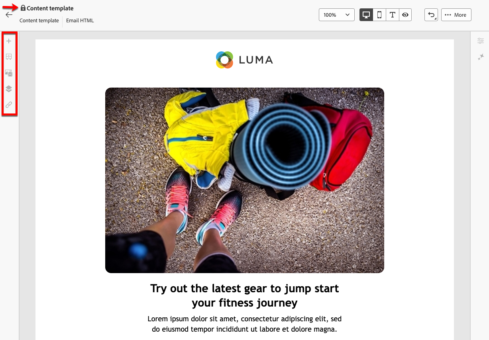

# Trabalho com modelos de conteúdo {#content-templates}

>[!CONTEXTUALHELP]
>id="acw_contenttemplate_menu"
>title="Modelos de conteúdo"
>abstract="Para acelerar e melhorar o processo de criação, é possível criar modelos de email independentes para reutilizar facilmente o conteúdo personalizado no Adobe Campaign. Esses modelos de conteúdo podem ser criados do zero, com base em modelos integrados ou personalizados, criados a partir de um conteúdo já existente ou importados no editor de modelo de conteúdo."

Para um processo de design acelerado e aprimorado, você pode criar modelos independentes para reutilizar facilmente o conteúdo personalizado no [!DNL Adobe Campaign]. Esses modelos de conteúdo podem ser criados do zero, com base em modelos incorporados ou personalizados, criados a partir de conteúdo existente ou importados no editor de modelos de conteúdo.

Essa funcionalidade permite que os usuários orientados a conteúdo trabalhem em modelos independentes para que os usuários de marketing possam reutilizar e adaptá-los em suas próprias campanhas de email.

>[!NOTE]
>
>Atualmente, somente **modelos de conteúdo de email** são aceitos.

## Acessar modelos de conteúdo {#access-templates}

>[!CONTEXTUALHELP]
>id="acw_contenttemplate_edition"
>title="Editar o conteúdo do modelo"
>abstract="Clique em **Editar conteúdo** para atualizar o conteúdo com o Designer de email."

Para acessar a lista de modelos de conteúdo, navegue até o menu **[!UICONTROL Gerenciamento de Conteúdo]** > **[!UICONTROL Modelos de Conteúdo]** no painel esquerdo.

{zoomable="yes"}

Esse painel mostra todos os modelos de conteúdo disponíveis como uma lista. Você pode filtrar em uma [pasta](../get-started/permissions.md#folders) específica usando a lista suspensa ou adicionar regras usando o [modelador de consultas](../query/query-modeler-overview.md).

{zoomable="yes"}

Na lista, você pode editar, duplicar ou excluir modelos de conteúdo existentes. Use o botão na seção superior para criar um template de conteúdo.

### Modelo de conteúdo no modo somente leitura {#template-readonly}

Os direitos de acesso podem ser aplicados a modelos de conteúdo.

Se você não tiver permissões de edição para um modelo de conteúdo específico, ele será exibido no **modo somente leitura**. Nesse caso, o botão **[!UICONTROL Editar conteúdo]** é substituído pelo botão **[!UICONTROL Exibir conteúdo]**, permitindo que você exiba o modelo sem fazer alterações.

{zoomable="yes"}

Como mostrado abaixo, todos os ícones de recursos são desativados, limitando a interação somente para visualização.

{zoomable="yes"}

## Criar modelos de conteúdo {#create-content-templates}

>[!CONTEXTUALHELP]
>id="acw_contenttemplate_design"
>title="Design do modelo de conteúdo"
>abstract="Criar modelo de conteúdo de email."

>[!CONTEXTUALHELP]
>id="acw_contenttemplate_selection"
>title="Seleção do modelo de conteúdo"
>abstract="Selecione o modelo de conteúdo de email."

Os modelos de conteúdo podem ser criados ao [salvar um email existente como modelo](#save-as-template) ou a partir da lista de modelos de email, por meio do botão **Criar modelo de conteúdo**, [conforme detalhado abaixo](#create-template-from-scratch).

Depois de salvo, você poderá usar este modelo ao criar qualquer [email](../email/create-email.md) em [!DNL Adobe Campaign]. [Saiba como](use-email-templates.md)

>[!NOTE]
>
>* As alterações feitas em modelos de conteúdo não são propagadas para emails.
>
>* Da mesma forma, quando os modelos são usados em um email, as edições feitas no conteúdo do email não afetam o modelo de conteúdo usado anteriormente.

### Criar um novo modelo de conteúdo {#create-template-from-scratch}

>[!CONTEXTUALHELP]
>id="acw_contenttemplate_properties"
>title="Definir as propriedades do modelo"
>abstract="Defina as propriedades do modelo de conteúdo de email para recuperá-las facilmente quando necessário."

Para criar um novo modelo de conteúdo no painel de modelos de conteúdo, siga estas etapas:

1. Navegue até a lista de modelos de conteúdo no painel esquerdo **[!UICONTROL Gerenciamento de conteúdo]** > **[!UICONTROL Modelos de conteúdo]**.

1. Selecione **[!UICONTROL Criar modelo]**.

   {zoomable="yes"}

1. Insira o rótulo e as propriedades do template. Você pode selecionar a pasta onde deseja armazenar o modelo. Por padrão, os modelos de conteúdo são armazenados em uma pasta dedicada da hierarquia do Adobe Campaign: **[!UICONTROL Explorer]** > **[!UICONTROL Recursos]** > **[!UICONTROL Modelos]** > **[!UICONTROL Modelos de conteúdo]**. Saiba mais sobre pastas em [esta página](../get-started/permissions.md#folders)

   {zoomable="yes"}

1. Clique em **[!UICONTROL Criar]** e escolha como deseja criar seu modelo a partir das diferentes opções:

   * [Crie o conteúdo do zero](create-email-content.md) por meio da interface do Designer de Email.
   * [Codifique ou copie e cole o HTML bruto](code-content.md) diretamente no Designer de email.
   * [Importe conteúdo existente do HTML](existing-content.md) de um arquivo ou de uma pasta .zip.
   * Use conteúdo existente de uma lista de modelos incorporados ou personalizados. As etapas para usar um modelo de conteúdo em um email estão descritas em [esta seção](use-email-templates.md).

   {zoomable="yes"}

1. A janela Email Designer é exibida. Edite o conteúdo conforme necessário, da mesma forma que faria para qualquer email, de acordo com a opção selecionada. Saiba como usar o Designer de Email em [esta seção](get-started-email-designer.md).

   <!--You can test your content if needed. [Learn how](#test-template)-->

1. Quando o modelo estiver pronto, clique em **[!UICONTROL Salvar]**.

   Se necessário, clique na seta ao lado do nome do modelo para voltar para a tela **[!UICONTROL Detalhes]** e editar seu modelo.

   {zoomable="yes"}

O modelo está disponível na lista **[!UICONTROL Modelos de conteúdo]**. [Saiba mais](#access-templates)

Agora você pode usar esse template para criar novo conteúdo. Ele está disponível na guia **[!UICONTROL Modelos salvos]** do Designer de email. [Saiba como](use-email-templates.md)

### Salvar conteúdo de email como modelo {#save-as-template}

Depois de [criar um email](create-email-content.md), você pode salvar esse conteúdo como um modelo para reutilização futura. Os modelos salvos estão disponíveis para todos os usuários do seu ambiente Adobe Campaign.

Para salvar um conteúdo de email como modelo, siga as etapas a seguir:

1. No designer de email, clique no botão **[!UICONTROL Mais]**, na parte superior direita da tela.

1. Selecione **[!UICONTROL Salvar como modelo de conteúdo]** no menu suspenso.

   {zoomable="yes"}

1. Insira um nome para esse modelo e salve.

   {zoomable="yes"}

O modelo é salvo e exibido na lista **[!UICONTROL Modelos de conteúdo]**. Ele se torna um modelo de conteúdo independente que pode ser acessado, editado e excluído como qualquer outro item dessa lista. [Saiba mais](#access-manage-templates)

Agora você pode usar esse template para criar novo conteúdo. Ele está disponível na guia **[!UICONTROL Modelos salvos]** do Designer de email. [Saiba como](use-email-templates.md)

{zoomable="yes"}

>[!NOTE]
>
>Qualquer alteração nesse novo modelo não será propagada para o email de onde vem. Da mesma forma, quando o conteúdo original é editado nesse email, o novo modelo não é modificado.

<!--

Test your content template {#test-template}

You can test the rendering of any email content template, whether created from scratch or from an email. To do so, follow the steps below.

1. Access the content template list.

1. Click **[!UICONTROL Edit content]** from the **[!UICONTROL Template properties]**.

1. Click **[!UICONTROL Simulate Content]** and select a test profile to check your email rendering. You can choose the desktop or mobile view.

1. You can send a proof to test your content and have it approved by some internal users before using it. To do so, click the **[!UICONTROL Send proof]** button and follow the steps described in .

-->

## Modificar um modelo de conteúdo {#modify-delete}

Para atualizar um template de conteúdo existente, siga estas etapas:

1. Na lista de templates de conteúdo, clique no rótulo do template para modificá-lo.

1. Clique no botão **[!UICONTROL Editar conteúdo]** para atualizar seu conteúdo com o [Designer de email](get-started-email-designer.md).

{zoomable="yes"}

>[!NOTE]
>
>As alterações feitas em modelos de conteúdo não são propagadas para emails usando esse modelo de conteúdo.

## Excluir um modelo de conteúdo {#content-delete}

Há duas maneiras de excluir um template de conteúdo:

* Na lista de modelos de conteúdo, clique no botão de reticências e selecione **Excluir**.

  {zoomable="yes"}

* No próprio modelo de conteúdo, clique no botão **Mais** e selecione **Excluir**.

>[!NOTE]
>
>A exclusão de um template de conteúdo não afeta os deliveries criados usando esse template.

## Duplicação de um template de conteúdo {#content-duplicate}

Há duas maneiras de duplicar um template de conteúdo:

* Na lista de modelos de conteúdo, clique no botão de reticências e selecione **Duplicar**.

* No próprio modelo de conteúdo, clique no botão **Mais** e selecione **Duplicar**.

Em ambos os casos, confirme a duplicação para criar o novo template de conteúdo. O rótulo do novo modelo de conteúdo é **Cópia de`<label of the initial campaign>`**. Navegue até as configurações do modelo para atualizar este rótulo.