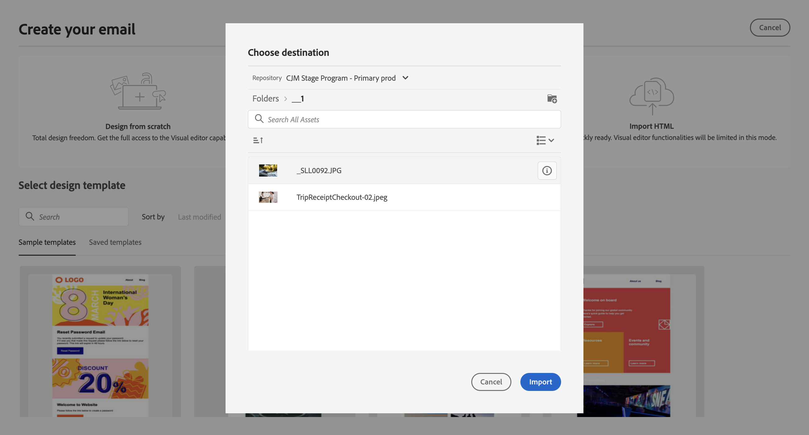

# Enviar seu primeiro email {#first-email}

Saiba como criar seu primeiro email direcionado. Nesse caso de uso, você agenda o envio de um email para membros de fidelidade Silver e Gold em uma data específica.

Com base em um modelo de design predefinido, o email também apresenta conteúdo personalizado com base nos atributos do perfil do cliente.

## Criar o email {#create-email}

>[!CONTEXTUALHELP]
>id="acw_deliveries_email_template_selection"
>title="Selecionar um template de email"
>abstract="Um template de email é uma configuração de delivery específica que contém configurações predefinidas, como regras de tipologia, personalização ou parâmetros de roteamento. Os modelos são definidos no console do cliente Campaign."

>[!CONTEXTUALHELP]
>id="acw_deliveries_email_properties"
>title="Propriedades de email"
>abstract="As propriedades são os parâmetros de delivery comuns que ajudam a nomear e classificar o delivery. Se o delivery for baseado em um schema estendido definido no console do Adobe Campaign v8, alguns **Opções personalizadas** estão disponíveis."

1. Para criar um novo delivery, acesse **[!UICONTROL Deliveries]** e selecione **[!UICONTROL Email]** como canal.

1. Selecione o modelo que deseja usar e clique em **[!UICONTROL Criar delivery]**.

   >[!NOTE]
   >
   >Os modelos são configurações de delivery pré-definidas salvas para uso futuro. Eles podem ser criados por usuários administradores no console do Adobe Campaign. [Saiba como trabalhar com templates do delivery](https://experienceleague.adobe.com/docs/campaign/campaign-v8/campaigns/send/create-templates.html){target="_blank"}.

   

1. Forneça um rótulo para o email e configure opções adicionais com base em suas necessidades:

   * **[!UICONTROL Nome interno]**: atribuir um identificador exclusivo ao delivery,
   * **[!UICONTROL Pasta]**: armazene o delivery em uma pasta específica,
   * **[!UICONTROL Código de delivery]**: use esse campo para organizar seus deliveries com base em sua própria convenção de nomenclatura,
   * **[!UICONTROL Descrição]**: especifique uma descrição para o delivery,
   * **[!UICONTROL Natureza]**: especifique a natureza do email para fins de classificação.<!--The content of the list is defined in the delivery template selected when creating the email.-->

   >[!NOTE]
   >
   >Se você tiver estendido seu esquema com campos personalizados específicos, poderá acessá-los na **[!UICONTROL Opções personalizadas]** seção.

   

   Além disso, as configurações avançadas, como regras de tipologia e target mappings, podem ser acessadas clicando no botão localizado ao lado do nome do delivery. Essas configurações são pré-configuradas no template selecionado, mas podem ser editadas conforme necessário para esse email específico.

## Criar o conteúdo do email {#create-content}

>[!CONTEXTUALHELP]
>id="acw_homepage_card3"
>title="Saiba como criar o conteúdo de email"
>abstract="Saiba como usar o Designer de email."

Nesse caso de uso, você usa um modelo predefinido para projetar nosso email.

Instruções detalhadas sobre como configurar o conteúdo de email estão disponíveis em [esta seção](../content/edit-content.md).

1. Para começar a criar o conteúdo do email, clique no link **[!UICONTROL Editar conteúdo]** botão.

   Isso leva você a uma interface dedicada, onde é possível configurar o conteúdo do email e projetá-lo usando o Designer de email.

   

1. Insira a linha de assunto do email e personalize-a usando o Editor de expressão. [Saiba como personalizar seu conteúdo](../personalization/personalize.md)

   

1. Para projetar o corpo do email, clique no link **[!UICONTROL Editar corpo do email]** botão.

   Escolha o método a ser usado para criar o conteúdo de email. Neste exemplo, use um modelo de design predefinido.

   

<!--1. Select the HTML or ZIP file to import then click **[!UICONTROL Next]**.

    If your folder contains assets, choose the instance and folder where they should be stored then click **[!UICONTROL Import]**. (+ link to doc on assets?)

    -->

1. Após selecionar o modelo, ele é exibido no Designer de email, onde é possível fazer as edições necessárias e adicionar a personalização.

   Por exemplo, para adicionar personalização ao título do email, selecione o bloco de componentes e clique em **[!UICONTROL Adicionar personalização]**.

   

1. Quando estiver satisfeito com o conteúdo, salve e feche o design. Clique em **[!UICONTROL Salvar]** para retornar à tela de criação do email.

   

## Definir a audiência {#define-audience}

>[!CONTEXTUALHELP]
>id="acw_deliveries_email_audience"
>title="Definir a audiência"
>abstract="Selecione o melhor público-alvo para sua mensagem de marketing. Você pode escolher um público-alvo existente já definido em uma instância do Campaign v8 ou no Adobe Experience Platform, ou criar um novo público-alvo com o construtor de regras."

Nesse caso de uso, você envia o email para um público existente. Instruções adicionais sobre como trabalhar com públicos-alvo estão disponíveis em [esta seção](../audience/about-audiences.md).

1. Para selecionar o público do email, clique no link **[!UICONTROL Seleção do público-alvo]** e escolha um público-alvo existente na lista.

   Neste exemplo, queremos usar um público-alvo existente direcionado a clientes que pertencem aos níveis de pontos de fidelidade de prata e ouro.

   

   >[!NOTE]
   >
   >Os públicos-alvo disponíveis na lista são originários da instância do Campaign v8 ou do Adobe Experience Platform, se a integração de Destino/Fontes tiver sido configurada em sua instância.
   >
   >A integração de Destino/Fontes permite enviar segmentos do Experience Platform para o Adobe Campaign e enviar o delivery do Campaign e os logs de rastreamento para o Adobe Experience Platform. [Saiba como trabalhar com o Campaign e o Adobe Experience Platform](https://experienceleague.adobe.com/docs/campaign/campaign-v8/connect/ac-aep.html){target="_blank"}.

1. Depois que o público-alvo é selecionado, você pode refinar mais o público-alvo aplicando regras adicionais.

   Você também pode definir um grupo de controle para analisar o comportamento dos destinatários de email em comparação com aqueles que não foram direcionados. [Saiba como trabalhar com grupos de controle](../audience/control-group.md)

   

## Programar o envio {#schedule}

>[!CONTEXTUALHELP]
>id="acw_deliveries_email_schedule"
>title="Programar o envio"
>abstract="Defina a data e a hora exata para seu envio. Ao escolher o horário mais apropriado para sua mensagem de marketing, você pode maximizar as taxas de abertura."

Para agendar o envio do email, clique em **[!UICONTROL Habilitar]** e defina a data e a hora desejadas para o envio.

Por padrão, a variável **[!UICONTROL Confirmar antes de enviar]** estiver ativada, exigindo que você confirme o envio antes que o email seja enviado na data e hora programadas. Se desejar enviar o email automaticamente na data e hora agendadas, desative essa opção.

## Visualizar e testar o email {#preview-test}

Antes de enviar seu email, você pode pré-visualizá-lo e testá-lo para garantir que ele atenda às suas expectativas.

Nesse caso de uso, você visualiza o email e envia versões de teste para endereços de email específicos enquanto representa alguns dos perfis direcionados.

Informações adicionais sobre como visualizar e testar emails estão disponíveis em [esta seção](../preview-test/preview-test.md).

1. Para revisar e enviar o email, clique em **[!UICONTROL Revisar e enviar]**. Isso exibe uma pré-visualização do email, juntamente com todas as propriedades, público-alvo e programação configurados. Você pode editar qualquer um desses elementos clicando no botão modificar .

1. Para visualizar o email e enviar versões de teste, clique no link **[!UICONTROL Simular conteúdo]** botão.

   

1. No lado esquerdo, selecione os perfis que deseja usar para visualizar o email.

   O painel direito exibe uma visualização do email com base no perfil selecionado. Se você tiver adicionado vários perfis, é possível alternar entre eles para visualizar o email correspondente.

   

   <!-- !NOTE
    >
    >Additionally, the **[!UICONTROL Render email]** button allows you to preview the email using mutiple devices or mail providers. Learn on how to preview email rendering-->

1. Para enviar versões de teste do seu email, clique no link **[!UICONTROL Teste]** em seguida, escolha o modo que deseja usar.

   Neste exemplo, use o **[!UICONTROL Substituir do target principal]** , que envia versões de teste para endereços de email específicos enquanto representa alguns dos perfis direcionados pelo email.

   

1. Clique em **[!UICONTROL Adicionar endereço]** e especifique os endereços de email que recebem as versões de teste.

   Para cada endereço de email, selecione o perfil a ser representado. Você também pode permitir que o Adobe Campaign selecione um perfil aleatório no target.

   

1. Clique em **[!UICONTROL Enviar email de teste]** e confirme o envio.

   As versões de teste são enviadas para os endereços de email especificados usando o perfil selecionado com o **[Prova x]** prefixo.

   

   Você pode verificar o status do envio e acessar os emails de teste enviados a qualquer momento clicando no link **[!UICONTROL Exibir log de email de teste]** na tela simular conteúdo.

## Enviar e monitorar o email {#prepare-send}

Após revisar e testar seu email, você pode iniciar sua preparação e enviá-lo.

1. Para iniciar a preparação do email, clique em **[!UICONTROL Preparar]**. [Saiba como preparar um email](../monitor/prepare-send.md)

   

1. Depois que o email estiver pronto para ser enviado, clique no link **[!UICONTROL Enviar]** botão (ou **[!UICONTROL Enviar conforme agendado]** caso tenha agendado seu envio) e confirme o envio.

1. Durante o processo de envio, você pode acompanhar seu progresso e exibir estatísticas em tempo real diretamente nessa tela.

   

   Você também pode acessar informações detalhadas sobre o envio clicando no link **[!UICONTROL Logs]** botão. [Saiba como monitorar logs do delivery](../monitor/delivery-logs.md)

1. Depois que o email tiver sido enviado, você poderá acessar os relatórios dedicados para análise adicional clicando no link **[!UICONTROL Relatório]** botão.

