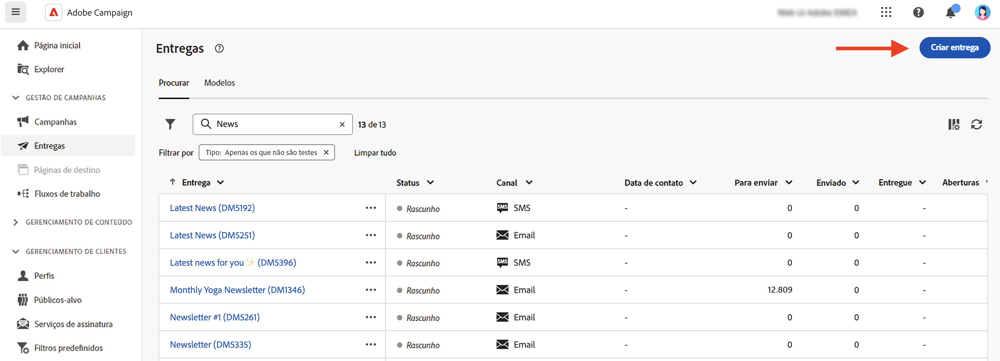
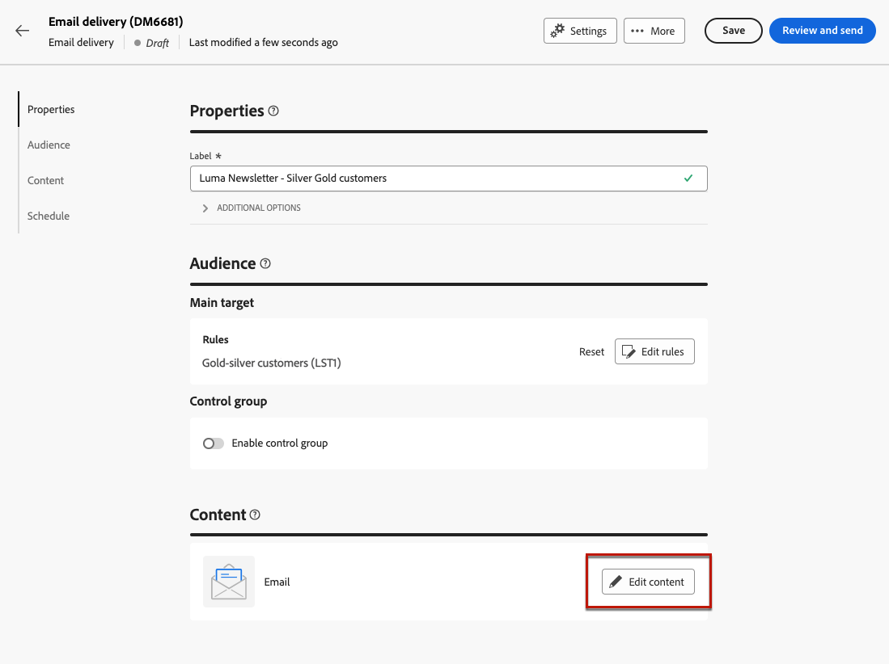

# Criar seu primeiro email {#first-email}

>[!CONTEXTUALHELP]
>id="acw_homepage_learning_card3"
>title="Introdução a emails"
>abstract="Você pode gerar uma entrega de email independente ou criar um email no contexto de um fluxo de trabalho de campanha. Saiba como gerar a entrega, selecionar o público-alvo e criar o conteúdo do email."

Saiba como criar seu primeiro email direcionado. Nesse caso de uso, você agendará uma data específica para o envio de um email para membros do programa de fidelidade de nível prata e ouro.

Com base em um [modelo de design](../email/create-email-templates.md) predefinido, o email também apresenta conteúdo personalizado com base nos atributos do perfil do cliente.

➡️ [Descubra este recurso no vídeo](#video)

## Criar a entrega de email {#create-email}

>[!CONTEXTUALHELP]
>id="acw_deliveries_email_template_selection"
>title="Selecionar um modelo de email"
>abstract="Um modelo de email é uma configuração específica de entrega que contém configurações predefinidas, como regras de tipologia, personalização ou parâmetros de roteamento. Os modelos são definidos no console do cliente do Campaign."

>[!CONTEXTUALHELP]
>id="acw_deliveries_email_properties"
>title="Defina as propriedades do email"
>abstract="As propriedades são os parâmetros de entrega comuns que ajudam a nomear e classificar a entrega. As configurações adicionais são opcionais. Se a entrega for baseada em um schema estendido definido no console do Adobe Campaign v8, alguns campos de **Opções personalizadas** estarão disponíveis."

Você pode gerar uma entrega de email independente ou criar um email no contexto de um fluxo de trabalho de campanha. As etapas abaixo detalham o procedimento para um delivery de email independente (único). Saiba mais sobre as etapas de criação de entrega no Adobe Campaign em [esta página](../msg/gs-deliveries.md).

Para criar um novo delivery de email independente, siga as etapas abaixo.

1. Navegue até o menu **[!UICONTROL Entregas]** no painel esquerdo e clique no botão **[!UICONTROL Criar entrega]**.

   

1. Selecione **[!UICONTROL Email]** como canal e escolha um modelo de entrega de email na lista.

   >[!NOTE]
   >
   >Os templates são configurações de entrega predefinidas salvas para uso futuro. [Saiba mais](../msg/delivery-template.md)

   {zoomable="yes"}

1. Clique no botão **[!UICONTROL Criar entrega]** para confirmar.
1. Insira um rótulo para a entrega e configure as opções adicionais com base em suas necessidades:

   * **[!UICONTROL Nome interno]**: atribua um identificador exclusivo à entrega.
   * **[!UICONTROL Pasta]**: armazene a entrega em uma pasta específica.
   * **[!UICONTROL Código de entrega]**: use este campo para organizar suas entregas com base em sua própria convenção de nomenclatura.
   * **[!UICONTROL Descrição]**: especifique uma descrição para a entrega.
   * **[!UICONTROL Natureza]**: especifica a natureza do email para fins de classificação.<!--The content of the list is defined in the delivery template selected when creating the email.-->

   >[!NOTE]
   >
   >Se tiver estendido seu schema com campos personalizados específicos, será possível acessá-los na seção **[!UICONTROL Opções personalizadas]**.

   {zoomable="yes"}

1. Além disso, as configurações avançadas, como regras de tipologia e mapeamentos de destino, podem ser acessadas por meio do botão **[!UICONTROL Configurações]**, localizado na parte superior direita da tela. Essas configurações são pré-definidas no modelo selecionado, mas podem ser editadas conforme necessário para esse email específico. [Saiba mais](../advanced-settings/delivery-settings.md)

## Definir o público-alvo {#define-audience}

>[!CONTEXTUALHELP]
>id="acw_deliveries_email_audience"
>title="Selecione um público-alvo para a entrega"
>abstract="Selecione o melhor público-alvo para a sua mensagem de marketing. É possível escolher um público-alvo existente (já definido em uma instância do Campaign v8 ou na Adobe Experience Platform), criar um novo usando o modelador de consulta ou fazer upload de um arquivo que contenha o público-alvo. Os grupos de controle não estão habilitados para a opção **Selecionar do arquivo** e vice-versa."
>additional-url="https://experienceleague.adobe.com/docs/campaign-web/v8/audiences/target-audiences/add-audience.html?lang=pt-BR" text="Selecione os públicos-alvo principais"
>additional-url="https://experienceleague.adobe.com/docs/campaign-web/v8/audiences/target-audiences/control-group.html?lang=pt-BR" text="Definir um grupo de controle"

Nesse caso de uso, você enviará o email para um público-alvo existente.

Instruções adicionais sobre como trabalhar com públicos-alvo estão disponíveis [nesta seção](../audience/about-recipients.md).

1. Para selecionar o público do email, clique no botão **[!UICONTROL Selecionar público-alvo]** e escolha um público existente na lista.

   Neste exemplo, queremos usar um público-alvo existente direcionado a clientes que pertencem aos níveis prata e ouro do programa de fidelidade.

   {zoomable="yes"}

   >[!NOTE]
   >
   >Os públicos disponíveis na lista são originários da instância do Campaign v8 ou da Adobe Experience Platform se a integração Destino/Source tiver sido configurada na instância. Essa integração permite enviar segmentos de Experience Platform para o Adobe Campaign e enviar o delivery do Campaign e os logs de rastreamento para o Adobe Experience Platform. Saiba como trabalhar com o Campaign e o Adobe Experience Platform na [documentação do Campaign v8 (console do cliente)](https://experienceleague.adobe.com/docs/campaign/campaign-v8/connect/ac-aep/ac-aep.html){target="_blank"}.

1. Depois que o público-alvo é selecionado, você pode refinar o público-alvo aplicando regras adicionais.

   {zoomable="yes"}

1. Você também pode definir um grupo de controle para analisar o comportamento dos destinatários de email, em comparação com aqueles que não foram direcionados. [Saiba como trabalhar com grupos de controle](../audience/control-group.md)

## Definir o conteúdo do email {#create-content}

Para começar a criar seu conteúdo de email, siga as etapas abaixo. Nesse caso de uso, você usa um [modelo de entrega](../msg/delivery-template.md) de email predefinido para criar seu email.<!--TBC delivery template or email content template?-->

<!--Detailed instructions on how to configure the email content are available in [this section](../email/edit-content.md).-->

1. No painel de delivery de email, clique no botão **[!UICONTROL Editar conteúdo]**.

   {zoomable="yes"}

   Isso leva você a uma interface dedicada, onde é possível configurar o conteúdo do email e acessar o Designer de email. [Saiba mais](edit-content.md)

   {zoomable="yes"}

1. Insira a linha de assunto do email e personalize-a usando o Editor de expressão. [Saiba como personalizar o conteúdo](../personalization/personalize.md)

   {zoomable="yes"}

1. Para criar o conteúdo do email, clique no botão **[!UICONTROL Editar corpo do email]**.

   Escolha o método a ser usado para criar o conteúdo de email. Neste exemplo, use um [modelo de conteúdo predefinido](create-email-templates.md).

   {zoomable="yes"}

1. Após selecionar o modelo, ele será exibido no [Designer de Email](create-email-content.md), onde você poderá fazer as edições necessárias e adicionar personalização.

   Por exemplo, para personalizar o título do email, selecione o bloco de componentes e clique em **[!UICONTROL Adicionar personalização]**.

   {zoomable="yes"}

1. Quando estiver satisfeito com o conteúdo, salve e feche o design. Clique em **[!UICONTROL Salvar]** para retornar à tela de criação do email.

   {zoomable="yes"}

## Agendar o envio {#schedule}

Quando uma entrega é enviada no contexto de um fluxo de trabalho, você deve usar a atividade **Scheduler**. Saiba mais em [esta página](../workflows/activities/scheduler.md). As etapas abaixo se aplicam apenas aos deliveries independentes.

1. Navegue até a seção **[!UICONTROL Agendamento]** das propriedades de entrega.

1. Use o botão de alternância **[!UICONTROL Habilitar agendamento]** para ativá-lo.

1. Defina a data e a hora desejadas para envio.

   {zoomable="yes"}

Depois que você envia o delivery, o envio real começa na data de contato definida.

Saiba mais sobre o agendamento de entrega em [esta seção](../msg/gs-deliveries.md#schedule-the-delivery-sending).

## Pré-visualizar um email e enviar provas {#preview-test}

Antes de enviar um email, você pode visualizá-lo e testá-lo para garantir que ele atenda às suas expectativas.

Nesse caso de uso, você pré-visualiza o email e envia provas para endereços de email específicos enquanto representa alguns dos perfis direcionados.

Informações adicionais sobre como visualizar um email e enviar provas estão disponíveis em [esta seção](../preview-test/preview-test.md).

1. Para revisar seu email, clique em **[!UICONTROL Revisar e enviar]**. Isso exibe uma visualização do email, juntamente com todas as propriedades, o público-alvo e o agendamento configurados. Você pode editar qualquer um desses elementos clicando no botão Modificar.

1. Para visualizar o email e enviar provas, clique no botão **[!UICONTROL Simular conteúdo]**.

   {zoomable="yes"}

1. No lado esquerdo, selecione os perfis que deseja usar para visualizar o email.

   O painel direito exibe uma visualização do email com base no perfil selecionado. Se você tiver adicionado vários perfis, é possível alternar entre eles para visualizar o email correspondente.

   {zoomable="yes"}

   <!--Additionally, the **[!UICONTROL Render email]** button allows you to preview the email using mutiple devices or mail providers. Learn on how to preview email rendering
    -->

1. Para enviar provas, clique no botão **[!UICONTROL Enviar provas]** e escolha o modo que deseja usar.

   Neste exemplo, use o modo **[!UICONTROL Substituir do público-alvo principal]**, que envia provas para endereços de email específicos enquanto representa alguns dos perfis direcionados pelo email.

   {zoomable="yes"}

1. Clique em **[!UICONTROL Adicionar endereço]** e especifique os endereços de email que receberão as provas.

   Para cada endereço de email, selecione o perfil a ser representado. Você também pode permitir que o Adobe Campaign selecione um perfil aleatório do público alvo.

   {zoomable="yes"}

1. Clique em **[!UICONTROL Enviar prova]** e confirme o envio.

   As provas são enviadas para os endereços de email especificados usando o perfil selecionado com o prefixo **[Prova x]**.

   {zoomable="yes"}

   Você pode verificar o status do envio e acessar as provas enviadas a qualquer momento clicando no botão **[!UICONTROL Exibir provas]** na tela de conteúdo simulado.

## Enviar e monitorar o email {#prepare-send}

Após revisar e testar seu email, você pode iniciar sua preparação e envio.

1. Para iniciar a preparação do email, clique em **[!UICONTROL Preparar]**. [Saiba como preparar um email](../monitor/prepare-send.md)

   {zoomable="yes"}

1. Depois que o email estiver pronto para ser enviado, clique no botão **[!UICONTROL Enviar]** (ou em **[!UICONTROL Enviar conforme agendado]** caso tenha agendado seu envio) e confirme o envio.

1. Durante o processo de envio, você pode acompanhar seu progresso e exibir estatísticas em tempo real diretamente nessa tela.

   {zoomable="yes"}

   <!--
    {zoomable="yes"}-->

   Você também pode acessar informações detalhadas sobre o envio clicando no botão **[!UICONTROL Logs]**. [Saiba como monitorar os logs de entrega](../monitor/delivery-logs.md)

1. Depois que o email tiver sido enviado, você poderá acessar os relatórios dedicados para análise adicional clicando no botão **[!UICONTROL Relatórios]**.

{zoomable="yes"}

## Vídeo tutorial {#video}

Saiba como criar uma entrega por email do zero, definir o público-alvo, criar o conteúdo, simular a pré-visualização e enviar uma prova.

>[!VIDEO](https://video.tv.adobe.com/v/3425866/?quality=12)
