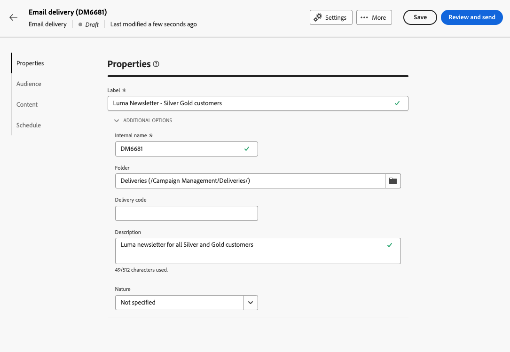

# Enviar seu primeiro email {#first-email}

Este caso de uso apresenta como criar seu primeiro email. Vamos agendar o envio de um email em uma data específica para clientes de fidelidade prata e ouro. Esse email será projetado usando um template predefinido e incluirá a personalização usando atributos do perfil.

## Criar o email {#create-email}

>[!CONTEXTUALHELP]
>id="acw_deliveries_email_template_selection"
>title="Selecionar um template de email"
>abstract="Um modelo é definido no console do Adobe Campaign v8. Essa é uma configuração de delivery específica que contém parâmetros predefinidos, como regras de tipologia, personalização ou parâmetros de roteamento."

>[!CONTEXTUALHELP]
>id="acw_deliveries_email_properties"
>title="Propriedades de email"
>abstract="As propriedades são os parâmetros de delivery comuns que ajudam a nomear e classificar o delivery. Se o delivery for baseado em um schema estendido definido no console do Adobe Campaign v8, alguns **Opções personalizadas** estão disponíveis."

1. Crie um novo delivery a partir do **[!UICONTROL Deliveries]** menu.

1. Selecione o **[!UICONTROL Email]** e o modelo a ser usado e clique em **[!UICONTROL Criar]**.

   >[!NOTE]
   >
   >Um template é uma configuração de delivery específica que foi salva como um template para ser reutilizada. Os templates de delivery são configurados pelos usuários administradores no console Adobe Campaign. [Saiba como trabalhar com templates do delivery](https://experienceleague.adobe.com/docs/campaign-classic/using/sending-messages/using-delivery-templates/about-templates.html?lang=pt-BR){target=&quot;_blank&quot;}

   

1. Forneça um rótulo para o email e configure opções adicionais com base em suas necessidades:

   * **[!UICONTROL Nome interno]**: atribuir um identificador exclusivo ao delivery,
   * **[!UICONTROL Pasta]**: armazene o delivery em uma pasta específica,
   * **[!UICONTROL Código de delivery]**: use esse campo para organizar seus deliveries com base em sua própria convenção de nomenclatura,
   * **[!UICONTROL Descrição]**: especifique uma descrição para o delivery,
   * **[!UICONTROL Natureza]**: especifique a natureza do email para fins de classificação.<!--The content of the list is defined in the delivery template selected when creating the email.-->

   >[!NOTE]
   >
   >Se você tiver estendido seu esquema com campos personalizados específicos, poderá acessá-los a partir do **[!UICONTROL Opções personalizadas]** seção.

   

   Além disso, configurações avançadas (regra de tipologia, target mappings etc.) estão disponíveis no botão , localizado ao lado do nome do delivery. Eles são predefinidos no template selecionado ao criar o email. Você pode editá-las, se necessário.

## Criar o conteúdo do email {#create-content}

>[!CONTEXTUALHELP]
>id="acw_homepage_card3"
>title="Saiba como criar seu conteúdo de email usando o Designer de email."
>abstract="Saiba como criar seu conteúdo"

Nesse caso de uso, vamos projetar o email usando um template predefinido. Informações detalhadas sobre como configurar o conteúdo de email estão disponíveis em [esta seção](../content/edit-content.md).

1. Clique no botão **[!UICONTROL Editar conteúdo]** para começar a criar o conteúdo do email.

   Essa tela permite que você configure o conteúdo do email e o projete usando o Designer de email.

   

1. Especifique o assunto do seu email e personalize-o usando o Editor de expressão. [Saiba como personalizar seu conteúdo](../personalization/personalize.md)

   

1. Clique no botão **[!UICONTROL Editar corpo do email]** para criar e criar o conteúdo do email.

   Escolha o método a ser usado para criar o conteúdo de email. Neste exemplo, queremos usar um modelo de design existente.

   

<!--1. Select the HTML or ZIP file to import then click **[!UICONTROL Next]**.

    If your folder contains assets, choose the instance and folder where they should be stored then click **[!UICONTROL Import]**. (+ link to doc on assets?)

    -->

1. Após selecionar o modelo, ele é exibido no Designer de email, permitindo que você o edite, se necessário, e adicione personalização.

   Neste exemplo, queremos adicionar personalização ao título do email. Para fazer isso, selecione o bloco de componentes e clique em **[!UICONTROL Adicionar personalização]**.

   

1. Quando o conteúdo estiver pronto, salve-o e clique na seta para voltar à tela de criação de email.

   

## Definir a audiência {#define-audience}

>[!CONTEXTUALHELP]
>id="acw_deliveries_email_audience"
>title="Definir a audiência"
>abstract="Selecione o melhor público-alvo para sua mensagem de marketing. Você pode escolher um público-alvo existente já definido em uma instância do Campaign v8 ou no Adobe Experience Platform, ou pode optar por criar um novo público-alvo com o construtor de regras."

Nesse caso de uso, enviaremos o email para um público existente. Informações adicionais sobre como trabalhar com públicos-alvo estão disponíveis em [esta seção](../audience/about-audiences.md).

1. Clique no botão **[!UICONTROL Seleção do público-alvo]** em seguida, escolha um público-alvo existente para direcionar.

   Neste exemplo, queremos usar um público-alvo existente direcionado a clientes que pertencem aos níveis de pontos de fidelidade de prata e ouro.

   

   >[!NOTE]
   >
   >Os públicos-alvo disponíveis na lista são originários da instância do Campaign V8 ou do Adobe Experience Platform, se a integração de Destino/Fontes tiver sido configurada em sua instância.
   >
   >A integração de Destino/Fontes permite enviar segmentos do Experience Platform para o Adobe Campaign e enviar o delivery do Campaign e os logs de rastreamento para o Adobe Experience Platform. [Saiba como trabalhar com o Campaign e o Adobe Experience Platform](https://experienceleague.adobe.com/docs/campaign/campaign-v8/connect/ac-aep.html)

1. Após selecionar o público-alvo, é possível refinar o público-alvo usando regras adicionais.

   Você também pode definir um grupo de controle para analisar o comportamento dos destinatários de email em comparação ao comportamento dos perfis que não foram direcionados. [Saiba como trabalhar com grupos de controle](../audience/control-group.md)

## Programar o envio {#schedule}

>[!CONTEXTUALHELP]
>id="acw_deliveries_email_schedule"
>title="Programar o envio"
>abstract="Defina a data e a hora exata para seu envio. Ao escolher o horário mais apropriado para sua mensagem de marketing, você maximizará as taxas de abertura."

Para agendar o envio do email, clique em **[!UICONTROL Habilitar]** em seguida, especifique a data e a hora desejadas para o envio.

Por padrão, a variável **[!UICONTROL Confirmar antes de enviar]** estiver ativada, o que significa que será necessário confirmar o envio para permitir que o email seja enviado na data e hora especificadas. Desative essa opção para permitir que o email seja enviado na data e hora agendadas, sem nenhuma confirmação necessária.

## Visualizar e testar o email {#preview-test}

Quando o email estiver pronto, você poderá pré-visualizá-lo e testá-lo antes de iniciar seu envio.

Nesse caso de uso, vamos pré-visualizar o email e enviar uma prova usando perfis existentes.

Informações adicionais sobre como visualizar e testar emails estão disponíveis em [esta seção](../preview-test/preview-test.md).

1. Clique em **[!UICONTROL Revisar para enviar]**. É exibida uma visualização do email, juntamente com todas as propriedades, público-alvo e programação configurados. Você pode editar qualquer um desses elementos usando o botão modificar .

1. Clique no botão **[!UICONTROL Simular conteúdo]** para visualizar o email e enviar provas.

   

1. Na área do lado esquerdo, selecione os perfis que serão usados para visualizar o email.

1. Uma visualização do email é exibida no painel direito com base no perfil selecionado. Se você tiver adicionado vários perfis, é possível alternar entre eles para visualizar o email correspondente.

   

   <!-- !NOTE
    >
    >Additionally, the **[!UICONTROL Render email]** button allows you to preview the email using mutiple devices or mail providers. Learn on how to preview email rendering-->

1. Para enviar provas do seu email, clique no link **[!UICONTROL Teste]** em seguida, selecione os perfis que receberão a prova.

   <!--TO REPLACE WITH SUBSTITUTION PROFILE-->In this example, we want to send the proofs to a specific test profile, which is a seed address that is not part of the target. [Learn how to work with seed addresses](https://experienceleague.adobe.com/docs/campaign-classic/using/sending-messages/using-seed-addresses/about-seed-addresses.html){target="_blank"}

   

   >[!NOTE]
   >
   >Você também pode testar suas mensagens representando alguns dos perfis segmentados e enviando a mensagem de prova para o endereço de email de sua escolha. [Saiba como enviar provas](../preview-test/preview-test.md)

1. Clique em **[!UICONTROL Enviar email de teste]** em seguida, confirme o envio.

   Depois que as provas forem enviadas, você poderá verificar seu status clicando no botão **[!UICONTROL Exibir log de email de teste]** botão.

## Enviar e monitorar o email {#prepare-send}

Depois de revisar e testar seu email, você pode iniciar a preparação e enviá-lo.

1. Clique em **[!UICONTROL Preparar]** para iniciar a preparação da mensagem. [Saiba como preparar um email](../monitor/prepare-send.md)

   

1. Depois que o email estiver pronto para ser enviado, clique em **[!UICONTROL Enviar]** em seguida, confirme o envio.

   Você pode rastrear o envio em tempo real, juntamente com as estatísticas. Além disso, a variável **[!UICONTROL Logs]** permite acessar informações detalhadas sobre o envio do email. [Saiba como monitorar logs do delivery](../monitor/delivery-logs.md)
   

1. Depois que o email tiver sido enviado, você poderá acessar os [relatórios](../reporting/reports.md) para efeitos de análise complementar.

   
