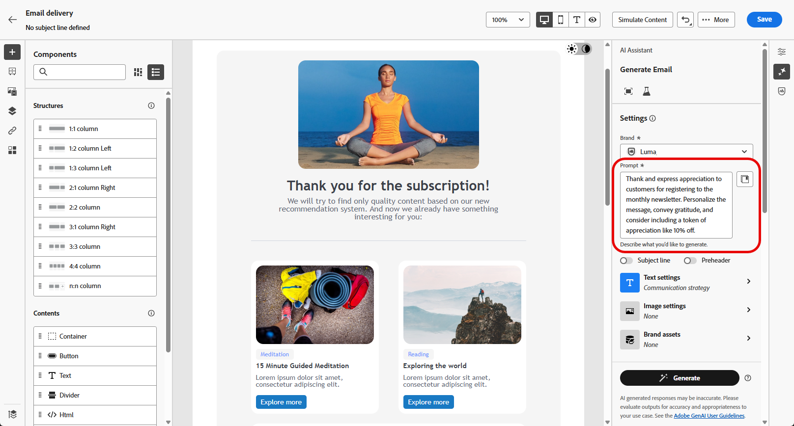
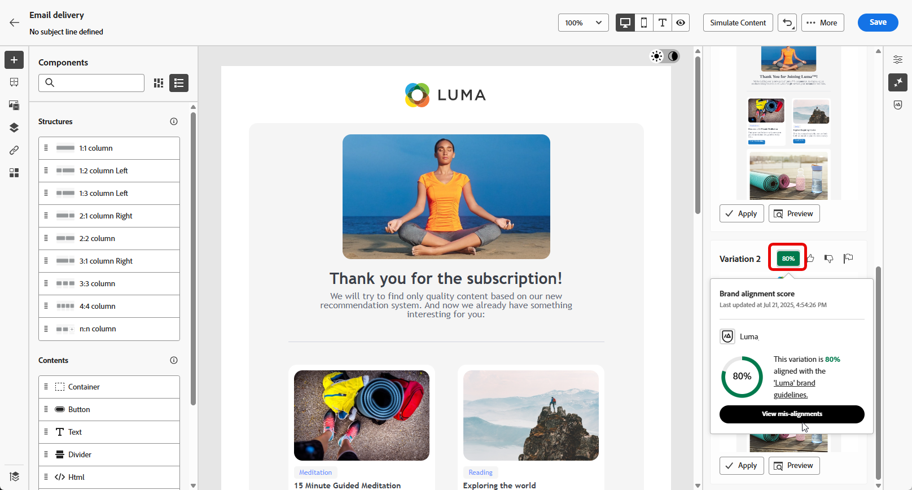
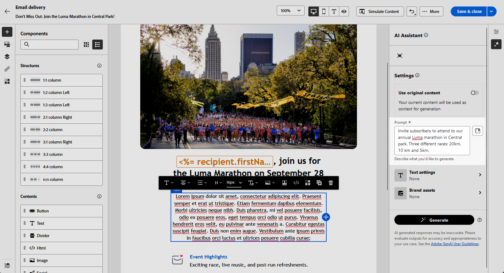

# Geração de email com o Assistente de IA {#generative-content}

>[!IMPORTANT]
>
>Antes de começar a usar este recurso, leia as [Medidas de Proteção e Limitações](generative-gs.md#generative-guardrails) relacionadas.
>> 
>
>Você deve concordar com um [contrato de usuário](https://www.adobe.com/legal/licenses-terms/adobe-dx-gen-ai-user-guidelines.html){target="_blank"} antes de usar o Assistente de IA no Adobe Campaign Web. Para mais informações, entre em contato com o seu representante da Adobe.

Depois de criar e personalizar seus emails, use o Assistente de IA no Adobe Campaign Web para aprimorar seu conteúdo.

O Assistente de IA no Adobe Campaign Web ajuda a otimizar o impacto de seus deliveries, gerando emails inteiros, conteúdo de texto direcionado e imagens personalizadas para repercutir com seu público-alvo. Isso melhora suas campanhas de email para melhorar o engajamento.

Com suas campanhas de email, use o Assistente de IA para gerar emails, texto ou imagens completos. Explore as guias abaixo para saber como usar o Assistente de IA no Adobe Campaign Web.

>[!BEGINTABS]

>[!TAB Geração de email completa]

No exemplo a seguir, use o Assistente de IA no Adobe Campaign Web para refinar um email existente, personalizando-o para um evento especial.

1. Depois de criar e configurar o delivery de email, clique em **[!UICONTROL Editar conteúdo]**.

   Para obter mais informações sobre como configurar a entrega de emails, consulte [esta página](../email/create-email-content.md).

1. Personalize seu layout conforme necessário e acesse o menu do **[!UICONTROL Assistente de IA]**.

   {zoomable="yes"}

1. Habilite a opção **[!UICONTROL Usar conteúdo original]** para que o Assistente de IA personalize o novo conteúdo com base no conteúdo selecionado.

1. Ajuste o conteúdo descrevendo o que você deseja gerar no campo **[!UICONTROL Prompt]**.

   Se precisar de ajuda para criar seu prompt, acesse a **[!UICONTROL Biblioteca de Prompts]**, que fornece diversas ideias de prompt para melhorar suas entregas.

   {zoomable="yes"}

1. Alterne a **[!UICONTROL Linha de assunto]** ou o **[!UICONTROL Pré-cabeçalho]** para incluí-los na geração da variante.

1. Personalize seu prompt usando a opção **[!UICONTROL Configurações de texto]**:

   * **[!UICONTROL Estratégia de comunicação]**: escolha o estilo de comunicação mais adequado para o texto gerado.
   * **[!UICONTROL Tone]**: verifique se o tom do seu email está de acordo com o seu público-alvo. Se você quiser soar informativo, divertido ou persuasivo, o Assistente de IA adapta a mensagem de acordo.

   {zoomable="yes"}

1. Escolha suas **[!UICONTROL configurações de imagem]**:

   * **[!UICONTROL Tipo de conteúdo]**: categorize a natureza do elemento visual, distinguindo entre diferentes formas de representação visual, como fotos, gráficos ou arte.
   * **[!UICONTROL Intensidade visual]**: controle o impacto da imagem ajustando sua intensidade. Uma configuração mais baixa (2) cria uma aparência mais suave, enquanto uma configuração mais alta (10) torna a imagem mais vibrante.
   * **[!UICONTROL Cor e tom]**: ajuste a aparência geral das cores e o humor ou atmosfera transmitidos.
   * **[!UICONTROL Iluminação]**: modifique a iluminação na imagem para moldar sua atmosfera e destacar elementos específicos.
   * **[!UICONTROL Composição]**: organizar elementos dentro do quadro da imagem.

1. No menu **[!UICONTROL Ativos de marca]**, clique em **[!UICONTROL Carregar ativo de marca]** para adicionar qualquer ativo de marca que forneça contexto adicional ao Assistente de IA ou selecione um que tenha sido carregado anteriormente.

   Os arquivos carregados anteriormente estão disponíveis no menu suspenso **[!UICONTROL Ativos de marca carregados]**. Alterne os ativos que deseja incluir na geração.

   {zoomable="yes"}

1. Quando o prompt estiver pronto, clique em **[!UICONTROL Gerar]**.

1. Navegue pelas **[!UICONTROL Variações]** geradas e clique em **[!UICONTROL Visualizar]** para exibir uma versão em tela inteira da variação selecionada ou **[!UICONTROL Aplicar]** para substituir o conteúdo atual.

1. Clique no ícone de porcentagem para exibir sua **[!UICONTROL Pontuação de alinhamento da marca]** e identificar quaisquer desalinhamentos com sua marca.

   Saiba mais sobre [Pontuação de alinhamento da marca](../content/brands-score.md).

   {zoomable="yes"}

1. Navegue até a opção **[!UICONTROL Refinar]** na janela **[!UICONTROL Visualizar]** para acessar recursos de personalização adicionais:

   * **[!UICONTROL Refrase]**: o Assistente de IA reformula sua mensagem de maneiras diferentes, mantendo sua escrita atualizada e envolvente para públicos-alvo diversos.
   * **[!UICONTROL Usar linguagem mais simples]**: simplifique sua linguagem para garantir clareza e acessibilidade para um público-alvo maior.

   Você também pode alterar o **[!UICONTROL Tom]** e a **[!UICONTROL estratégia de comunicação]** do seu texto.

   {zoomable="yes"}

1. Abra a guia **[!UICONTROL Alinhamento da marca]** para ver como o seu conteúdo se alinha às suas [diretrizes da marca](../content/brands.md).

1. Clique em **[!UICONTROL Selecionar]** depois de encontrar o conteúdo apropriado.

1. Insira campos de personalização para personalizar seu conteúdo de email com base nos dados do perfil. Em seguida, clique no botão **[!UICONTROL Simular conteúdo]** para controlar a renderização e verificar as configurações de personalização com perfis de teste. [Saiba mais](../preview-test/preview-content.md)

Ao definir seu conteúdo, público-alvo e programação, prepare sua entrega de email. [Saiba mais](../monitor/prepare-send.md)

>[!TAB Geração somente texto]

No exemplo a seguir, use o Assistente de IA para aprimorar o conteúdo de seu convite por email para um evento futuro.

1. Depois de criar e configurar o delivery de email, clique em **[!UICONTROL Editar conteúdo]**.

   Para obter mais informações sobre como configurar a entrega de emails, consulte [esta página](../email/create-email-content.md).

1. Selecione um **[!UICONTROL Componente de texto]** para direcionar conteúdo específico e acesse o menu **[!UICONTROL Assistente de IA]**.

   {zoomable="yes"}

1. Habilite a opção **[!UICONTROL Usar conteúdo original]** para que o Assistente de IA personalize o novo conteúdo com base no conteúdo selecionado.

1. Ajuste o conteúdo descrevendo o que você deseja gerar no campo **[!UICONTROL Prompt]**.

   Se precisar de ajuda para criar seu prompt, acesse a **[!UICONTROL Biblioteca de Prompts]**, que fornece diversas ideias de prompt para melhorar suas entregas.

   {zoomable="yes"}

1. Personalize seu prompt usando a opção **[!UICONTROL Configurações de texto]**:

   * **[!UICONTROL Estratégia de comunicação]**: escolha o estilo de comunicação mais adequado para o texto gerado.
   * **[!UICONTROL Tone]**: verifique se o tom do seu email está de acordo com o seu público-alvo. Se você quiser soar informativo, divertido ou persuasivo, o Assistente de IA adapta a mensagem de acordo.
   * **Comprimento do texto**: use o controle deslizante para selecionar o comprimento desejado do texto.

   {zoomable="yes"}

1. No menu **[!UICONTROL Ativos de marca]**, clique em **[!UICONTROL Carregar ativo de marca]** para adicionar qualquer ativo de marca que forneça contexto adicional ao Assistente de IA ou selecione um que tenha sido carregado anteriormente.

   Os arquivos carregados anteriormente estão disponíveis no menu suspenso **[!UICONTROL Ativos de marca carregados]**. Alterne os ativos que deseja incluir na geração.

1. Quando o prompt estiver pronto, clique em **[!UICONTROL Gerar]**.

1. Navegue pelas **[!UICONTROL Variações]** geradas e clique em **[!UICONTROL Visualizar]** para exibir uma versão em tela inteira da variação selecionada ou **[!UICONTROL Aplicar]** para substituir o conteúdo atual.

1. Clique no ícone de porcentagem para exibir sua **[!UICONTROL Pontuação de alinhamento da marca]** e identificar quaisquer desalinhamentos com sua marca.

   Saiba mais sobre [Pontuação de alinhamento da marca](../content/brands-score.md).

   {zoomable="yes"}

1. Navegue até a opção **[!UICONTROL Refinar]** na janela **[!UICONTROL Visualizar]** para acessar recursos de personalização adicionais:

   * **[!UICONTROL Usar como conteúdo de referência]**: a variante escolhida serve como conteúdo de referência para gerar outros resultados.
   * **[!UICONTROL Elaborar]**: aprofunde-se em tópicos específicos, fornecendo detalhes adicionais para compreender e participar melhor.
   * **[!UICONTROL Resumir]**: condensa os pontos-chave em resumos claros e concisos para chamar a atenção e incentivar mais leituras.
   * **[!UICONTROL Refrase]**: reformule sua mensagem de maneiras diferentes, mantendo sua escrita atualizada e engajando públicos diversos.
   * **[!UICONTROL Usar linguagem mais simples]**: simplifique sua linguagem para garantir clareza e acessibilidade para um público-alvo maior.

   Você também pode alterar o **[!UICONTROL Tom]** e a **[!UICONTROL estratégia de comunicação]** do seu texto.

   {zoomable="yes"}

1. Abra a guia **[!UICONTROL Alinhamento da marca]** para ver como o seu conteúdo se alinha às suas [diretrizes da marca](../content/brands.md).

1. Clique em **[!UICONTROL Selecionar]** depois de encontrar o conteúdo apropriado.

1. Insira campos de personalização para personalizar seu conteúdo de email com base nos dados do perfil. Em seguida, clique no botão **[!UICONTROL Simular conteúdo]** para controlar a renderização e verificar as configurações de personalização com perfis de teste. [Saiba mais](../preview-test/preview-content.md)

Ao definir seu conteúdo, público-alvo e programação, prepare sua entrega de email. [Saiba mais](../monitor/prepare-send.md)

>[!TAB Geração de imagem]

No exemplo abaixo, saiba como usar o Assistente de IA para otimizar e melhorar seus ativos, garantindo uma experiência mais amigável.

1. Depois de criar e configurar o delivery de email, clique em **[!UICONTROL Editar conteúdo]**.

   Para obter mais informações sobre como configurar a entrega de emails, consulte [esta página](../email/create-email-content.md).

1. Preencha os **[!UICONTROL detalhes Básicos]** da sua entrega. Depois de concluído, clique em **[!UICONTROL Editar conteúdo de email]**.

1. Selecione o ativo que deseja alterar com o Assistente de IA.

1. No menu à direita, selecione **[!UICONTROL Assistente do AI]**.

   {zoomable="yes"}

1. Habilite a opção **[!UICONTROL Estilo de referência]** para que o Assistente de IA personalize o novo conteúdo com base no conteúdo selecionado.

1. Ajuste o conteúdo descrevendo o que você deseja gerar no campo **[!UICONTROL Prompt]**.

   Se precisar de ajuda para criar seu prompt, acesse a **[!UICONTROL Biblioteca de Prompts]**, que fornece diversas ideias de prompt para melhorar suas entregas.

   {zoomable="yes"}

1. Personalize seu prompt usando a opção **[!UICONTROL Configurações de imagem]**:

   * **[!UICONTROL Taxa de proporção]**: determine a largura e a altura do ativo. Escolha entre taxas comuns, como 16:9, 4:3, 3:2 ou 1:1, ou insira um tamanho personalizado.
   * **[!UICONTROL Tipo de conteúdo]**: categorize a natureza do elemento visual, distinguindo entre diferentes formas de representação visual, como fotos, gráficos ou arte.
   * **[!UICONTROL Intensidade visual]**: controle o impacto da imagem ajustando sua intensidade. Uma configuração mais baixa (2) cria uma aparência mais suave, enquanto uma configuração mais alta (10) torna a imagem mais vibrante.
   * **[!UICONTROL Cor e tom]**: ajuste a aparência geral das cores e o humor ou atmosfera transmitidos.
   * **[!UICONTROL Iluminação]**: modifique a iluminação na imagem para moldar sua atmosfera e destacar elementos específicos.
   * **[!UICONTROL Composição]**: organizar elementos dentro do quadro da imagem.

   {zoomable="yes"}

1. No menu **[!UICONTROL Ativos de marca]**, clique em **[!UICONTROL Carregar ativo de marca]** para adicionar qualquer ativo de marca que forneça contexto adicional ao Assistente de IA ou selecione um que tenha sido carregado anteriormente.

   Os arquivos carregados anteriormente estão disponíveis no menu suspenso **[!UICONTROL Ativos de marca carregados]**. Alterne os ativos que deseja incluir na geração.

1. Quando estiver satisfeito com a configuração do prompt, clique em **[!UICONTROL Gerar]**.

1. Navegue pelas **[!UICONTROL Variações]** geradas e clique em **[!UICONTROL Visualizar]** para exibir uma versão em tela inteira da variação selecionada ou **[!UICONTROL Aplicar]** para substituir o conteúdo atual.

1. Clique no ícone de porcentagem para exibir sua **[!UICONTROL Pontuação de alinhamento da marca]** e identificar quaisquer desalinhamentos com sua marca.

   Saiba mais sobre [Pontuação de alinhamento da marca](../content/brands-score.md).

   {zoomable="yes"}

1. Escolha **[!UICONTROL Gerar Semelhante]** se desejar exibir imagens relacionadas a essa variante.

1. Abra a guia **[!UICONTROL Alinhamento da marca]** para ver como o seu conteúdo se alinha às suas [diretrizes da marca](../content/brands.md).

1. Clique em **[!UICONTROL Selecionar]** depois de encontrar o conteúdo apropriado.

1. Após definir o conteúdo da mensagem, clique no botão **[!UICONTROL Simular conteúdo]** para controlar a renderização e verificar as configurações de personalização com perfis de teste. [Saiba mais](../preview-test/preview-content.md)

1. Ao definir seu conteúdo, público-alvo e programação, prepare sua entrega de email. [Saiba mais](../monitor/prepare-send.md)

>[!ENDTABS]

## Vídeo tutorial {#video}

Saiba como usar o Assistente de IA para gerar conteúdo de email, texto e imagens completos.

>[!VIDEO](https://video.tv.adobe.com/v/3428984)