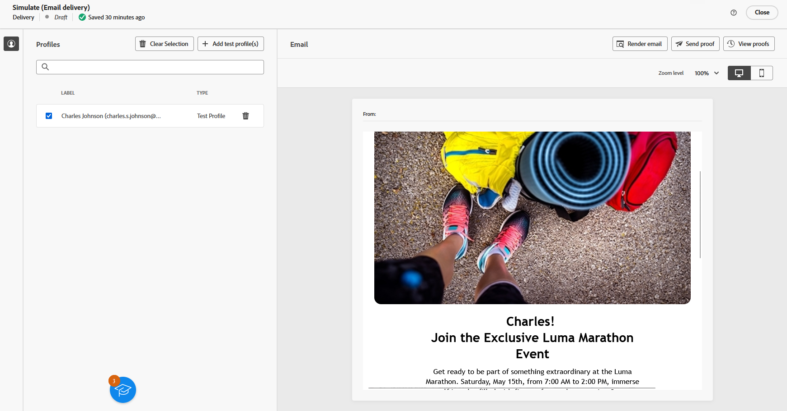

# Geração de texto com o Assistente de conteúdo {#generative-content}

Depois de criar e personalizar seus emails, use o Assistente de conteúdo habilitado pela IA gerativa para elevar seu conteúdo ao próximo nível.

O Assistente de conteúdo pode ajudá-lo a otimizar o impacto de suas entregas, sugerindo conteúdo diferente que tenha mais probabilidade de repercutir com seu público-alvo.

>[!NOTE]
>
>Antes de começar a usar esse recurso, leia as informações relacionadas [Medidas de proteção e limitações](generative-gs.md#guardrails-and-limitations).

Para gerar e melhorar um conteúdo de email com o Assistente de conteúdo, siga as etapas abaixo. Você também pode criar o conteúdo de HTML completo com o Assistente de conteúdo, conforme detalhado em [esta página](generative-email.md).

1. Depois de criar e configurar o delivery de email, clique em **[!UICONTROL Editar conteúdo]**.

   Para obter mais informações sobre como configurar o delivery de email, consulte [esta página](../email/create-email-content.md).

1. Preencha o **[!UICONTROL Detalhes básicos]** para o seu delivery. Depois de concluído, clique em **[!UICONTROL Editar conteúdo de email]**.

1. Personalize o email conforme necessário.

1. Selecione o **[!UICONTROL Componente de texto]** atualize e acesse o menu Geração de experiência.

   {zoom=&quot;yes&quot;}

1. Ajuste o conteúdo descrevendo o que você deseja gerar.

   Ativar o **[!UICONTROL Aprimorar com o contexto atual]** opção do Assistente de conteúdo para personalizar novo conteúdo com base na entrega, nome da entrega e público-alvo selecionado.

   {zoom=&quot;yes&quot;}

1. Selecionar **[!UICONTROL Carregar arquivo]** para adicionar qualquer ativo de marca com conteúdo que possa fornecer contexto adicional ao Assistente de conteúdo.

   Você também pode clicar em **[!UICONTROL Conteúdo carregado]** para localizar arquivos atualizados anteriormente. Observe que o conteúdo carregado está disponível exclusivamente para reutilização pelo usuário atual.

1. Selecione o **[!UICONTROL Estratégia de comunicação]** que melhor atenda às suas necessidades. Isso afetará o tom e o estilo do texto gerado.

1. Escolha o **[!UICONTROL Idioma]** e **[!UICONTROL Tom]** que você deseja que o texto gerado tenha. Isso garantirá que o texto seja adequado ao seu público-alvo e propósito.

   {zoom=&quot;yes&quot;}

1. Use o controle deslizante para definir o comprimento do texto gerado.

1. Quando o prompt estiver pronto, clique em **[!UICONTROL Gerar]**.

1. Navegue pelo arquivo gerado **[!UICONTROL Variações]** e clique em **[!UICONTROL Aplicar]** depois de encontrar o conteúdo apropriado.

   {zoom=&quot;yes&quot;}

1. Insira campos de personalização para personalizar seu conteúdo de email com base nos dados de perfis. [Saiba mais sobre a personalização de conteúdo](../personalization/personalize.md)

   {zoom=&quot;yes&quot;}

1. Depois de definir o conteúdo da mensagem, clique no link **[!UICONTROL Simular conteúdo]** botão para controlar a renderização e verificar as configurações de personalização com perfis de teste. [Saiba mais](../preview-test/preview-content.md)

   {zoom=&quot;yes&quot;}

1. Depois de definir seu conteúdo, público-alvo e agendamento, você estará pronto para preparar seu delivery de email. [Saiba mais](../monitor/prepare-send.md)
