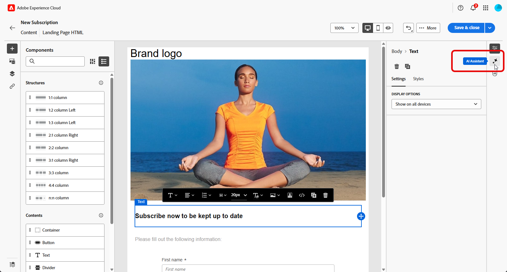

# Geração de página de aterrissagem com o Assistente de IA{#generative-lp}

>[!IMPORTANT]
>
>Antes de começar a usar este recurso, leia as [Medidas de Proteção e Limitações](generative-gs.md#generative-guardrails) relacionadas.
> 
>
>Você deve concordar com um [contrato de usuário](https://www.adobe.com/legal/licenses-terms/adobe-dx-gen-ai-user-guidelines.html) antes de usar o Assistente de IA na Web do Adobe Campaign. Para mais informações, entre em contato com o seu representante da Adobe.

Transforme suas páginas de aterrissagem com o Assistente de IA no Adobe Campaign Web, viabilizado pela IA gerativa.

Crie conteúdo impactante sem esforço, incluindo páginas completas, trechos de texto personalizados e visuais que repercutem com seu público-alvo, gerando mais engajamento e interação.

Explore as guias abaixo para saber como usar o Assistente de IA no Adobe Campaign Web.

>[!BEGINTABS]

>[!TAB Geração completa da página de aterrissagem]

No exemplo a seguir, saiba como usar o Assistente de IA para refinar um modelo de página de aterrissagem existente.

1. Depois de criar e configurar sua página de aterrissagem, clique em **[!UICONTROL Editar conteúdo]**.

   Para obter mais informações sobre como configurar sua página de aterrissagem, consulte [esta página](../landing-pages/create-lp.md).

1. Personalize seu layout conforme necessário e acesse o menu do **[!UICONTROL Assistente de IA]**.

   {zoomable="yes"}

1. Habilite a opção **[!UICONTROL Usar conteúdo original]** para que o Assistente de IA personalize o novo conteúdo com base no conteúdo selecionado.

1. Ajuste o conteúdo descrevendo o que você deseja gerar no campo **[!UICONTROL Prompt]**.

   Se precisar de ajuda para criar seu prompt, acesse a **[!UICONTROL Biblioteca de Prompts]**, que fornece diversas ideias de prompt para melhorar sua página de aterrissagem.

   {zoomable="yes"}

1. Personalize seu prompt com a opção **[!UICONTROL Configurações de texto]**:

   * **[!UICONTROL Estratégia de comunicação]**: escolha o estilo de comunicação mais adequado para o texto gerado.
   * **[!UICONTROL Tom]**: o tom da sua página de aterrissagem deve repercutir no seu público. Se você deseja parecer informativo, divertido ou persuasivo, o Assistente de IA pode adaptar a mensagem de acordo.

   {zoomable="yes"}

1. Escolha suas **[!UICONTROL configurações de imagem]**:

   * **[!UICONTROL Tipo de conteúdo]**: categorize a natureza do elemento visual, distinguindo entre diferentes formas de representação visual, como fotos, gráficos ou arte.
   * **[!UICONTROL Intensidade visual]**: controle o impacto da imagem ajustando sua intensidade. Uma configuração mais baixa (2) cria uma aparência mais suave, enquanto uma configuração mais alta (10) torna a imagem mais vibrante.
   * **[!UICONTROL Cor e tom]**: ajusta a aparência geral das cores dentro de uma imagem e o humor ou atmosfera que ela transmite.
   * **[!UICONTROL Iluminação]**: modifique a iluminação presente em uma imagem para moldar sua atmosfera e destacar elementos específicos.
   * **[!UICONTROL Composição]**: organizar elementos dentro do quadro de uma imagem.

   {zoomable="yes"}

1. No menu **[!UICONTROL Ativos de marca]**, clique em **[!UICONTROL Carregar ativo de marca]** para adicionar qualquer ativo de marca que forneça contexto adicional ao Assistente de IA ou selecione um que tenha sido carregado anteriormente.

   Os arquivos carregados anteriormente estão disponíveis no menu suspenso **[!UICONTROL Ativos de marca carregados]**. Alterne os ativos que deseja incluir na geração.

   {zoomable="yes"}

1. Quando o prompt estiver pronto, clique em **[!UICONTROL Gerar]**.

1. Navegue pelas **[!UICONTROL Variações]** geradas e clique em **[!UICONTROL Visualizar]** para exibir uma versão em tela inteira da variação selecionada.

1. Navegue até a opção **[!UICONTROL Refinar]** na janela **[!UICONTROL Visualizar]** para acessar recursos de personalização adicionais:

   * **[!UICONTROL Refrase]**: o Assistente de IA pode reformular sua mensagem de diferentes maneiras, mantendo sua escrita atualizada e engajando públicos diversos.
   * **[!UICONTROL Usar linguagem mais simples]**: simplifique sua linguagem para garantir clareza e acessibilidade para um público-alvo maior.

   Você também pode alterar o **[!UICONTROL Tom]** e a **[!UICONTROL estratégia de comunicação]** do seu texto.

   {zoomable="yes"}

1. Clique em **[!UICONTROL Selecionar]** depois de encontrar o conteúdo apropriado.

1. Insira campos de personalização para personalizar o conteúdo da landing page com base nos dados do perfil. Em seguida, clique no botão **[!UICONTROL Simular conteúdo]** para controlar a renderização e verificar as configurações de personalização com perfis de teste. [Saiba mais](../landing-pages/create-lp.md#test-landing-page).

Quando a landing page estiver pronta, publique-a para disponibilizá-la para uso em uma mensagem. [Saiba mais](../landing-pages/create-lp.md#publish-landing-page).

>[!TAB Geração somente texto]

No exemplo a seguir, saiba como usar o AI Assistant para aprimorar o conteúdo da sua landing page.

1. Depois de criar e configurar sua página de aterrissagem, clique em **[!UICONTROL Editar conteúdo]**.

   Para obter mais informações sobre como configurar sua página de aterrissagem, consulte [esta página](../landing-pages/create-lp.md).

1. Selecione um **[!UICONTROL Componente de texto]** para direcionar conteúdo específico e acesse o menu **[!UICONTROL Assistente de IA]**.

   {zoomable="yes"}

1. Habilite a opção **[!UICONTROL Usar conteúdo original]** para que o Assistente de IA personalize o novo conteúdo com base no conteúdo selecionado.

1. Ajuste o conteúdo descrevendo o que você deseja gerar no campo **[!UICONTROL Prompt]**.

   Se precisar de ajuda para criar seu prompt, acesse a **[!UICONTROL Biblioteca de Prompts]**, que fornece diversas ideias de prompt para melhorar suas páginas de aterrissagem.

   {zoomable="yes"}

1. Personalize seu prompt com a opção **[!UICONTROL Configurações de texto]**:

   * **[!UICONTROL Estratégia de comunicação]**: escolha o estilo de comunicação mais adequado para o texto gerado.
   * **[!UICONTROL Tom]**: o tom da sua página de aterrissagem deve repercutir no seu público. Se você deseja parecer informativo, divertido ou persuasivo, o Assistente de IA pode adaptar a mensagem de acordo.
   * **Comprimento do texto**: use o controle deslizante para selecionar o comprimento desejado do texto.

   {zoomable="yes"}

1. No menu **[!UICONTROL Ativos de marca]**, clique em **[!UICONTROL Carregar ativo de marca]** para adicionar qualquer ativo de marca que forneça contexto adicional ao Assistente de IA ou selecione um que tenha sido carregado anteriormente.

   Os arquivos carregados anteriormente estão disponíveis no menu suspenso **[!UICONTROL Ativos de marca carregados]**. Alterne os ativos que deseja incluir na geração.

   {zoomable="yes"}

1. Quando o prompt estiver pronto, clique em **[!UICONTROL Gerar]**.

1. Navegue pelas **[!UICONTROL Variações]** geradas e clique em **[!UICONTROL Visualizar]** para exibir uma versão em tela inteira da variação selecionada.

1. Navegue até a opção **[!UICONTROL Refinar]** na janela **[!UICONTROL Visualizar]** para acessar recursos de personalização adicionais:

   * **[!UICONTROL Usar como conteúdo de referência]**: a variante escolhida servirá como conteúdo de referência para gerar outros resultados.
   * **[!UICONTROL Elaborar]**: aprofunde-se em tópicos específicos, fornecendo detalhes adicionais para compreender e participar melhor.
   * **[!UICONTROL Resumir]**: condensa informações extensas em resumos claros e concisos que chamem a atenção e incentivem outras leituras.
   * **[!UICONTROL Refrase]**: reformule sua mensagem de maneiras diferentes, mantendo sua escrita atualizada e engajando públicos diversos.
   * **[!UICONTROL Usar linguagem mais simples]**: simplifique sua linguagem para garantir clareza e acessibilidade para um público-alvo maior.

   Você também pode alterar o **[!UICONTROL Tom]** e a **[!UICONTROL estratégia de comunicação]** do seu texto.

   {zoomable="yes"}

1. Clique em **[!UICONTROL Selecionar]** depois de encontrar o conteúdo apropriado.

1. Insira campos de personalização para personalizar o conteúdo da landing page com base nos dados do perfil. Em seguida, clique no botão **[!UICONTROL Simular conteúdo]** para controlar a renderização e verificar as configurações de personalização com perfis de teste. [Saiba mais](../landing-pages/create-lp.md#test-landing-page).

Quando a landing page estiver pronta, publique-a para disponibilizá-la para uso em uma mensagem. [Saiba mais](../landing-pages/create-lp.md#publish-landing-page).

>[!TAB Geração somente de imagem]

No exemplo abaixo, saiba como usar o Assistente de IA para otimizar e melhorar seus ativos, garantindo uma experiência mais amigável.

1. Depois de criar e configurar sua página de aterrissagem, clique em **[!UICONTROL Editar conteúdo]**.

   Para obter mais informações sobre como configurar sua página de aterrissagem, consulte [esta página](../landing-pages/create-lp.md).

1. Selecione o ativo que deseja alterar com o Assistente de IA.

1. No menu à direita, selecione **[!UICONTROL Assistente do AI]**.

   {zoomable="yes"}

1. Habilite a opção **[!UICONTROL Estilo de referência]** para que o Assistente de IA personalize o novo conteúdo com base no conteúdo de referência. Você também pode carregar uma imagem para adicionar contexto à sua variação.

1. Ajuste o conteúdo descrevendo o que você deseja gerar no campo **[!UICONTROL Prompt]**.

   Se precisar de ajuda para criar seu prompt, acesse a **[!UICONTROL Biblioteca de Prompts]**, que fornece diversas ideias de prompt para melhorar suas páginas de aterrissagem.

   {zoomable="yes"}

1. Personalize seu prompt com a opção **[!UICONTROL Configurações de imagem]**:

   * **[!UICONTROL Taxa de proporção]**: determine a largura e a altura do ativo. Escolha entre as taxas comuns, como 16:9, 4:3, 3:2 ou 1:1, ou insira um tamanho personalizado.
   * **[!UICONTROL Tipo de conteúdo]**: categorize a natureza do elemento visual, distinguindo entre diferentes formas de representação visual, como fotos, gráficos ou arte.
   * **[!UICONTROL Intensidade visual]**: controle o impacto da imagem ajustando sua intensidade. Uma configuração mais baixa (2) cria uma aparência mais suave, enquanto uma configuração mais alta (10) torna a imagem mais vibrante.
   * **[!UICONTROL Cor e tom]**: ajusta a aparência geral das cores dentro de uma imagem e o humor ou atmosfera que ela transmite.
   * **[!UICONTROL Iluminação]**: modifique a iluminação presente em uma imagem para moldar sua atmosfera e destacar elementos específicos.
   * **[!UICONTROL Composição]**: organizar elementos dentro do quadro de uma imagem.

   {zoomable="yes"}

1. No menu **[!UICONTROL Ativos de marca]**, clique em **[!UICONTROL Carregar ativo de marca]** para adicionar qualquer ativo de marca que forneça contexto adicional ao Assistente de IA ou selecione um que tenha sido carregado anteriormente.

   Os arquivos carregados anteriormente estão disponíveis no menu suspenso **[!UICONTROL Ativos de marca carregados]**. Alterne os ativos que deseja incluir na geração.

1. Quando estiver satisfeito com a configuração do prompt, clique em **[!UICONTROL Gerar]**.

1. Navegue pelas **[!UICONTROL Sugestões de variação]** para encontrar o ativo desejado.

   Clique em **[!UICONTROL Visualizar]** para exibir uma versão em tela inteira da variação selecionada.

1. Escolha **[!UICONTROL Gerar Semelhante]** se desejar exibir imagens relacionadas a essa variante.

   {zoomable="yes"}

1. Clique em **[!UICONTROL Selecionar]** depois de encontrar o conteúdo apropriado.

1. Após definir o conteúdo da mensagem, clique no botão **[!UICONTROL Simular conteúdo]** para controlar a renderização e verificar as configurações de personalização com perfis de teste. [Saiba mais](../landing-pages/create-lp.md#test-landing-page).

Quando a landing page estiver pronta, publique-a para disponibilizá-la para uso em uma mensagem. [Saiba mais](../landing-pages/create-lp.md#publish-landing-page).

>[!ENDTABS]