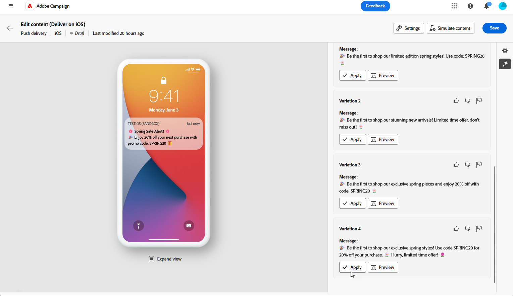
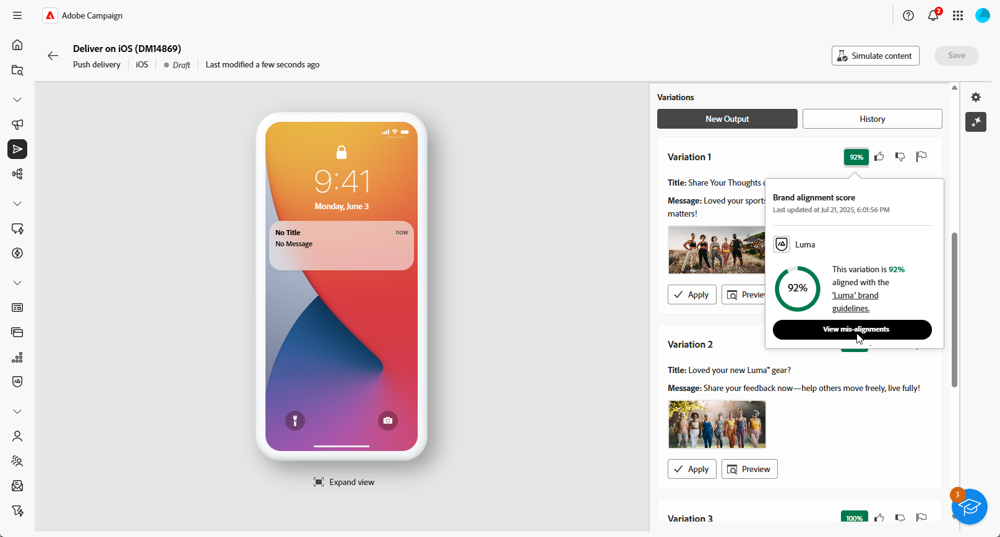

# Geração de notificação por push com o Assistente de IA {#generative-push}

>[!BEGINSHADEBOX]

**Índice**

* [Introdução ao Assistente de IA](generative-gs.md)
* [Geração de email com o Assistente de IA](generative-content.md)
* [Geração de SMS com o Assistente de IA](generative-sms.md)
* **[Geração de notificação por push com o Assistente de IA](generative-push.md)**

>[!ENDSHADEBOX]

Depois de criar e personalizar seus emails, use o Assistente de IA no Campaign viabilizado pela IA generativa para elevar o conteúdo ao próximo nível.

O Assistente de IA pode ajudá-lo a otimizar o impacto de suas entregas, sugerindo conteúdo diferente que tenha mais probabilidade de repercutir com seu público-alvo.

>[!NOTE]
>
>Antes de começar a usar esse recurso, leia as informações relacionadas [Medidas de proteção e limitações](generative-gs.md#guardrails-and-limitations).

1. Depois de criar e configurar o delivery de notificação por push, clique em **[!UICONTROL Editar conteúdo]**.

   Para obter mais informações sobre como configurar o delivery por push, consulte [esta página](../push/create-push.md).

1. Preencha o **[!UICONTROL Detalhes básicos]** para o seu delivery. Depois de concluído, clique em **[!UICONTROL Editar conteúdo]**.

1. Personalize sua notificação por push conforme necessário. [Saiba mais](../push/content-push.md)

1. Acesse o **[!UICONTROL Mostrar assistente de IA]** menu.

   {zoomable=&quot;yes&quot;}

1. Ajuste o conteúdo descrevendo o que você deseja gerar na variável **[!UICONTROL Aviso]** campo.

   Se você estiver procurando ajuda para elaborar seu prompt, acesse o **[!UICONTROL Biblioteca de Prompts]** que fornece uma variedade diversa de ideias rápidas para melhorar seus deliveries.

   {zoomable=&quot;yes&quot;}

1. Ativar o **[!UICONTROL Aprimorar com o contexto atual]** opção do Assistente de IA para personalizar novo conteúdo com base na entrega, nome da entrega e público-alvo selecionado.

   >[!IMPORTANT]
   >
   > Seu prompt deve estar sempre vinculado a um contexto específico, carregando um ativo de marca ou habilitando o **[!UICONTROL Melhorar conteúdo atual]** opção.

   {zoomable=&quot;yes&quot;}

1. Selecionar **[!UICONTROL Fazer upload do ativo da marca]** para adicionar qualquer ativo de marca com conteúdo que possa fornecer contexto adicional ao Assistente de IA.

1. Escolha qual campo você deseja gerar: **[!UICONTROL Título]**, **[!UICONTROL Legenda]** ou **[!UICONTROL Mensagem]**.

1. Selecione o **[!UICONTROL Estratégia de comunicação]** que melhor atenda às suas necessidades. Isso afetará o tom e o estilo do texto gerado.

1. Escolha o **[!UICONTROL Idioma]** e **[!UICONTROL Tom]** que você deseja que o texto gerado tenha. Isso garantirá que o texto seja adequado ao seu público-alvo e propósito.

   {zoomable=&quot;yes&quot;}

1. Quando o prompt estiver pronto, clique em **[!UICONTROL Gerar]**.

1. Navegue pelo arquivo gerado **[!UICONTROL Variações]** e clique em **[!UICONTROL Aplicar]** depois de encontrar o conteúdo apropriado.

   Clique em **[!UICONTROL Visualizar]** para exibir uma versão em tela cheia da variação selecionada.

   {zoomable=&quot;yes&quot;}

1. Insira campos de personalização para personalizar o conteúdo de push com base nos dados de perfis. [Saiba mais sobre a personalização de conteúdo](../personalization/personalize.md)

   {zoomable=&quot;yes&quot;}

1. Depois de definir o conteúdo da mensagem, clique no link **[!UICONTROL Simular conteúdo]** botão para controlar a renderização e verificar as configurações de personalização com perfis de teste. [Saiba mais](../preview-test/preview-content.md)

   {zoomable=&quot;yes&quot;}

1. Depois de definir seu conteúdo, público-alvo e programação, você estará pronto para preparar sua entrega por push. [Saiba mais](../monitor/prepare-send.md)
