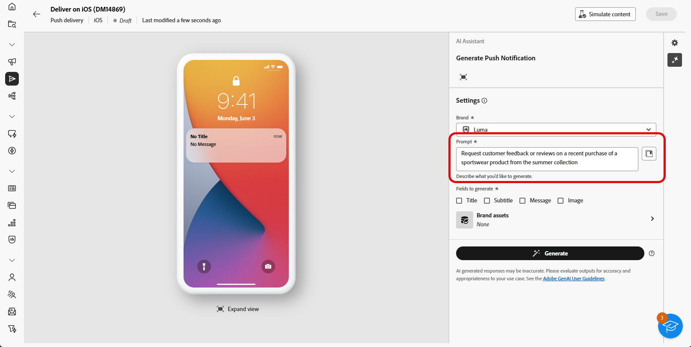

# Geração de notificação por push com o Acelerador de conteúdo do assistente de IA {#generative-push}

>[!IMPORTANT]
>
>Antes de começar a usar esse recurso, leia as [Medidas de Proteção e Limitações](generative-gs.md#generative-guardrails) relacionadas.
> 
>
>Você deve concordar com um [contrato de usuário](https://www.adobe.com/legal/licenses-terms/adobe-dx-gen-ai-user-guidelines.html) antes de usar o Assistente de IA no Adobe Campaign Web para aceleração de conteúdo. Para mais informações, entre em contato com o seu representante da Adobe.

O Assistente de IA para aceleração de conteúdo pode ajudar você a otimizar o impacto de seus deliveries, sugerindo conteúdo diferente que tenha mais probabilidade de repercutir com seu público-alvo.

No exemplo a seguir, aproveitaremos o assistente de IA para criar mensagens atraentes e criar uma experiência do cliente mais envolvente.

1. Depois de criar e configurar a entrega de notificação por push, clique em **[!UICONTROL Editar conteúdo]**.

   Para obter mais informações sobre como configurar a entrega por push, consulte [esta página](../push/create-push.md).

1. Acesse o menu **[!UICONTROL Mostrar assistente de IA]**.

   {zoomable="yes"}

1. Habilite a opção **[!UICONTROL Usar conteúdo original]** para que o Assistente de IA personalize o novo conteúdo com base no conteúdo selecionado.

1. Ajuste o conteúdo descrevendo o que você deseja gerar no campo **[!UICONTROL Prompt]**.

   Se você estiver procurando ajuda para criar seu prompt, acesse a **[!UICONTROL Biblioteca de Prompts]**, que fornece diversas ideias de prompt para melhorar suas entregas.

   {zoomable="yes"}

1. Escolha qual campo você deseja gerar: **[!UICONTROL Título]**, **[!UICONTROL Mensagem]** e/ou **[!UICONTROL Imagem]**.

1. Personalize seu prompt com a opção **[!UICONTROL Configurações de texto]**:

   * **[!UICONTROL Estratégia de comunicação]**: escolha o estilo de comunicação mais adequado para o texto gerado.
   * **[!UICONTROL Tom]**: o tom do seu email deve repercutir na sua audiência. Se você quiser soar informativo, divertido ou persuasivo, o Assistente de IA poderá adaptar a mensagem de acordo.

   {zoomable="yes"}

1. Escolha suas **[!UICONTROL configurações de imagem]**:

   * **[!UICONTROL Tipo de conteúdo]**: categoriza a natureza do elemento visual, distinguindo entre diferentes formas de representação visual, como fotos, gráficos ou arte.
   * **[!UICONTROL Intensidade visual]**: você pode controlar o impacto da imagem ajustando sua intensidade. Uma configuração mais baixa (2) criará uma aparência mais suave e mais restrita, enquanto uma configuração mais alta (10) tornará a imagem mais vibrante e visualmente poderosa.
   * **[!UICONTROL Iluminação]**: refere-se ao relâmpago presente em uma imagem, que molda sua atmosfera e realça elementos específicos.
   * **[!UICONTROL Composição]**: refere-se à disposição dos elementos dentro do quadro de uma imagem

   {zoomable="yes"}

1. No menu **[!UICONTROL Ativos de marca]**, clique em **[!UICONTROL Carregar ativo de marca]** para adicionar qualquer ativo de marca que contenha conteúdo que possa fornecer contexto adicional ao Assistente de IA ou selecione um ativo carregado anteriormente.

   Os arquivos carregados anteriormente estão disponíveis no menu suspenso **[!UICONTROL Ativos de marca carregados]**. Basta alternar os ativos que deseja incluir na geração.

1. Quando o prompt estiver pronto, clique em **[!UICONTROL Gerar]**.

1. Navegue pelas **[!UICONTROL Variações]** geradas e clique em **[!UICONTROL Visualizar]** para exibir uma versão em tela inteira da variação selecionada.

1. Navegue até a opção **[!UICONTROL Refinar]** na janela **[!UICONTROL Visualizar]** para acessar recursos de personalização adicionais:

   * **[!UICONTROL Usar como conteúdo de referência]**: a variante escolhida servirá como conteúdo de referência para gerar outros resultados.

   * **[!UICONTROL Refrase]**: o Assistente de IA pode reformular sua mensagem de diferentes maneiras, mantendo sua escrita atualizada e engajando públicos diversos.

   * **[!UICONTROL Usar linguagem mais simples]**: use o Assistente de IA para simplificar sua linguagem, garantindo clareza e acessibilidade para um público-alvo maior.

   Você também pode alterar o **[!UICONTROL Tom]** e a **[!UICONTROL estratégia de comunicação]** do seu texto.

   {zoomable="yes"}

1. Clique em **[!UICONTROL Selecionar]** depois de encontrar o conteúdo apropriado.

1. Insira campos de personalização para personalizar seu conteúdo de email com base nos dados de perfis. Em seguida, clique no botão **[!UICONTROL Simular conteúdo]** para controlar a renderização e verificar as configurações de personalização com perfis de teste. [Saiba mais](../preview-test/preview-content.md)

   {zoomable="yes"}

Depois de definir seu conteúdo, público-alvo e programação, você estará pronto para preparar sua entrega por push. [Saiba mais](../monitor/prepare-send.md)

