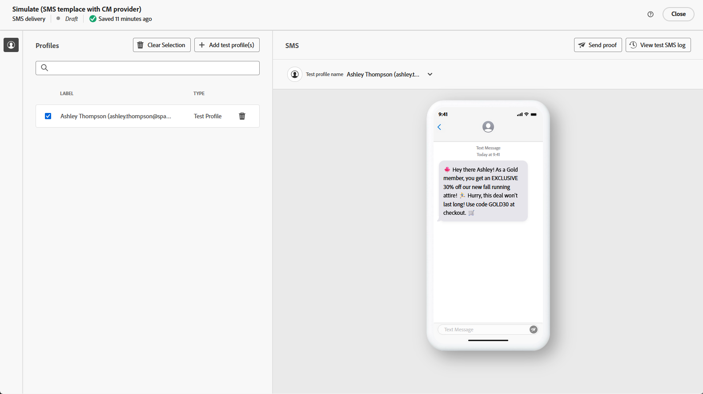

# Geração de SMS com o Assistente de IA {#generative-sms}

>[!IMPORTANT]
>
>Antes de começar a usar este recurso, leia as [Medidas de Proteção e Limitações](generative-gs.md#generative-guardrails) relacionadas.
> 
>
>Você deve concordar com um [contrato de usuário](https://www.adobe.com/legal/licenses-terms/adobe-dx-gen-ai-user-guidelines.html) antes de usar o Assistente de IA no Adobe Campaign Web. Para mais informações, entre em contato com o seu representante da Adobe.

Depois de criar e personalizar suas mensagens SMS para atender ao seu público-alvo, eleve sua comunicação com o Assistente de IA no Adobe Campaign Web, alimentado por tecnologia de IA inovadora.

Essa ferramenta fornece sugestões inteligentes para refinar seu conteúdo, garantindo que suas mensagens repercutam com eficiência e maximizem o engajamento.

>[!BEGINTABS]

>[!TAB Geração de SMS completo]

1. Depois de criar e configurar a entrega de SMS, clique em **[!UICONTROL Editar conteúdo]**.

   Para obter mais informações sobre como configurar a entrega de SMS, consulte [esta página](../sms/create-sms.md).

1. Preencha os **[!UICONTROL detalhes Básicos]** da sua entrega. Depois de concluído, clique em **[!UICONTROL Editar conteúdo]**.

1. Acesse o menu **[!UICONTROL Mostrar assistente de IA]**.

   {zoomable="yes"}

1. Ajuste o conteúdo descrevendo o que você deseja gerar no campo **[!UICONTROL Prompt]**.

   Se precisar de ajuda para criar seu prompt, acesse a **[!UICONTROL Biblioteca de Prompts]**, que fornece diversas ideias de prompt para melhorar suas entregas.

   {zoomable="yes"}

1. Personalize seu prompt usando a opção **[!UICONTROL Configurações de texto]**:

   * **[!UICONTROL Estratégia de comunicação]**: escolha o estilo de comunicação mais adequado para o texto gerado.
   * **[!UICONTROL Tone]**: verifique se o tom do seu email está de acordo com o seu público-alvo. Se você quiser soar informativo, divertido ou persuasivo, o Assistente de IA adapta a mensagem de acordo.
   * **Comprimento do texto**: use o controle deslizante para selecionar o comprimento desejado do texto.

   {zoomable="yes"}

1. No menu **[!UICONTROL Ativos de marca]**, clique em **[!UICONTROL Carregar ativo de marca]** para adicionar qualquer ativo de marca com conteúdo que forneça contexto adicional ao Assistente de IA ou selecione um ativo carregado anteriormente.

   Os arquivos carregados anteriormente estão disponíveis no menu suspenso **[!UICONTROL Ativos de marca carregados]**. Alterne os ativos que deseja incluir na geração.

1. Quando o prompt estiver pronto, clique em **[!UICONTROL Gerar]**.

1. Navegue pelas **[!UICONTROL Variações]** geradas e clique em **[!UICONTROL Visualizar]** para exibir uma versão em tela inteira da variação selecionada.

   {zoomable="yes"}

1. Navegue até a opção **[!UICONTROL Refinar]** na janela **[!UICONTROL Visualizar]** para acessar recursos de personalização adicionais e ajustar a variação de acordo com suas preferências:

   * **[!UICONTROL Usar como conteúdo de referência]**: a variante escolhida serve como conteúdo de referência para gerar outros resultados.
   * **[!UICONTROL Usar linguagem mais simples]**: o Assistente de IA ajuda você a escrever mensagens claras e concisas que todos possam entender.
   * **[!UICONTROL Refrase]**: o Assistente de IA reformula sua mensagem para mantê-la atraente para públicos diferentes.

   Você também pode alterar o **[!UICONTROL Tom]** e a **[!UICONTROL estratégia de comunicação]** do seu texto.

   {zoomable="yes"}

1. Clique em **[!UICONTROL Selecionar]** depois de encontrar o conteúdo apropriado.

1. Insira campos de personalização para personalizar o conteúdo de SMS com base nos dados do perfil. [Saiba mais sobre a personalização de conteúdo](../personalization/personalize.md).

   {zoomable="yes"}

1. Após definir o conteúdo da mensagem, clique no botão **[!UICONTROL Simular conteúdo]** para controlar a renderização e verificar as configurações de personalização com perfis de teste. [Saiba mais](../preview-test/preview-content.md).

   {zoomable="yes"}

Ao definir seu conteúdo, público-alvo e programação, prepare sua entrega de SMS. [Saiba mais](../monitor/prepare-send.md).

>[!TAB Geração somente texto]

1. Depois de criar e configurar a entrega de SMS, clique em **[!UICONTROL Editar conteúdo]**.

   Para obter mais informações sobre como configurar a entrega de SMS, consulte [esta página](../sms/create-sms.md).

1. Preencha os **[!UICONTROL detalhes Básicos]** da sua entrega. Depois de concluído, clique em **[!UICONTROL Editar conteúdo]**.

1. Personalize a mensagem SMS conforme necessário. [Saiba mais](../sms/content-sms.md).

1. Acesse o menu do **[!UICONTROL Assistente de IA]** ao lado do campo **[!UICONTROL Mensagem]**.

   {zoomable="yes"}

1. Habilite a opção **[!UICONTROL Usar conteúdo de referência]** para que o Assistente de IA personalize o novo conteúdo com base no conteúdo selecionado.

1. Ajuste o conteúdo descrevendo o que você deseja gerar no campo **[!UICONTROL Prompt]**.

   Se precisar de ajuda para criar seu prompt, acesse a **[!UICONTROL Biblioteca de Prompts]**, que fornece diversas ideias de prompt para melhorar suas campanhas.

   {zoomable="yes"}

1. Personalize seu prompt usando a opção **[!UICONTROL Configurações de texto]**:

   * **[!UICONTROL Estratégia de comunicação]**: selecione a abordagem de comunicação desejada para o texto gerado.
   * **[!UICONTROL Idioma]**: escolha o idioma para o conteúdo da variante.
   * **[!UICONTROL Tom]**: certifique-se de que o texto é apropriado para seu público-alvo e sua finalidade.
   * **[!UICONTROL Comprimento]**: selecione o comprimento do conteúdo usando o controle deslizante de intervalo.

   {zoomable="yes"}

1. No menu **[!UICONTROL Ativos de marca]**, clique em **[!UICONTROL Carregar ativo de marca]** para adicionar qualquer ativo de marca com conteúdo que forneça contexto adicional ao Assistente de IA ou selecione um ativo carregado anteriormente.

   Os arquivos carregados anteriormente estão disponíveis no menu suspenso **[!UICONTROL Ativos de marca carregados]**. Alterne os ativos que deseja incluir na geração.

1. Quando o prompt estiver pronto, clique em **[!UICONTROL Gerar]**.

1. Navegue pelas **[!UICONTROL Variações]** geradas e clique em **[!UICONTROL Visualizar]** para exibir uma versão em tela inteira da variação selecionada.

1. Navegue até a opção **[!UICONTROL Refinar]** na janela **[!UICONTROL Visualizar]** para acessar recursos de personalização adicionais e ajustar a variação de acordo com suas preferências:

   * **[!UICONTROL Usar como conteúdo de referência]**: a variante escolhida serve como conteúdo de referência para gerar outros resultados.
   * **[!UICONTROL Refrase]**: o Assistente de IA pode reformular sua mensagem de diferentes maneiras, mantendo sua escrita atualizada e engajando públicos diversos.
   * **[!UICONTROL Usar linguagem mais simples]**: use o Assistente de IA para simplificar sua linguagem, garantindo clareza e acessibilidade para um público-alvo maior.

   Você também pode alterar o **[!UICONTROL Tom]** e a **[!UICONTROL estratégia de comunicação]** do seu texto.

   {zoomable="yes"}

1. Clique em **[!UICONTROL Selecionar]** depois de encontrar o conteúdo apropriado.

1. Insira campos de personalização para personalizar o conteúdo de SMS com base nos dados do perfil. [Saiba mais sobre a personalização de conteúdo](../personalization/personalize.md).

1. Após definir o conteúdo da mensagem, clique no botão **[!UICONTROL Simular conteúdo]** para controlar a renderização e verificar as configurações de personalização com perfis de teste. [Saiba mais](../preview-test/preview-content.md).

   {zoomable="yes"}

Ao definir seu conteúdo, público-alvo e programação, prepare sua entrega de SMS. [Saiba mais](../monitor/prepare-send.md).

>[!ENDTABS]