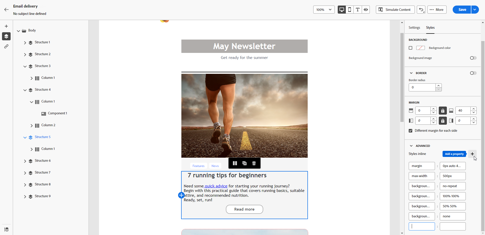

# Adicionar atributos de estilo em linha {#adding-inline-styling-attributes}

Na interface do Email Designer, ao selecionar um elemento e exibir suas configurações no painel direito, você personaliza os atributos em linha e seus valores para esse elemento específico.

1. Selecione um componente diretamente no seu conteúdo ou use a **[!UICONTROL Árvore de navegação]** disponível no painel esquerdo.

1. Na guia **[!UICONTROL Estilos]**, clique no menu suspenso **[!UICONTROL Avançado]**.

   {zoomable="yes"}

1. Modifique os valores dos atributos existentes.

1. Adicionar novas propriedades usando o botão **+**. Adicione qualquer atributo e valor que seja compatível com CSS.

   {zoomable="yes"}

O estilo se aplica ao elemento selecionado.

>[!NOTE]
>
>Se os elementos filhos não tiverem atributos de estilo específicos definidos, o estilo do elemento pai será herdado.