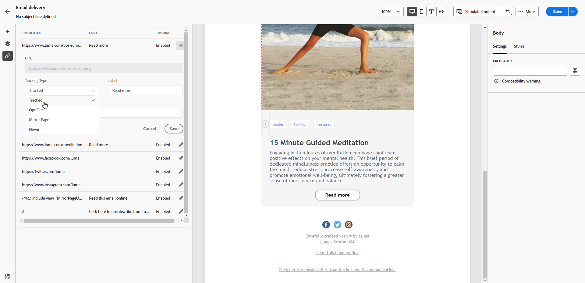

# Adicionar links e rastrear mensagens {#tracking}

Use o Designer de email para adicionar links ao seu conteúdo e rastrear as mensagens enviadas, a fim de monitorar o comportamento dos destinatários.

## Inserir links {#insert-links}

Ao criar uma mensagem, você pode adicionar links ao seu conteúdo.

>[!NOTE]
>
>Quando o rastreamento é ativado, todos os links incluídos no conteúdo da mensagem são rastreados.

Para inserir links no conteúdo do email, siga as etapas abaixo:

1. Selecione um elemento e clique em **[!UICONTROL Inserir link]** na barra de ferramentas contextual.

1. Escolha o tipo de link que deseja criar:

   {zoomable="yes"}

   * **[!UICONTROL Link externo]**: insira um link para uma URL externa.

     >[!AVAILABILITY]
     >
     >Os seguintes recursos (link para **[!UICONTROL Página de aterrissagem]**, **[!UICONTROL Link de assinatura]** e **[!UICONTROL Link de cancelamento de assinatura]**) estão em Disponibilidade Limitada (DL). Eles estão restritos a clientes que estão migrando **do Adobe Campaign Standard para o Adobe Campaign v8** e não podem ser implantados em nenhum outro ambiente.

   * **[!UICONTROL Página de aterrissagem]**: insira um link para uma página de aterrissagem. Se você selecionar uma página de aterrissagem dinâmica (com a opção **[!UICONTROL Serviço da URL]** selecionada), será possível selecionar qualquer serviço da lista. [Saiba mais](../landing-pages/create-lp.md#define-actions-on-form-submission)

     {zoomable="yes"}

   * **[!UICONTROL Link de assinatura]**: insira um link para um serviço de assinatura. Quando os usuários clicam no link, eles são direcionados para a landing page de assinatura referenciada no serviço selecionado. [Saiba mais](../audience/manage-services.md#create-service)

     {zoomable="yes"}

   * **[!UICONTROL Link de cancelamento de assinatura]**: insira um link para um serviço de cancelamento de assinatura. Quando os assinantes clicam no link, eles são direcionados para a landing page de cancelamento de subscrição referenciada no serviço selecionado. [Saiba mais](../audience/manage-services.md#create-service)

   <!--* **[!UICONTROL Mirror page]**: Add a link to display the email content in a web browser. [Learn more]-->

1. Insira o URL desejado no campo correspondente ou selecione uma landing page ou um serviço e defina as configurações e os estilos do link.

1. Adicione um **[!UICONTROL Rótulo]** e um **[!UICONTROL Link]**.

1. Salve as alterações.

1. Depois que o link for criado, ainda será possível modificá-lo na guia **[!UICONTROL Configurações]**.

   * Você pode editar o link e alterar seu **[!UICONTROL Público-alvo]**.
   * Você pode optar por sublinhar o link ou não, marcando a opção correspondente.

   {zoomable="yes"}

>[!NOTE]
>
>As mensagens de email de marketing devem incluir um link para opção de não participação, o que não é necessário para mensagens transacionais. A categoria da mensagem (**[!UICONTROL Marketing]** ou **[!UICONTROL Transacional]**) é definida no nível da superfície de canal e ao criar a mensagem.

Um link específico para a mirror page deve ser adicionado em todas as suas mensagens de email. Saiba mais sobre a mirror page [nesta seção](mirror-page.md).

## Gerenciar rastreamento {#manage-tracking}

O [Designer de email](create-email-content.md) permite gerenciar os URLs rastreados, como editar o tipo de rastreamento de cada link.

1. Clique no ícone **[!UICONTROL Links]** no painel esquerdo para exibir a lista de todos os URLs do conteúdo a ser rastreado.

   Essa lista oferece uma visualização centralizada, permitindo localizar cada URL no conteúdo do email.

1. Para editar um link, clique no ícone de lápis correspondente.

   {zoomable="yes"}

1. Você pode modificar o **[!UICONTROL Tipo de rastreamento]**, se necessário:

   {zoomable="yes"}

   Para cada URL rastreado é possível definir o modo de rastreamento utilizando um destes valores:

   * **[!UICONTROL Rastrear]**: ativa o rastreamento nesse URL.
   * **[!UICONTROL Opt out]**: considera-o como um URL de recusa ou cancelamento de assinatura.
   * **[!UICONTROL Mirror page]**: considera-o como um URL de mirror page.
   * **[!UICONTROL Nunca]**: nunca ativa o rastreamento desse URL.<!--This information is saved: if the URL appears again in a future message, its tracking is automatically deactivated.-->

1. Adicione uma **[!UICONTROL Categoria]** ao seu link para agrupar links rastreados e clique em **[!UICONTROL Salvar]**.

   {zoomable="yes"}

1. Após enviar a entrega, acesse o relatório de entrega. Em **[!UICONTROL Rastreamento]**, o relatório **[!UICONTROL Fluxos de cliques e URL]** exibe quais são os URLs mais visitados de sua entrega. [Saiba mais](../reporting/gs-reports.md)
