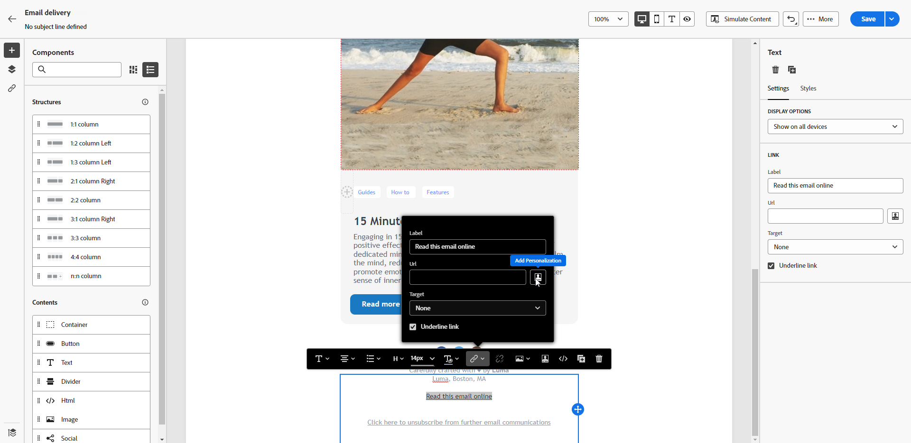

# Mirror page {#mirror-page}

A mirror page é uma versão online do email. Adicionar um link para a mirror page é uma boa prática no marketing por email. Os usuários podem acessar a mirror page de um email, por exemplo, se tiverem problemas de renderização ou imagens corrompidas ao visualizá-lo na caixa de entrada. O fornecimento de uma versão online também é recomendado por motivos de acessibilidade ou para incentivar o compartilhamento em redes sociais.

A mirror page gerada pelo Adobe Campaign inclui todos os dados de personalização.

{width="600" align="left"}

## Adicionar um link para a mirror page {#link-to-mirror-page}

No Adobe Campaign, insira um link para a mirror page do conteúdo do email usando o **bloco de personalização** dedicado. O bloco de personalização do **Link integrado para a mirror page** insere o seguinte código no conteúdo do email: `<%@ include view='MirrorPage' %>`.

Para adicionar um link a uma mirror page no seu email, siga estas etapas:

1. Selecione um elemento (texto ou imagem) e clique em **[!UICONTROL Inserir link]** na barra de ferramentas contextual.

   {zoomable="yes"}

1. Selecione o ícone de **[!UICONTROL Adicionar personalização]** para acessar o menu de personalização.

   {zoomable="yes"}

1. No menu **[!UICONTROL Fragmentos]**, selecione **[!UICONTROL URL da mirror page]** e clique em **[!UICONTROL Adicionar]**. [Saiba como usar fragmentos de expressão](../content/use-expression-fragments.md)

   {zoomable="yes"}

A mirror page é criada automaticamente.

Quando o email é enviado, os recipients que clicam no link da mirror page veem o conteúdo do email exibido em seu navegador da Web padrão.

Por padrão, o período de retenção de uma mirror page é de **60 dias**. Após esse período, a mirror page não estará mais disponível.

>[!CAUTION]
>
>* Os links da mirror page são gerados automaticamente e não podem ser editados. Eles incluem todos os dados personalizados criptografados necessários para renderizar o email original. Usar atributos personalizados com valores grandes pode gerar URLs de mirror page longos, o que pode impedir que o link funcione em navegadores da Web com um comprimento máximo de URL.
>
>* Na prova enviada para perfis de teste, o link para a mirror page não está ativo. Ela só estará ativa nas mensagens finais.

## Geração de mirror page {#mirror-page-generation}

Por padrão, o Adobe Campaign gera automaticamente a mirror page se o conteúdo do email não estiver vazio e contiver um link para a mirror page (também conhecido como Mirror link).

Controle o modo de geração da mirror page do email por meio das opções disponíveis nas propriedades de delivery. [Saiba mais](../advanced-settings/delivery-settings.md#mirror)