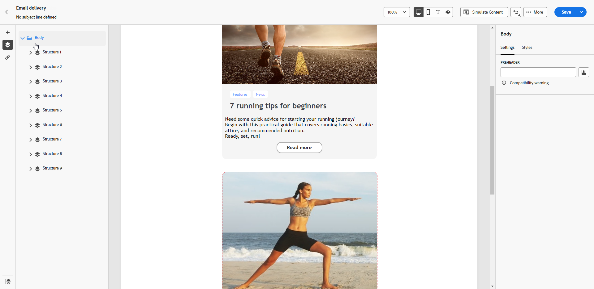

# Adicionar um pré-cabeçalho a um email {#preheader}

>[!CONTEXTUALHELP]
>id="ac_edition_preheader"
>title="Adição de um pré-cabeçalho"
>abstract="Um pré-cabeçalho é um resumo curto que sucede à linha de assunto quando visualizamos o email no cliente de email. Em muitos casos, ele fornece um breve resumo do email e, normalmente, tem a extensão de uma frase."

Um pré-cabeçalho é um texto curto que segue a linha de assunto ao visualizar um email de qualquer cliente de email principal.

Em muitos casos, fornece um breve resumo do conteúdo e geralmente tem uma frase de comprimento.

>[!NOTE]
>
>Os pré-cabeçalhos não são compatíveis com todos os clientes de email. Quando não é compatível, o pré-cabeçalho não é exibido.

Para definir o pré-cabeçalho do email, siga as etapas abaixo.

1. No [Email Designer](create-email-content.md), adicione pelo menos um **[!UICONTROL Estrutura]** componente para começar a projetar seu email.

1. Clique no ícone **[!UICONTROL Árvore de navegação]** no painel esquerdo e selecione **[!UICONTROL Corpo]**.

   

1. No **[!UICONTROL Configurações]** insira algum texto para o pré-cabeçalho.

1. Para personalizá-lo ainda mais, clique no link **[!UICONTROL Adicionar personalização]** ícone à esquerda da **[!UICONTROL Pré-cabeçalho]** campo.

   

1. No **[!UICONTROL Editar personalização]** , é possível adicionar [campos de personalização](../personalization/personalize.md), [blocos de conteúdo](../personalization/content-blocks.md) e [conteúdo condicional](../personalization/conditions.md) usando as entradas dedicadas à esquerda.

   

1. Clique em **[!UICONTROL Confirmar]**.

O pré-cabeçalho agora está configurado para o email.
