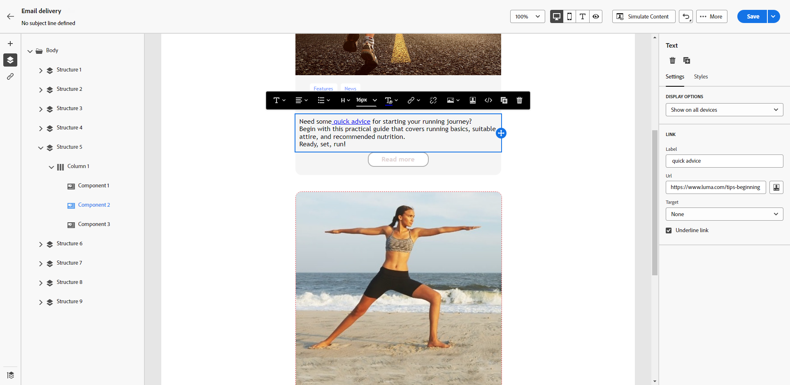

# Definir o estilo dos links {#styling-links}

É possível sublinhar um link e selecionar a cor e o público alvo no Designer de email.

1. Em um componente **[!UICONTROL Texto]**, no qual um link é inserido, selecione seu link.

1. Na guia **[!UICONTROL Configurações]**, marque **[!UICONTROL Sublinhar link]** para que o rótulo fique sublinhado.

   {zoomable=&quot;yes&quot;}

1. Escolha como seu público-alvo será redirecionado com a lista suspensa **[!UICONTROL Direcionamento]**:

   * **[!UICONTROL Nenhum]**: abre o link no mesmo quadro em que foi clicado (padrão).
   * **[!UICONTROL Branco]**: abre o link em uma nova janela ou guia.
   * **[!UICONTROL Auto]**: abre o link no mesmo quadro em que foi clicado.
   * **[!UICONTROL Principal]**: abre o link no quadro principal.
   * **[!UICONTROL Superior]**: abre o link no corpo completo da janela.

   {zoomable=&quot;yes&quot;}

1. Para alterar a cor do link, clique em **[!UICONTROL Cor do link]** na guia **[!UICONTROL Estilos]**.

   {zoomable=&quot;yes&quot;}

1. Salve as alterações.
