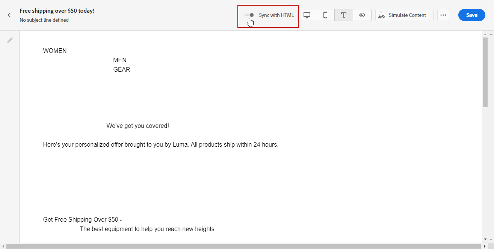
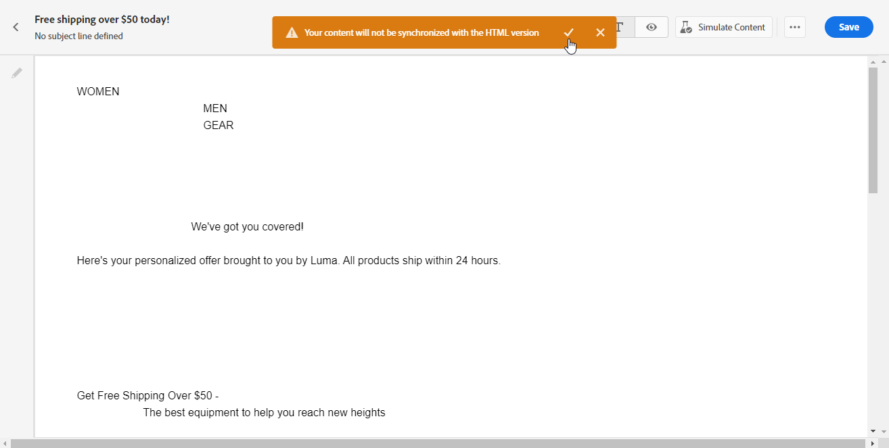

# Criar a versão de texto de um email {#text-version-email}

É recomendável criar uma versão de texto do corpo do email, que é usada quando o conteúdo HTML não pode ser exibido.

Por padrão, o Designer de email cria uma versão de **[!UICONTROL texto sem formatação]** do email, que inclui campos de personalização. Esta versão é gerada e sincronizada automaticamente com a versão do HTML do seu conteúdo.

Se preferir usar conteúdo diferente para a versão de texto simples, siga as etapas abaixo:

1. No email, selecione a guia **[!UICONTROL Texto sem formatação]**.

   {zoomable="yes"}

1. Use o botão de alternância **[!UICONTROL Sincronizar com HTML]** para desabilitar a sincronização.

   {zoomable="yes"}

1. Clique na marca de seleção para confirmar sua escolha.

   {zoomable="yes"}

1. Edite a versão em texto simples conforme desejado.

>[!CAUTION]
>
>* As alterações feitas no modo de exibição **[!UICONTROL Texto sem formatação]** não se refletem no modo de exibição HTML.
>
>* Se você habilitar novamente a opção **[!UICONTROL Sincronizar com o HTML]** depois de atualizar o conteúdo de texto sem formatação, suas alterações serão perdidas e substituídas pelo conteúdo de texto gerado da versão do HTML.