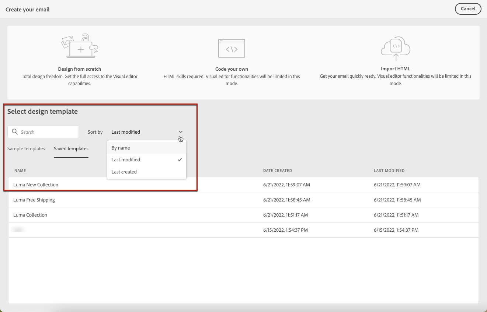

# Usar templates de conteúdo de email {#use-email-templates}

Ao [criar um email](../email/create-email.md), use a seção **[!UICONTROL Selecionar modelo de design]** da interface **[!UICONTROL Criar seu email]** para começar a criar o conteúdo a partir de um modelo.

{zoomable="yes"}

Você pode escolher entre:

* **Modelos de exemplo**. O Campaign vem com um conjunto de modelos integrados que você pode escolher.

* **Modelos salvos**. Você também pode usar um modelo personalizado que salvou como um modelo a partir de um conteúdo existente.

Saiba como usar modelos e como salvar conteúdo de email como modelo nas seções abaixo.

>[!NOTE]
>
>Os modelos de conteúdo de email são diferentes dos [modelos de entrega](../msg/delivery-template.md). Eles permitem reutilizar apenas conteúdo de email, enquanto templates do delivery permitem reutilizar conteúdo do delivery e todas as configurações e propriedades do delivery, como tipologias, endereço de remetente e públicos.

Para começar a criar o conteúdo com um dos modelos de amostra ou salvos, siga as etapas abaixo.

1. Abra o [Designer de email](create-email-content.md).

1. Na tela **[!UICONTROL Criar seu email]**, a guia **[!UICONTROL Modelos de amostra]** é selecionada por padrão.

1. Para usar um modelo personalizado existente, navegue até a guia **[!UICONTROL Modelos salvos]**.

   {zoomable="yes"}

1. A lista de todos os [modelos salvos](#save-as-template) será exibida. Você pode classificá-los **[!UICONTROL Pelo nome]**, **[!UICONTROL Última modificação]** e **[!UICONTROL Última criação]**.

   {zoomable="yes"}

1. Selecione um template da lista para exibir seu conteúdo.

1. Use as setas para a direita e para a esquerda para navegar entre os modelos (amostra ou salvo, dependendo da seleção).

   {zoomable="yes"}

1. Clique em **[!UICONTROL Usar este modelo]** na parte superior direita da tela.

1. Edite seu conteúdo conforme desejado usando o Designer de email. [Saiba mais](create-email-content.md)