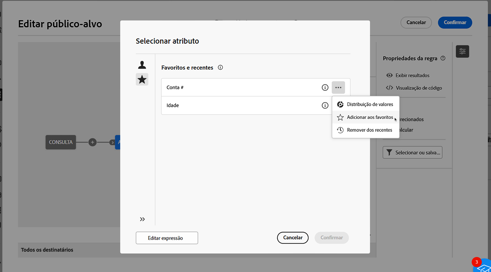

# Selecionar atributos e adicioná-los aos favoritos {#folders}

A interface do Campaign Web permite selecionar atributos do banco de dados em vários locais, dependendo da ação que está sendo realizada. Por exemplo, é possível selecionar atributos ao definir colunas de saída para uma entrega de correspondência direta ou um arquivo para extração. Da mesma forma, é possível selecionar atributos ao usar o modelador de consulta para criar regras, filtros ou públicos-alvo.

Para acessar rapidamente atributos usados com frequência, adicione-os aos favoritos. Isso garante que eles estejam prontamente acessíveis para tarefas futuras. Além dos favoritos, é possível ver e usar os atributos selecionados mais recentemente.

A interface também fornece uma ferramenta de distribuição de valores, que permite visualizar a distribuição dos valores de um atributo em uma tabela. Essa ferramenta ajuda a identificar o intervalo e a frequência dos valores, garantindo a consistência dos dados ao criar consultas ou expressões.

## Favoritos e atributos recentes {#favorites}

>[!CONTEXTUALHELP]
>id="acw_attribute_picker_favorites_recents"
>title="Favoritos e recentes"
>abstract="O menu **[!UICONTROL Favoritos e recentes]** do seletor de atributos oferece uma exibição organizada dos atributos adicionados aos favoritos, juntamente com uma lista de atributos usados recentemente. Os atributos favoritos aparecem primeiro, seguidos pelos usados recentemente, facilitando a localização dos atributos necessários."

O menu **[!UICONTROL Favoritos e Recentes]** no seletor de atributos fornece uma exibição organizada dos atributos adicionados aos favoritos, juntamente com uma lista de atributos usados recentemente. Os atributos favoritos aparecem por primeiro, seguidos pelos usados recentemente, o que facilita a localização dos atributos necessários.

Para adicionar um atributo aos favoritos, clique no botão expandir e selecione **[!UICONTROL Adicionar aos favoritos]**. O atributo será adicionado automaticamente à lista de favoritos. Para remover um atributo dos favoritos, clique no ícone de estrela novamente.

Usuários podem adicionar até 20 atributos aos favoritos. Atributos favoritos e recentes são associados a cada usuário dentro de uma organização, garantindo acessibilidade em diferentes computadores e proporcionando uma experiência contínua em todos os dispositivos.

## Identificação da distribuição de valores em uma tabela {#distribution}

O botão **Distribuição de Valores**, disponível ao clicar no botão expandir ao lado do atributo, permite que os usuários analisem a distribuição de valores para esse atributo na tabela. Esse recurso é útil para entender os valores disponíveis, suas contagens e porcentagens. Isso também ajuda a evitar problemas como inconsistências no uso de maiúsculas e minúsculas ou na ortografia ao criar consultas ou expressões.

Para atributos com um grande número de valores, a ferramenta exibe apenas os primeiros vinte. Nesses casos, uma notificação de **[!UICONTROL Carregamento parcial]** é exibida para indicar essa limitação. Aplique filtros avançados para refinar os resultados exibidos e manter o foco em valores específicos ou subconjuntos de dados. Clique [aqui](../get-started/work-with-folders.md#filter-the-values) para ver orientações detalhadas sobre o uso de filtros.

Para obter informações adicionais sobre como usar a ferramenta de distribuição de valores em contextos diferentes, consulte as seguintes seções:

* [Distribuição de valores em uma pasta](../get-started/work-with-folders.md##distribution-values-folder)
* [Distribuição de valores em uma consulta](../query/build-query.md#distribution-values-query)