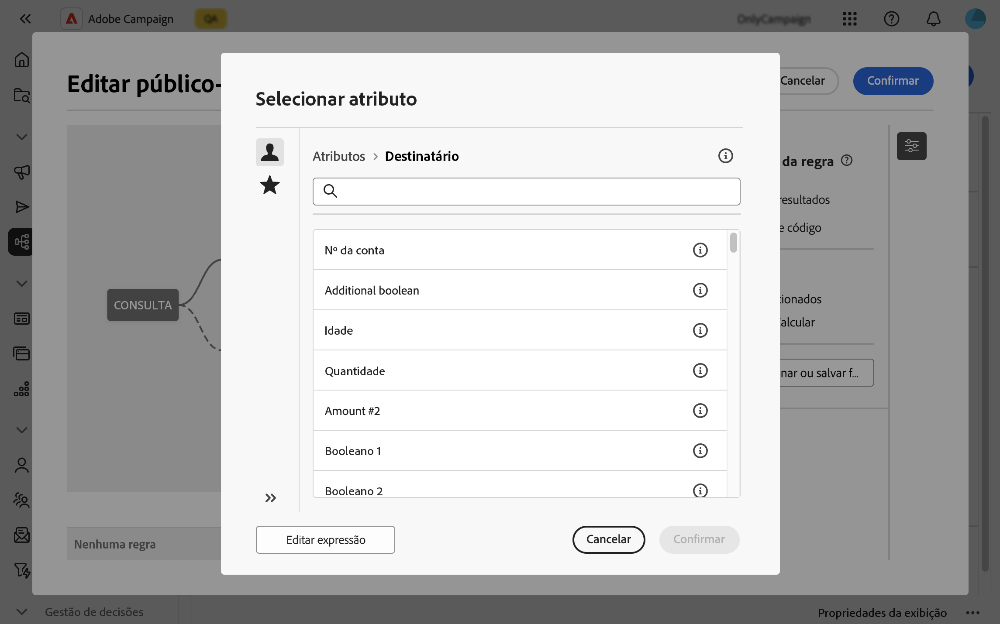
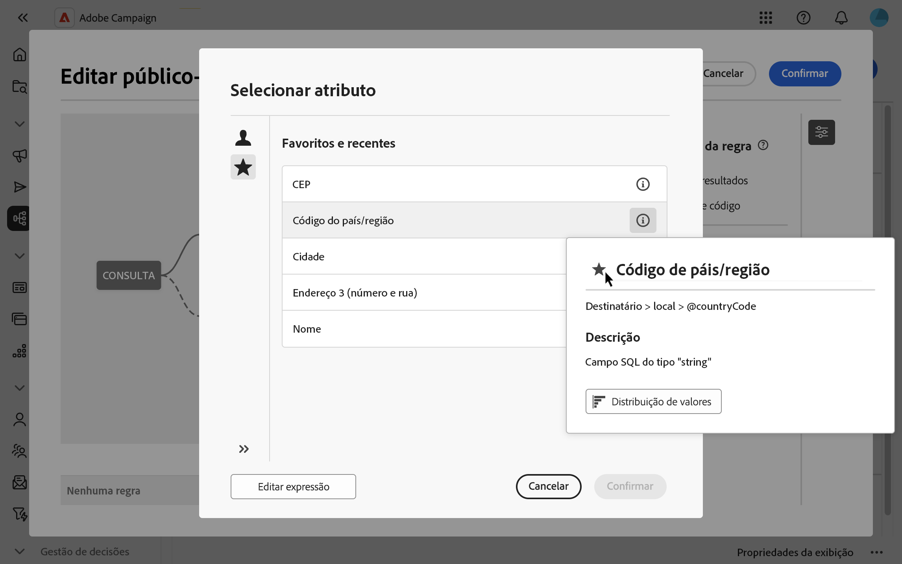
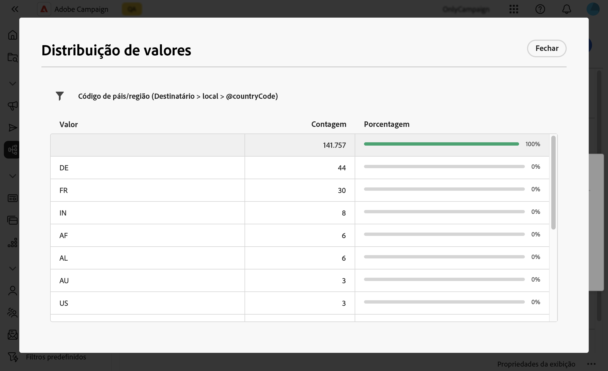

# Selecionar atributos e adicioná-los aos favoritos {#folders}

A interface do usuário da Web do Campaign permite selecionar atributos do banco de dados em vários locais, dependendo da ação que você deseja executar. Por exemplo, você pode selecionar atributos ao definir colunas de saída para um delivery de correspondência direta ou um arquivo a ser extraído. Da mesma forma, os atributos podem ser selecionados ao usar o modelador de consulta para criar regras, filtros ou públicos-alvo.

Para reutilizar rapidamente os atributos usados com frequência, adicione-os aos favoritos. Isso garante que eles estejam prontamente acessíveis para tarefas futuras. Além dos favoritos, é possível também visualizar e usar os atributos selecionados mais recentemente.

A interface também fornece uma ferramenta de distribuição de valores, que permite visualizar a distribuição dos valores de um atributo em uma tabela. Essa ferramenta pode ajudar a identificar o intervalo e a frequência dos valores, garantindo a consistência dos dados ao criar consultas ou expressões.

## Favoritos e atributos recentes {#favorites}

>[!CONTEXTUALHELP]
>id="acw_attribute_picker_favorites_recents"
>title="Favoritos e recentes"
>abstract="O menu **[!UICONTROL Favoritos e Recentes]** no seletor de atributos fornece uma exibição organizada dos atributos adicionados aos favoritos, juntamente com uma lista de atributos usados recentemente. Os atributos favoritos aparecem primeiro, seguido pelos usados recentemente, facilitando a localização dos atributos necessários."

O menu **[!UICONTROL Favoritos e Recentes]** no seletor de atributos fornece uma exibição organizada dos atributos adicionados aos favoritos, juntamente com uma lista de atributos usados recentemente. Os atributos favoritos aparecem primeiro, seguido pelos usados recentemente, facilitando a localização dos atributos necessários.

Para adicionar um atributo aos favoritos, passe o mouse sobre o botão de informações e selecione o ícone de estrela. O atributo será adicionado automaticamente à lista de favoritos. Se você não quiser mais manter um atributo como favorito, poderá removê-lo selecionando o ícone de estrela novamente.

Você pode adicionar até 20 atributos como favoritos. Os atributos favoritos e recentes estão associados a cada usuário em uma organização. Isso significa que eles podem ser acessados de máquinas diferentes, garantindo uma experiência perfeita em todos os dispositivos.

## Identificação da distribuição de valores em uma tabela {#distribution}

O botão **Distribuição de Valores**, disponível no painel de informações de um atributo, permite analisar a distribuição de valores para esse atributo dentro da tabela. Esse recurso é particularmente útil para entender os valores disponíveis, suas contagens e porcentagens. Também ajuda a evitar problemas como capitalização ou ortografia inconsistente ao criar consultas ou criar expressões.

Para atributos com um grande número de valores, a ferramenta exibe apenas os primeiros vinte. Nesses casos, uma notificação de **[!UICONTROL Carga parcial]** aparecerá para indicar essa limitação. Aplique filtros avançados para refinar os resultados exibidos e se concentrar em valores ou subconjuntos de dados específicos. Orientações detalhadas sobre o uso de filtros podem ser encontradas [aqui](../get-started/work-with-folders.md#filter-the-values).

Para obter informações adicionais sobre como usar a ferramenta de distribuição de valores em contextos diferentes, consulte as seguintes seções:

- [Distribuição de valores em uma pasta](../get-started/work-with-folders.md##distribution-values-folder)
- [Distribuição de valores em um query](../query/build-query.md#distribution-values-query)
