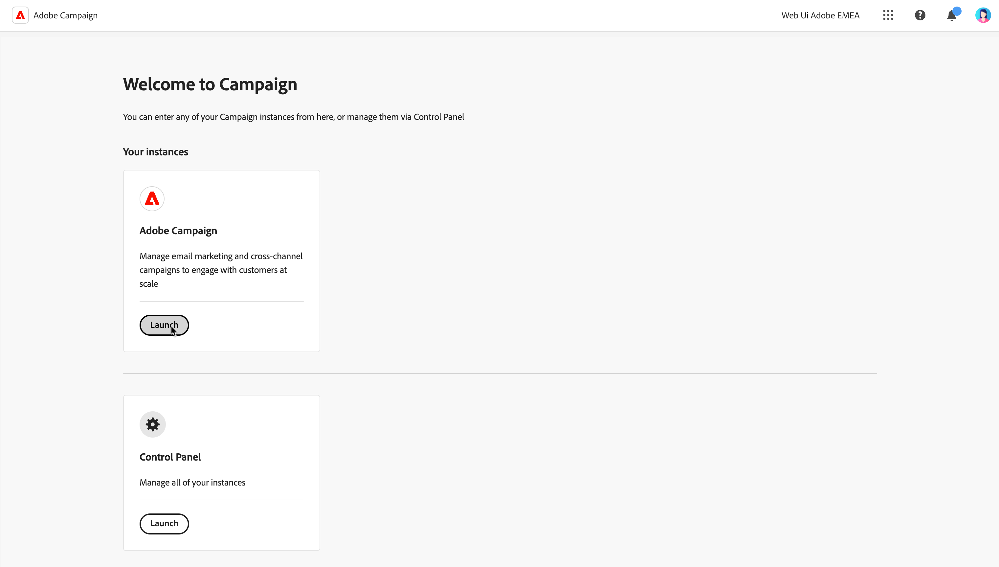

# Conexão com o Adobe Campaign {#connect-to-campaign}

Experience Cloud é uma família Adobe integrada de aplicativos de marketing digital, produtos e serviços. Com a interface intuitiva, você pode acessar rapidamente os aplicativos em nuvem, os recursos do produto e os serviços. Saiba como se conectar ao Adobe Experience Cloud e acessar a interface da Web do Adobe Campaign v8 nesta página.

## Fazer logon no Adobe Experience Cloud {#sign-in-to-exc}

Normalmente, os administradores de Experience Cloud concedem acesso a aplicativos e serviços. Siga as etapas no convite por email para o Experience Cloud.

Para fazer logon no Adobe Experience Cloud, as etapas básicas são:

1. Navegue até [Adobe Experience Cloud](https://experience.adobe.com/){target="_blank"}.

1. Faça logon usando sua Adobe ID ou Enterprise ID. Saiba mais sobre os tipos de identidade no Adobe em [este artigo](https://helpx.adobe.com/br/enterprise/using/identity.html){target="_blank"}.

   Depois de fazer logon no Experience Cloud, você pode acessar rapidamente todas as soluções e aplicativos.

   

1. Verifique se você está na organização correta.

   {width="50%" align="left"}

   Saiba mais sobre Organizações no Adobe Experience Cloud em [este artigo](https://experienceleague.adobe.com/docs/core-services/interface/administration/organizations.html?lang=pt-BR){target="_blank"}.

## Acesso ao Adobe Campaign {#access-to-campaign}

Para acessar o ambiente do Campaign, selecione **Campaign** na página inicial do Adobe Experience Cloud.

Você também pode usar o alternador de soluções para navegar entre as soluções e os aplicativos da Adobe Experience Cloud.

Se você tiver acesso a vários ambientes, incluindo o Painel de controle do Campaign, clique no link **Launch** para a instância correta.

## Navegação superior do Adobe Experience Cloud {#top-bar}

Use a barra superior da interface para:

* compartilhar seu feedback como um usuário Beta
* alternar entre suas organizações
* alternar entre as soluções e os aplicativos da Adobe Experience Cloud

{width="50%" align="left"}

## Navegadores compatíveis {#browsers}

O Campaign v8 Web foi projetado para funcionar de maneira ideal na versão mais recente do Google Chrome, Safari e Microsoft Edge. Você pode ter problemas ao usar determinados recursos em versões mais antigas ou outros navegadores.

## Preferências de idioma {#language-pref}

Atualmente, o Campaign Web v8 está disponível nos seguintes idiomas:

* Inglês (EUA) - EN-US
* Francês - FR
* Alemão - DE
* Italiano - IT
* Espanhol - ES
* Português (Brasil) - PTBR
* Japonês - JP
* Coreano - KR
* Chinês simplificado - CHS
* Chinês tradicional - CHT

O idioma padrão do Campaign Web é determinado pelo idioma preferencial especificado no perfil de usuário. Ele não está relacionado ao idioma do servidor do Campaign e do console do cliente.

Para alterar o idioma:

1. Clique no ícone do perfil, na parte superior direita, e selecione **Preferências**.
1. Em seguida, clique no link de idioma exibido sob o seu endereço de email.
1. Selecione o idioma de sua preferência e clique em **Salvar**. Você pode selecionar um segundo idioma, caso o componente que está usando não esteja traduzido em seu primeiro idioma.

## Tema escuro {#dark-theme}

Você pode alternar para o tema escuro a partir do ícone do perfil. Use o botão de alternância **Tema escuro** para habilitá-lo/desabilitá-lo.

As configurações de perfil do usuário e as preferências da conta estão detalhadas em [nesta seção](https://experienceleague.adobe.com/docs/core-services/interface/experience-cloud.html#preferences){target="_blank"}.

Saiba mais sobre os Componentes da interface central do Experience Cloud em [esta documentação](https://experienceleague.adobe.com/docs/core-services/interface/experience-cloud.html){target="_blank"}.

