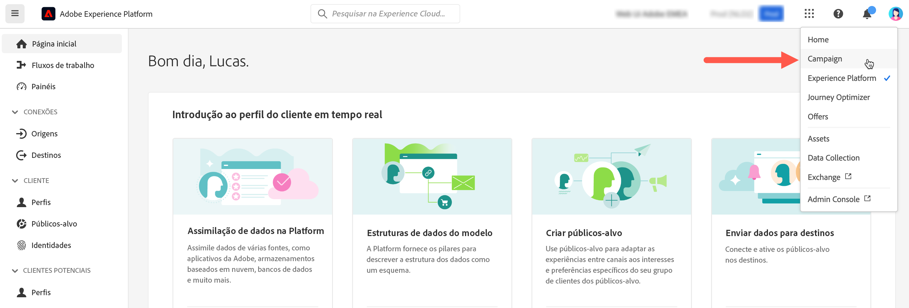

# Conexão com o Adobe Campaign {#connect-to-campaign}

A Experience Cloud é a família integrada de aplicativos, produtos e serviços de marketing digital da Adobe. Com sua interface intuitiva, você pode acessar rapidamente os aplicativos em nuvem, recursos do produto e serviços. Saiba como se conectar à Adobe Experience Cloud e acessar a interface do Adobe Campaign Web nesta página.

## Fazer logon na Adobe Experience Cloud {#sign-in-to-exc}

Você também pode usar o logon único (SSO) para se conectar ao Campaign. Normalmente, admins da Experience Cloud são responsáveis por conceder acesso a aplicativos e serviços. Siga as etapas no convite para a Experience Cloud enviado por email.

Estas são as etapas básicas para fazer logon na Adobe Experience Cloud:

1. Navegue até [Adobe Experience Cloud](https://experience.adobe.com/){target="_blank"}.

1. Faça logon usando sua Adobe ID ou Enterprise ID. Saiba mais sobre os tipos de identidade da Adobe [neste artigo](https://helpx.adobe.com/br/enterprise/using/identity.html){target="_blank"}.

   Depois de fazer logon na Experience Cloud, você pode acessar rapidamente todas as soluções e aplicativos.

   {zoomable="yes"}

1. Verifique se você está na organização correta.

   {zoomable="yes"}{width="50%" align="left"}

   Saiba mais sobre as organizações da Adobe Experience Cloud [neste artigo](https://experienceleague.adobe.com/docs/core-services/interface/administration/organizations.html?lang=pt-BR){target="_blank"}.

## Acesso ao Adobe Campaign {#access-to-campaign}

Para acessar o ambiente do Campaign, selecione **Campaign** na seção **Acesso rápido** da página inicial da Adobe Experience Cloud.

Se já estiver conectado a outra solução da Adobe Experience Cloud, você também poderá acessar o ambiente do Campaign por meio do alternador de soluções, na parte superior direita da tela.

{zoomable="yes"}

Se você tiver acesso a vários ambientes, incluindo o Painel de controle do Campaign, clique no botão **Iniciar** da instância correta.

{zoomable="yes"}

Agora você está conectado ao Campaign. Saiba como começar a usar a interface [nesta página](user-interface.md).

### Controle de acesso {#access-control}

>[!CONTEXTUALHELP]
>id="acw_explorer_permissions_create"
>title="Permissão necessária"
>abstract="A administração precisa conceder a permissão para que você possa criar este objeto."

>[!CONTEXTUALHELP]
>id="acw_audiences_read_only"
>title="Este público-alvo é somente de leitura"
>abstract="Você não tem permissões para editar este público-alvo. Se necessário, entre em contato com a sua administração para obter acesso."

>[!CONTEXTUALHELP]
>id="acw_subscription_services_read_only"
>title="Este serviço é somente de leitura."
>abstract="Você não tem permissões para editar este serviço. Se necessário, entre em contato com a sua administração para obter acesso."

>[!CONTEXTUALHELP]
>id="acw_recipients_readonlyprofile"
>title="Perfil de somente leitura de destinatários"
>abstract="Você não tem permissões para editar este perfil. Se necessário, entre em contato com a sua administração para obter acesso."

>[!CONTEXTUALHELP]
>id="acw_campaign_read_only"
>title="Esta campanha é somente de leitura"
>abstract="Você não tem permissões para editar esta campanha. Se necessário, entre em contato com a sua administração para obter acesso."

>[!CONTEXTUALHELP]
>id="acw_deliveries_read_only"
>title="Esta entrega é somente de leitura"
>abstract="Você não tem permissões para editar esta entrega. Se necessário, entre em contato com a sua administração para obter acesso."

>[!CONTEXTUALHELP]
>id="acw_wf_read_only"
>title="Este workflow é de somente leitura"
>abstract="Você não tem permissões para editar este fluxo de trabalho. Se necessário, entre em contato com a sua administração para obter acesso."

O controle de acesso pode restringir o acesso a objetos e dados de listas principais, como entregas, destinatários ou fluxos de trabalho. Essas restrições também se aplicam à árvore de navegação do Explorer. Além disso, você precisa de permissões para criar, excluir, duplicar e editar objetos na interface.

Todas as permissões no Campaign Web são sincronizadas com as permissões do console do cliente do Campaign. Somente administradores do Campaign podem definir e modificar permissões de usuário.

Ao navegar pela interface do Campaign Web, você pode acessar dados, objetos e recursos, dependendo das suas permissões. Por exemplo, caso não possua permissões de acesso a uma pasta, você não poderá vê-la. Suas permissões também afetam objetos e o gerenciamento de dados. Sem permissões de gravação para uma pasta específica, não é possível criar uma entrega nessa pasta, mesmo que você possa vê-la na interface.

Você pode aprender a [exibir e gerenciar permissões aqui](permissions.md).

## Navegação superior da Adobe Experience Cloud {#top-bar}

Navegue na barra superior da interface para:

* compartilhar feedback sobre a interface do Campaign Web
* alternar entre suas organizações
* alternar entre as soluções e aplicativos da Adobe Experience Cloud
* procurar ajuda sobre a [Adobe Experience League](https://experienceleague.adobe.com/docs/?lang=pt-BR){target="_blank"}
* verificar as notificações do produto
* editar o perfil da Adobe e gerenciar configurações, como [atualizar seu idioma favorito](#language-pref) ou [alternar para tema claro/escuro](#dark-theme)

{zoomable="yes"}{width="50%" align="left"}

## Navegadores compatíveis {#browsers}

O Adobe Campaign Web foi desenvolvido para funcionar de maneira ideal na versão mais recente do Google Chrome, Safari e Microsoft Edge. Você pode ter problemas ao usar determinados recursos em versões mais antigas ou em outros navegadores.

## Preferências de idioma {#language-pref}

Atualmente, o Adobe Campaign Web está disponível nos seguintes idiomas:

* Inglês (EUA) - EN-US
* Francês - FR
* Alemão - DE
* Italiano - IT
* Espanhol - ES
* Português (Brasil) - PTBR
* Japonês - JP
* Coreano - KR
* Chinês simplificado - CHS
* Chinês tradicional - CHT

O idioma padrão do Campaign Web é determinado pelo idioma preferencial especificado no perfil de usuário. Ele não está relacionado ao idioma do servidor do Campaign e do console do cliente.

Para alterar o idioma:

1. Clique no ícone do perfil, na parte superior direita, e selecione **Preferências**.
1. Em seguida, clique no link de idioma exibido sob o seu endereço de email.
1. Selecione o idioma de sua preferência e clique em **Salvar**. Você pode selecionar um segundo idioma caso o componente usado não esteja traduzido em seu idioma nativo.

<!--
>[!CAUTION]
>
>If you plan to use [AI-powered contextual help](using-ai.md) capabilities, you must set your prefered language to English. Other languages are not supported.
>
-->

## Temas escuro e claro {#dark-theme}

O Adobe Campaign está disponível em temas claros e escuros. Por padrão, a interface é habilitada no tema claro. Para mudar para o tema escuro, clique no ícone do seu perfil e use o botão **Tema escuro** para habilitá-lo/desabilitá-lo.

As configurações de perfil do usuário e as preferências da conta estão detalhadas [nesta seção](https://experienceleague.adobe.com/docs/core-services/interface/experience-cloud.html?lang=pt-BR#preferences){target="_blank"}.

Saiba mais sobre os componentes da interface central da Experience Cloud [nesta documentação](https://experienceleague.adobe.com/docs/core-services/interface/experience-cloud.html?lang=pt-BR){target="_blank"}.
