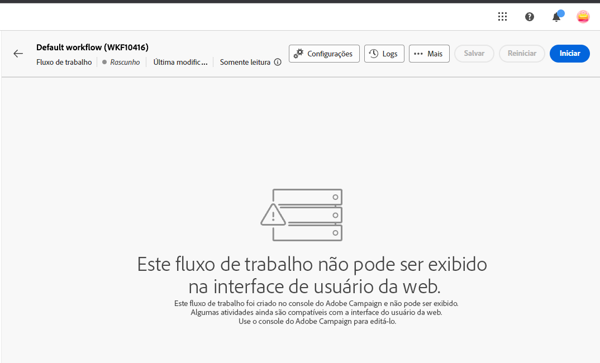
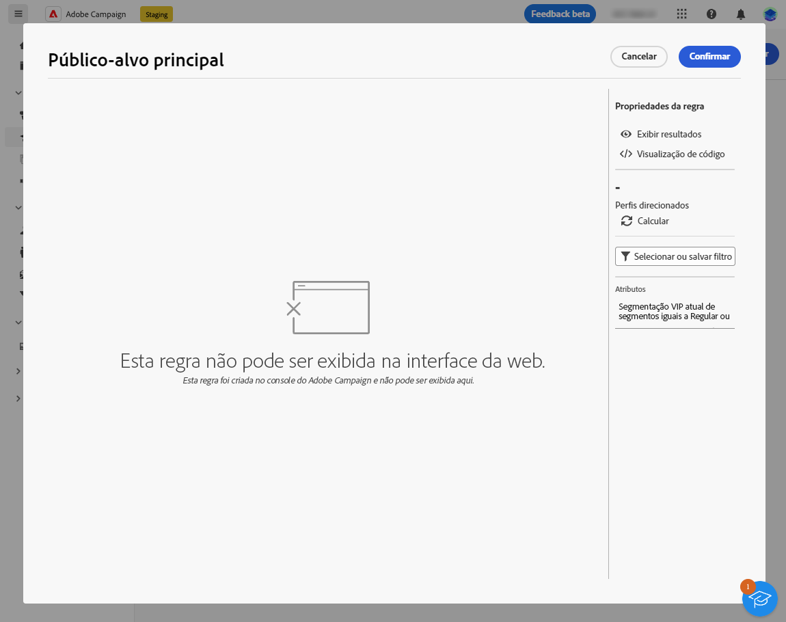

# Medidas de proteção e limitações {#guardrails-limitations}

Ao trabalhar na interface da Web do Campaign com componentes criados ou modificados no console do cliente do Campaign, as medidas de proteção e as limitações listadas abaixo se aplicam.

## Fluxos de trabalho {#wf-guardrails-limitations}

O mesmo workflow pode ser acessado no console e na interface do usuário da Web. No entanto, esteja ciente de que determinadas limitações se aplicam.

**Edição de atividade**

* Ao acessar um workflow de console na interface do usuário da Web, você só pode modificar atividades compatíveis.

**Edição da tela de desenho**

* Se um workflow de console tiver vários nós/ramificações iniciais ou atividades flutuantes, será necessário adicionar uma atividade inicial e uma bifurcação para conectar os nós iniciais ao nó principal. Você também precisa remover as atividades flutuantes.

**Posicionamento da atividade**

* O posicionamento dos nós será recalculado (o posicionamento inicial das atividades, portanto, será modificado) somente quando uma atividade tiver sido adicionada ou removida (nem sempre).

**Opções não expostas**

* As opções não compatíveis não são exibidas na interface do usuário da Web.

**Loops**

* Os loops ainda não estão disponíveis na interface da Web. Se você tiver criado um workflow incluindo um loop usando o console, ele não estará acessível na interface do usuário da Web. Uma mensagem de erro é exibida.

| Console | Interface do usuário da Web |
| --- | --- |
|  |  |

<table>
<tr>
<th>Console</th>
<th>Interface do usuário da Web</th>
</tr>
<tr>
<td></td>
<td></td>
</tr>
</table>

**Reconciliação e enriquecimento**

No console do cliente do Campaign, a variável **Enriquecimento** A atividade de pode executar reconciliação e enriquecimento. Na interface da Web do Campaign, os recursos de reconciliação ainda não estão disponíveis. Se você definiu a reconciliação na atividade do console, ela será exibida como uma atividade não compatível na interface do usuário da Web.

* Se a variável **Enriquecimento** no console só realizar um enriquecimento, a variável **Enriquecimento** atividade é exibida na web.
* Se a variável **Enriquecimento** Uma atividade de no console só executa uma reconciliação, uma atividade incompatível é exibida.

## Filtros predefinidos {#filters-guardrails-limitations}

Ao selecionar o público de um delivery ou ao criar um público em um workflow, alguns filtros predefinidos não estão disponíveis na interface, nessa versão do produto.

Uma mensagem de erro específica é exibida. Mesmo que não seja possível exibir a representação gráfica da consulta no construtor de regras e editar o filtro, você ainda poderá usá-lo, ver as condições de filtragem e os resultados. Você também pode acessar a consulta SQL para verificar as configurações exatas.

{width="70%" align="left"}

Observe que, se você criar um filtro na interface da Web e modificá-lo no console com atributos não suportados, a representação gráfica não poderá mais estar disponível na interface da Web. Em qualquer caso, ainda é possível usar o filtro.

Os atributos não compatíveis estão listados abaixo.

### Tipos de dados incompatíveis {#unsupported-data-type}

Os seguintes tipos de dados disponíveis no console do cliente não são compatíveis ao exibir um filtro ou uma regra na interface da Web:

* datetime
* tempo
* timespan
* duplo
* flutuante

### Recursos de filtragem não compatíveis {#unsupported-filtering-capabilities}

Quando um filtro é criado com expressões complexas e funções no console do cliente, ele não pode ser editado na interface da Web.

Além disso, os seguintes operadores não são compatíveis:

* Tipo numérico
   * está incluído em
   * não em

* Tipo de string
   * maior que
   * menor que
   * maior que ou igual a
   * menor que ou igual a
   * curtir
   * não é como

* Tipo de data
   * em ou depois de
   * em ou antes de
   * não é igual
   * está vazio
   * não está vazio
   * está incluído em
   * não está em
   * no(s) último(s)

* Links 1-N
   * CONTAGEM, SOMA, MÉDIA, MÍN, MAX