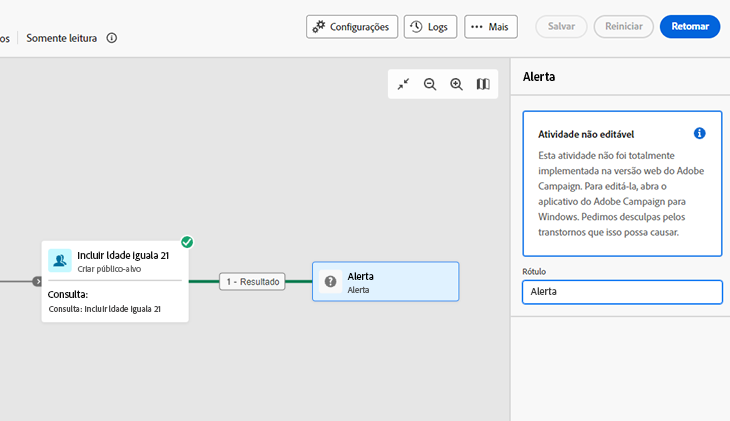
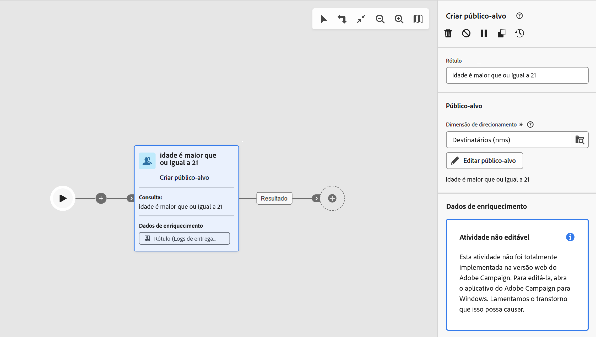
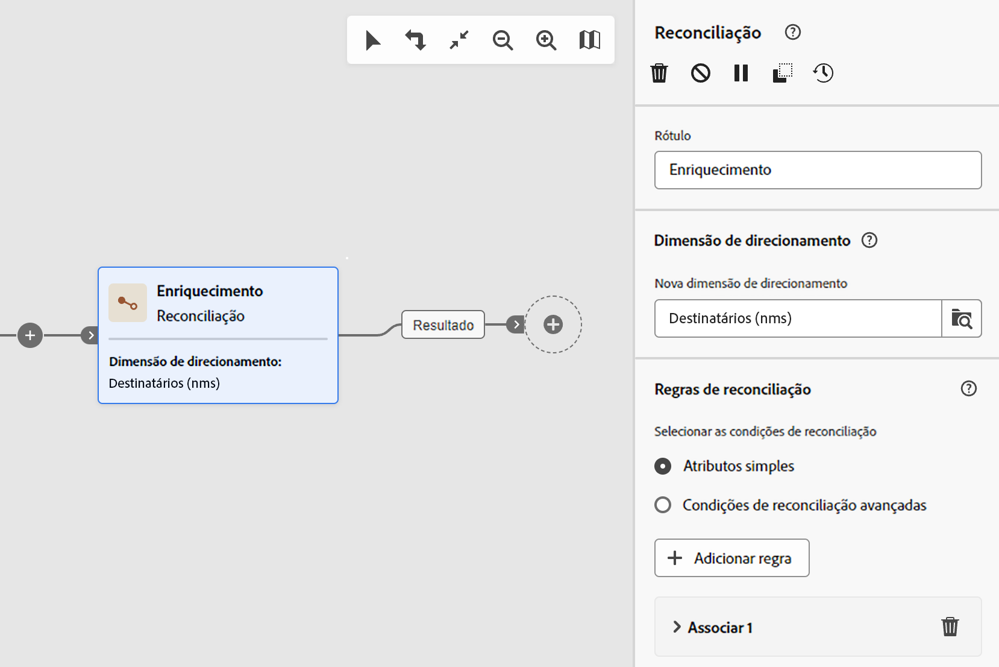
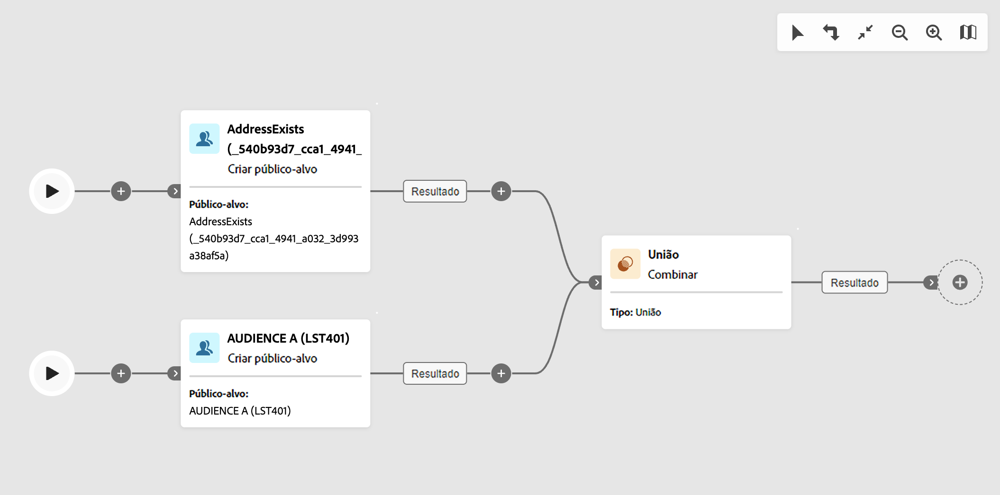

# Medidas de proteção e limitações para workflows {#guardrails-limitations}

As medidas de proteção e limitações listadas abaixo se aplicam ao trabalhar na interface do Campaign Web com fluxos de trabalho criados ou modificados no console do cliente do Campaign.

Observe que, embora esta página forneça infomações importantes sobre o uso de fluxos de trabalho no console e na interface web, ela não abrange todas as possíveis incompatibilidades entre as duas interfaces.

## Atividades de fluxos de trabalho {#wkf-activities}

>[!CONTEXTUALHELP]
>id="acw_orchestration_query_enrichment_noneditable"
>title="Atividade não editável"
>abstract="Quando uma atividade de **Consulta** ou **Enriquecimento** é configurada com dados adicionais no console, os dados de enriquecimento são levados em consideração no Campaign Web e transmitidos para a transição de saída, mas não podem ser editados."

As atividades de fluxo de trabalho que ainda não são compatíveis com a interface do Campaign Web são somente leitura e exibidas como atividades incompatíveis. Você ainda pode executar o fluxo de trabalho, enviar mensagens, verificar os logs etc. As atividades de fluxo de trabalho que estão disponíveis na interface do Campaign Web e no console do cliente do Campaign podem ser editadas.

| Console | Web |
| --- | --- |
| {zoomable=&quot;yes&quot;}{width="800px" align="left" zoomable="yes"} | {zoomable=&quot;yes&quot;}{width="800px" align="left" zoomable="yes"} |

Quando uma atividade de **Consulta** ou **Enriquecimento** é configurada com dados adicionais no console, os dados de enriquecimento são levados em consideração no Campaign Web e transmitidos para a transição de saída, mas não podem ser editados.

| Console | Web |
| --- | --- |
| {zoomable=&quot;yes&quot;}{width="800px" align="left" zoomable="yes"} | {zoomable=&quot;yes&quot;}{width="800px" align="left" zoomable="yes"} |

No console, a atividade **Enriquecimento** pode executar a reconciliação e o enriquecimento. Se você tiver definido configurações de reconciliação na atividade de **Enriquecimento** do console do cliente, elas serão exibidas como uma atividade de **Reconciliação** na interface do Campaign Web.

| Console | Web |
| --- | --- |
| {zoomable=&quot;yes&quot;}{width="800px" align="left" zoomable="yes"} | {zoomable=&quot;yes&quot;}{width="800px" align="left" zoomable="yes"} |

## Tela de fluxo de trabalho {#wkf-canvas}

Ao criar um novo fluxo de trabalho na interface do Campaign Web, a tela permite apenas um ponto de entrada. No entanto, se você criou um fluxo de trabalho no console com vários pontos de entrada, é possível abri-lo e editá-lo na interface do Campaign Web.

| Console | Web |
| --- | --- |
| {zoomable=&quot;yes&quot;}{width="800px" align="left" zoomable="yes"} | {zoomable=&quot;yes&quot;}{width="800px" align="left" zoomable="yes"} |

O posicionamento dos nós é atualizado sempre que uma atividade é adicionada ou removida. Se você criar um fluxo de trabalho no console, modificá-lo usando a interface do Campaign Web e reabri-lo no console, poderá notar alguns pequenos erros de posicionamento. Isso não afeta os processos e as tarefas do fluxo de trabalho.

| Fluxo de trabalho inicial | Alteração de posicionamento |
| --- | --- |
| {zoomable=&quot;yes&quot;}{width="800px" align="left" zoomable="yes"} | {zoomable=&quot;yes&quot;}{width="800px" align="left" zoomable="yes"} |
