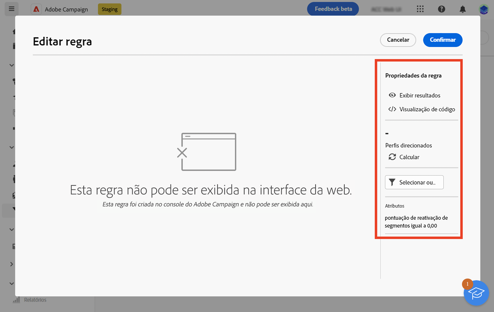
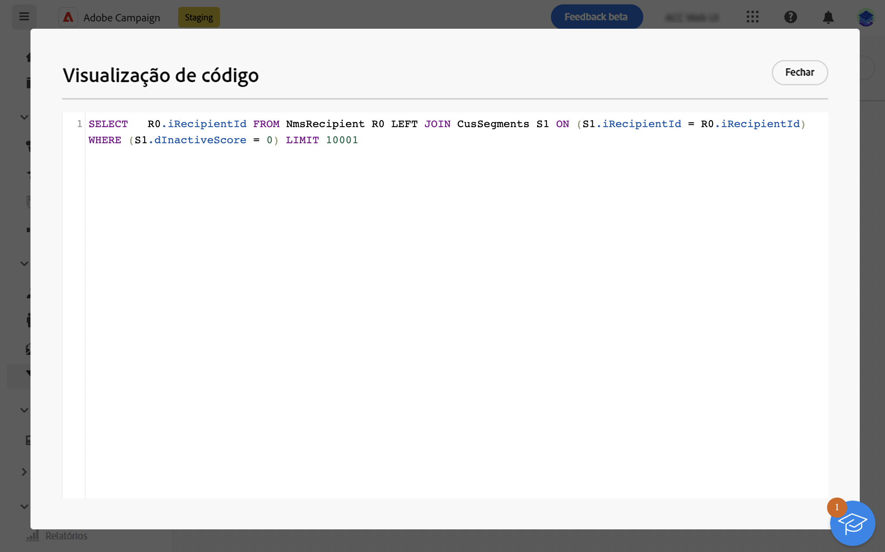
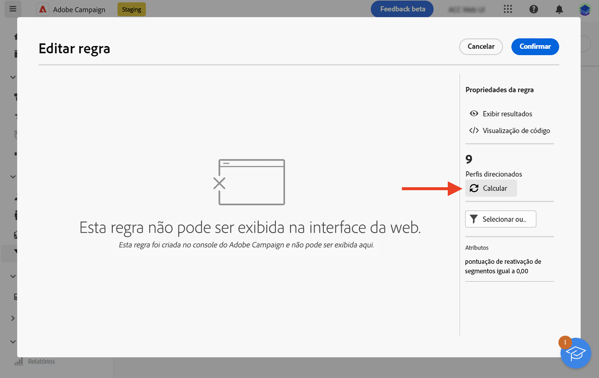
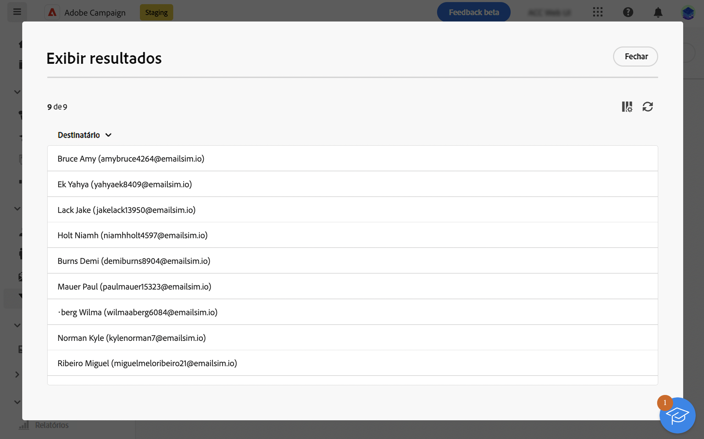

# Medidas de proteção e limitações {#guardrails-limitations}

Ao trabalhar na interface da Web do Campaign com componentes criados ou modificados no console do cliente do Campaign, as medidas de proteção e as limitações listadas abaixo se aplicam.

## Fluxos de trabalho {#wf-guardrails-limitations}

### Atividades

As atividades de fluxo de trabalho que ainda não são compatíveis na interface do usuário da Web são somente leitura e exibidas como atividades incompatíveis. Você ainda pode executar o fluxo de trabalho, enviar mensagens, verificar os logs etc. As atividades de fluxo de trabalho disponíveis na interface da Web e no console do cliente são editáveis.

| Console | Interface do usuário da Web |
| --- | --- |
| {width="800px" align="left" zoomable="yes"} | {width="800px" align="left" zoomable="yes"} |

As configurações de atividade do fluxo de trabalho que ainda não são compatíveis na interface do usuário da Web não são exibidas. No entanto, quando o fluxo de trabalho é executado, essas configurações se aplicam.

| Console | Interface do usuário da Web |
| --- | --- |
| {width="800px" align="left" zoomable="yes"} | {width="800px" align="left" zoomable="yes"} |

No console, a variável **Enriquecimento** A atividade de pode executar reconciliação e enriquecimento. Na interface da Web, os recursos de reconciliação ainda não estão disponíveis. Se você tiver definido, no console, as configurações de reconciliação no **Enriquecimento** será exibida como uma atividade somente leitura não compatível na interface do usuário da web.

| Console | Interface do usuário da Web |
| --- | --- |
| {width="800px" align="left" zoomable="yes"} | {width="800px" align="left" zoomable="yes"} |

### Tela

Ao criar um novo fluxo de trabalho na interface da Web, a tela de desenho suporta apenas um ponto de entrada. No entanto, se você criou um fluxo de trabalho no console com vários pontos de entrada, é possível abri-lo e editá-lo na interface do usuário da Web.

| Console | Interface do usuário da Web |
| --- | --- |
| {width="800px" align="left" zoomable="yes"} | {width="800px" align="left" zoomable="yes"} |

Os loops ainda não estão disponíveis na interface da Web. Se você criou um workflow incluindo um loop usando o console, não é possível acessá-lo a partir da interface do usuário da Web. Uma mensagem de erro é exibida.

| Console | Interface do usuário da Web |
| --- | --- |
| {width="800px" align="left" zoomable="yes"} | {width="800px" align="left" zoomable="yes"} |

O posicionamento dos nós é atualizado sempre que uma atividade é adicionada ou removida. Se você criar um fluxo de trabalho no console, modificá-lo usando a interface da Web e reabri-lo no console, poderá observar algumas pequenas imperfeições de posicionamento. Isso não afeta os processos e as tarefas do fluxo de trabalho.

| Fluxo de trabalho inicial | Alteração de posicionamento |
| --- | --- |
| {width="800px" align="left" zoomable="yes"} | {width="800px" align="left" zoomable="yes"} |

## Filtros predefinidos {#filters-guardrails-limitations}

Ao selecionar o público de um delivery ou ao criar um público em um workflow, alguns filtros predefinidos não estão disponíveis na interface, nessa versão do produto.

Uma mensagem de erro específica é exibida.

{width="70%" align="left"}

Mesmo que não seja possível exibir a representação gráfica da consulta no construtor de regras e editar o filtro, você ainda poderá usá-lo e ver as condições de filtragem no **Atributos** seção da tela.

{width="70%" align="left"}

Você também pode acessar a consulta SQL para verificar as configurações exatas. Para fazer isso, clique no link **Visualização de código** botão.

{width="70%" align="left"}

Clique em **Calcular** botão para verificar quantos itens atendem aos critérios do filtro.

{width="70%" align="left"}

Use o **Exibir resultados** botão para exibir esses itens.

{width="70%" align="left"}

Observe que, se você criar um filtro na interface da Web e modificá-lo no console com atributos não suportados, a representação gráfica não poderá mais estar disponível na interface da Web. Em qualquer caso, ainda é possível usar o filtro.

Os atributos não compatíveis estão listados abaixo.

### Tipos de dados incompatíveis {#unsupported-data-type}

Os seguintes tipos de dados disponíveis no console do cliente não são compatíveis ao exibir um filtro ou uma regra na interface da Web:

* datetime
* tempo
* timespan
* duplo
* flutuante

### Recursos de filtragem não compatíveis {#unsupported-filtering-capabilities}

Quando um filtro é criado com expressões complexas e funções no console do cliente, ele não pode ser editado na interface da Web.

Além disso, os seguintes operadores não são compatíveis:

* Tipo numérico
   * está incluído em
   * não em

* Tipo de string
   * maior que
   * menor que
   * maior que ou igual a
   * menor que ou igual a
   * curtir
   * não é como

* Tipo de data
   * em ou depois de
   * em ou antes de
   * não é igual
   * está vazio
   * não está vazio
   * está incluído em
   * não está em
   * no(s) último(s)

* Links 1-N
   * CONTAGEM, SOMA, MÉDIA, MÍN, MAX