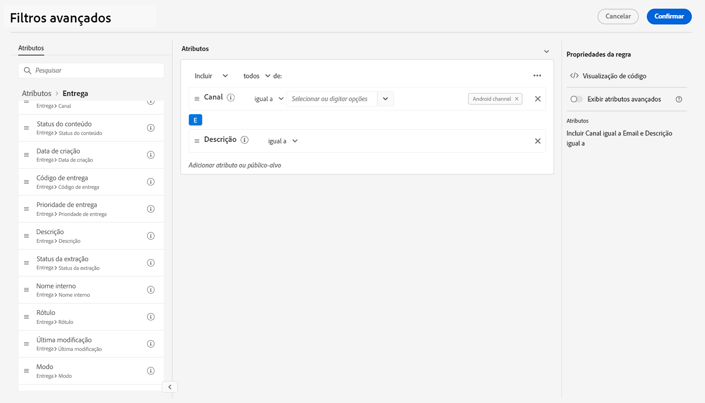

# Procurar, pesquisar e filtrar listas {#list-screens}

A maioria dos links do menu de navegação esquerdo exibe listas de objetos, como a lista de **Entregas** ou **Campanhas**. Algumas dessas telas de lista são somente leitura. Você pode personalizar a exibição da lista e filtrar essas listas, conforme detalhado abaixo.

Para remover um filtro, clique no link **Limpar tudo** botão.

## Personalizar telas de lista {#custom-lists}

As listas são exibidas em colunas. É possível exibir informações adicionais alterando a configuração da coluna. Para fazer isso, clique no link **Configurar coluna para layout personalizado** no canto superior direito da lista.

{width="70%" align="left" zoomable="yes"}

No **Configurar colunas** , adicionar ou remover colunas e alterar a ordem na qual elas são exibidas.

Por exemplo, para estas configurações:

{width="70%" align="left"}

A lista mostra as seguintes colunas:

{width="70%" align="left"}

Use o **Exibir atributos avançados** alternar para ver todos os atributos da lista atual. [Saiba mais](#adv-attributes)

## Classificar dados {#sort-lists}

Também é possível classificar itens na lista clicando em qualquer cabeçalho de coluna. Uma seta é exibida (para cima ou para baixo) indicando que a lista está classificada nessa coluna.

Para colunas numéricas ou de data, a variável **Para cima** indica que a lista é classificada em ordem crescente enquanto a variável **Para baixo** indica uma ordem descendente. Para strings ou colunas alfanuméricas, os valores são listados em ordem alfabética.

## Filtros embutidos {#list-built-in-filters}

Para localizar itens mais rapidamente, você pode usar a barra de pesquisa ou filtrar a lista com base em critérios contextuais.

{width="70%" align="left"}

Por exemplo, você pode filtrar deliveries em seu status, canal, data de contato ou pasta. Você também pode ocultar testes.

## Filtros personalizados{#list-custom-filters}

Para criar filtros personalizados nos dados, navegue até a parte inferior dos filtros e clique no **Adicionar regras** botão.

Arraste e solte atributos para criar seus critérios de filtro no **Filtros avançados** tela.

{width="70%" align="left"}

Use o **Exibir atributos avançados** alternar para ver todos os atributos da lista atual. [Saiba mais](#adv-attributes)

## Usar atributos avançados {#adv-attributes}

>[!CONTEXTUALHELP]
>id="acw_attributepicker_advancedfields"
>title="Exibir atributos avançados"
>abstract="Somente os atributos mais comuns são exibidos por padrão na lista de atributos. Use esse botão para criar um filtro com atributos avançados."

Somente os atributos mais comuns são exibidos por padrão nas telas de configuração de filtro e lista de atributos. Atributos que foram definidos como `advanced` os atributos no schema de dados estão ocultos nas telas de configuração.

Use o **Exibir atributos avançados** alternar para ver todos os atributos disponíveis para a lista atual.
