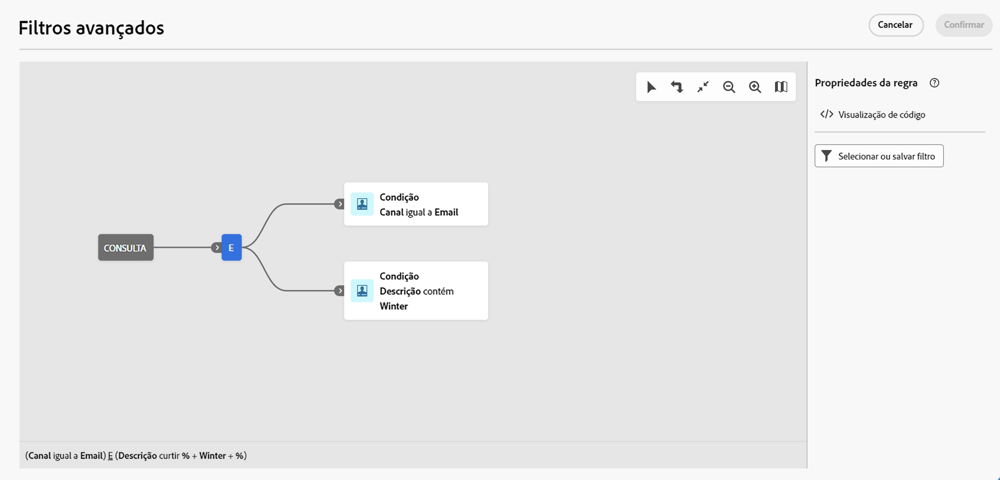

# Listas de busca, pesquisa e filtro {#list-screens}

A maioria dos links do menu de navegação esquerdo exibe listas de objetos, como a lista de **Entregas** ou **Campanhas**. Algumas dessas telas de lista são de somente leitura. É possível personalizar a exibição das listas e filtrá-las, conforme especificado abaixo.

Para remover um filtro, clique em **Limpar tudo**.

## Personalizar telas de lista {#custom-lists}

As listas são exibidas em colunas. É possível exibir informações adicionais alterando a configuração da coluna. Para fazer isso, clique no ícone de **Configurar coluna para um layout personalizado** no canto superior direito da lista.

{width="70%" align="left" zoomable="yes"}

Na tela **Configurar colunas**, adicione ou remova colunas e altere a ordem na qual elas são exibidas.

Por exemplo, para estas configurações:

{width="70%" align="left" zoomable="yes"}

A lista mostrará as seguintes colunas:

{width="70%" align="left" zoomable="yes"}

Use o botão **Exibir atributos avançados** para ver todos os atributos da lista atual. [Saiba mais](#adv-attributes)

## Classificação de dados {#sort-lists}

Também é possível classificar itens na lista clicando em qualquer cabeçalho de coluna. Uma seta será exibida (para cima ou para baixo) indicando que a lista está classificada por essa coluna.

Para colunas numéricas ou de datas, a seta para **cima** indica que a lista está classificada em ordem crescente, enquanto a seta para **baixo** indica ela está em ordem decrescente. Para strings ou colunas alfanuméricas, os valores são listados em ordem alfabética.

## Filtros integrados {#list-built-in-filters}

Para localizar itens mais rapidamente, é possível usar a barra de pesquisa ou filtrar a lista com base em critérios contextuais.

{width="70%" align="left" zoomable="yes"}

Por exemplo, você pode filtrar as entregas por seu status, canal, data de contato ou pasta. Também é possível ocultar testes.

## Filtros personalizados{#list-custom-filters}

Para criar filtros personalizados de dados, navegue até a parte inferior dos filtros e clique em **Adicionar regras** para acessar o criador de regras.

Arraste e solte atributos para criar seus critérios de filtro na tela **Filtros avançados**.

{width="70%" align="left" zoomable="yes"}

Use o botão **Exibir atributos avançados** para ver todos os atributos da lista atual. [Saiba mais](#adv-attributes)

O princípio operacional do criador de regras para filtros personalizados é semelhante ao usado para criar públicos-alvo. Informações detalhadas sobre como usá-lo estão disponíveis na [documentação de públicos-alvo](../audience/segment-builder.md).

## Usar atributos avançados {#adv-attributes}

>[!CONTEXTUALHELP]
>id="acw_attributepicker_advancedfields"
>title="Exibir atributos avançados"
>abstract="Por padrão, somente os atributos mais comuns são exibidos na lista de atributos. Ative o botão **Exibir atributos avançados** para ver todos os atributos disponíveis para a lista atual na paleta esquerda do construtor de regras, como nós, agrupamentos, links 1-1 e links 1-N."

>[!CONTEXTUALHELP]
>id="acw_rulebuilder_advancedfields"
>title="Campos avançados do construtor de regras"
>abstract="Por padrão, somente os atributos mais comuns são exibidos na lista de atributos. Ative o botão **Exibir atributos avançados** para ver todos os atributos disponíveis para a lista atual na paleta esquerda do construtor de regras, como nós, agrupamentos, links 1-1 e links 1-N."

>[!CONTEXTUALHELP]
>id="acw_rulebuilder_properties_advanced"
>title="Atributos avançados do construtor de regras"
>abstract="Por padrão, somente os atributos mais comuns são exibidos na lista de atributos. Ative o botão **Exibir atributos avançados** para ver todos os atributos disponíveis para a lista atual na paleta esquerda do construtor de regras, como nós, agrupamentos, links 1-1 e links 1-N."

Por padrão, somente os atributos mais comuns são exibidos nas telas de configuração de filtro e lista de atributos. Os atributos que foram definidos como atributos `advanced` no esquema de dados, estão ocultos nas telas de configuração.

Ative o botão **Exibir atributos avançados** para ver todos os atributos disponíveis para a lista atual na paleta esquerda do construtor de regras, como nós, agrupamentos, links 1-1 e links 1-N. A lista de atributos é atualizada instantaneamente.

{width="70%" align="left" zoomable="yes"}
