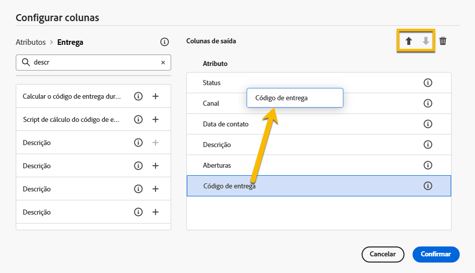

# Procurar e filtrar listas {#list-screens}

A maioria dos links do menu de navegação esquerdo exibe listas de objetos, como a lista de **Entregas** ou **Campanhas**. Algumas dessas telas de lista são de somente leitura. É possível personalizar a exibição das listas e filtrá-las, conforme especificado abaixo.

## Personalizar telas de lista {#custom-lists}

As listas são exibidas em colunas. É possível exibir informações adicionais alterando a configuração da coluna. Para fazer isso, clique no ícone de **Configurar coluna para um layout personalizado** no canto superior direito da lista.

{zoomable="yes"}{width="70%" align="left" zoomable="yes"}

Na tela **Configurar colunas**, adicione ou remova colunas e altere a ordem na qual elas são exibidas.

Você pode alterar a ordem da lista ao **arrastar e soltar** ou com as **setas para cima e para baixo** conforme mostrado abaixo:

{zoomable="yes"}{width="70%" align="left" zoomable="yes"}

Por exemplo, para estas configurações:

{zoomable="yes"}{width="70%" align="left" zoomable="yes"}

A lista mostrará as seguintes colunas:

{zoomable="yes"}{width="70%" align="left" zoomable="yes"}

## Classificação de dados {#sort-lists}

Também é possível classificar itens na lista clicando em qualquer cabeçalho de coluna. Uma seta será exibida (para cima ou para baixo) indicando que a lista está classificada por essa coluna.

Para colunas numéricas ou de datas, a seta para **cima** indica que a lista está classificada em ordem crescente, enquanto a seta para **baixo** indica ela está em ordem decrescente. Para strings ou colunas alfanuméricas, os valores são listados em ordem alfabética.

## Filtros {#list-built-in-filters}

Para encontrar itens mais rapidamente, você pode usar a barra de pesquisa ou filtros integrados e personalizados para adaptar a lista com base em critérios contextuais.

{zoomable="yes"}{width="70%" align="left" zoomable="yes"}

Informações detalhadas sobre como usar filtros e criar seus próprios filtros personalizados estão disponíveis [nesta seção](../query/filter.md).

<!--
## Use advanced attributes {#adv-attributes}

>[!CONTEXTUALHELP]
>id="acw_attributepicker_advancedfields"
>title="Display advanced attributes"
>abstract="Only the most common attributes are displayed by default in the attribute list. Activate the **Display advanced attributes** toggle to see all available attributes for the current list in the left palette of the rule builder, such as nodes, groupings, 1-1 links, 1-N links."

>[!CONTEXTUALHELP]
>id="acw_rulebuilder_advancedfields"
>title="Rule builder advanced fields"
>abstract="Only the most common attributes are displayed by default in the attribute list. Activate the **Display advanced attributes** toggle to see all available attributes for the current list in the left palette of the rule builder, such as nodes, groupings, 1-1 links, 1-N links."

>[!CONTEXTUALHELP]
>id="acw_rulebuilder_properties_advanced"
>title="Rule builder advanced attributes"
>abstract="Only the most common attributes are displayed by default in the attribute list. Activate the **Display advanced attributes** toggle to see all available attributes for the current list in the left palette of the rule builder, such as nodes, groupings, 1-1 links, 1-N links."

Only most common attributes are displayed by default in the attribute list and filter configuration screens. Attributes which were set as `advanced` attributes in the data schema are hidden from the configuration screens. 

Activate the **Display advanced attributes** toggle to see all available attributes for the current list in the left palette of the rule builder, such as nodes, groupings, 1-1 links, 1-N links. The attribute list is updated instantly.

{zoomable="yes"}{width="70%" align="left" zoomable="yes"}
-->