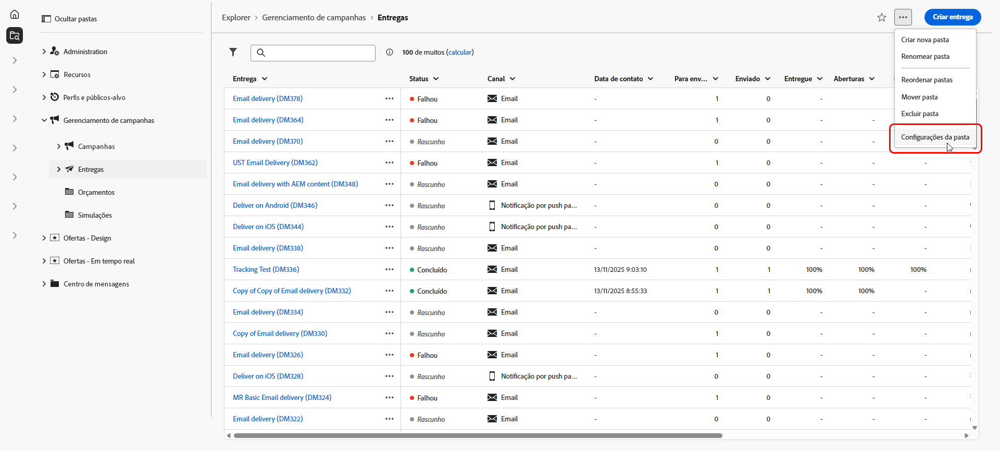
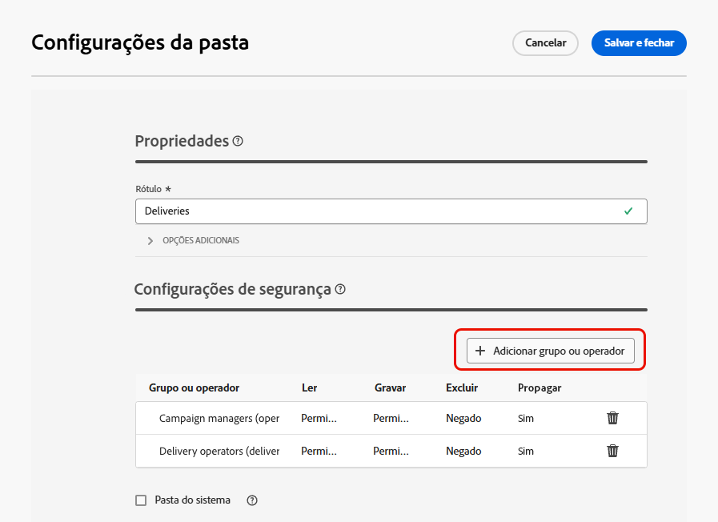
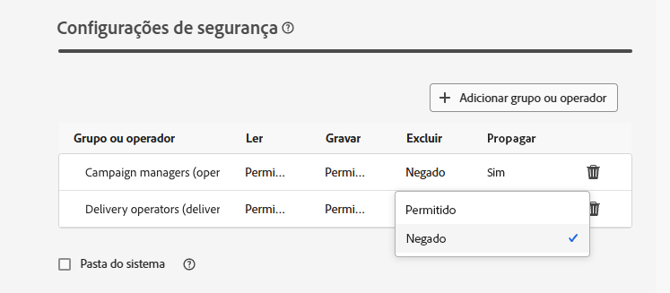

# Permissões {#permissions}

Cada usuário no Adobe Campaign tem suas próprias permissões e restrições no aplicativo. O usuário pode pertencer a um grupo de operadores e herdar as permissões do grupo.

Com base em suas permissões, o operador pode:

* Acessar certas funcionalidades
* Acessar certos dados
* Acessar certas ações (criar, modificar, excluir)

Um procedimento detalhado para configurar permissões no Adobe Campaign está disponível na [documentação do Adobe Campaign v8 (console)](https://experienceleague.adobe.com/pt-br/docs/campaign/campaign-v8/admin/permissions/gs-permissions){target="_blank"}.

## Permissões de pastas {#folder-permissions}

Com base em seus direitos, você pode exibir e gerenciar permissões de pastas nas **[!UICONTROL Configurações da pasta]**.

Veja abaixo um exemplo de uma pasta de entrega:

{zoomable="yes"}

Na seção **[!UICONTROL Segurança]** das **[!UICONTROL Configurações da pasta]**, é possível exibir e gerenciar (adicionar ou excluir) operadores ou grupos que podem acessar a pasta.

{zoomable="yes"}

Clique diretamente nas permissões e altere-as para **[!UICONTROL Permitido]** ou **[!UICONTROL Negado]**.

{zoomable="yes"}

>[!NOTE]
>
>Você não deve ser capaz de criar um objeto para o qual não tem pelo menos uma pasta com direitos de gravação.
>
>Não é necessário ser administrador para criar fragmentos, mas é preciso ter direitos de gravação em pelo menos uma pasta de &quot;Fragmento visual de conteúdo&quot;. Caso contrário, não será possível criar um fragmento visual.

Se a opção **[!UICONTROL Propagar]** estiver habilitada, todas as permissões definidas para uma pasta serão aplicadas a todas as suas subpastas. Essas permissões podem ser substituídas em cada subpasta.

Se a opção **[!UICONTROL Pasta do sistema]** for selecionada, o acesso será permitido a todos os operadores, independentemente de suas permissões.

Também é possível [gerenciar as permissões de pastas no console do Adobe Campaign](https://experienceleague.adobe.com/pt-br/docs/campaign/campaign-v8/admin/permissions/folder-permissions){target="_blank"}.

Todas as permissões na interface do Campaign Web são sincronizadas com as permissões do console do cliente do Campaign. 