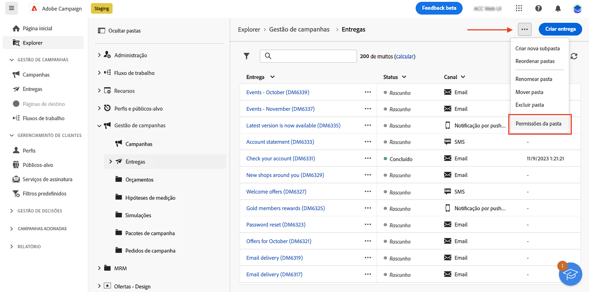
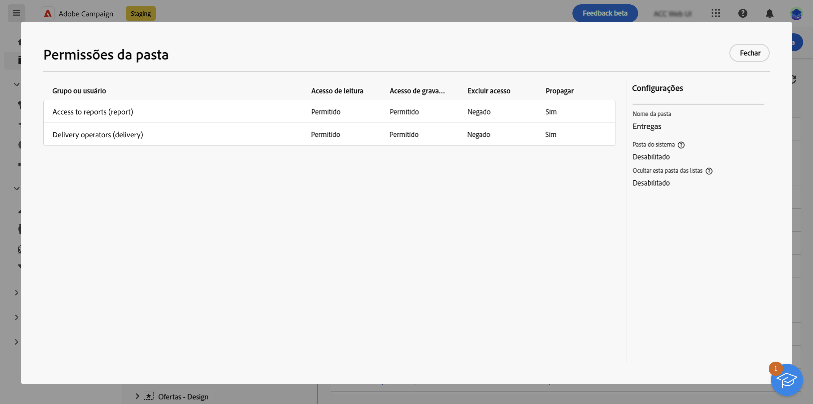
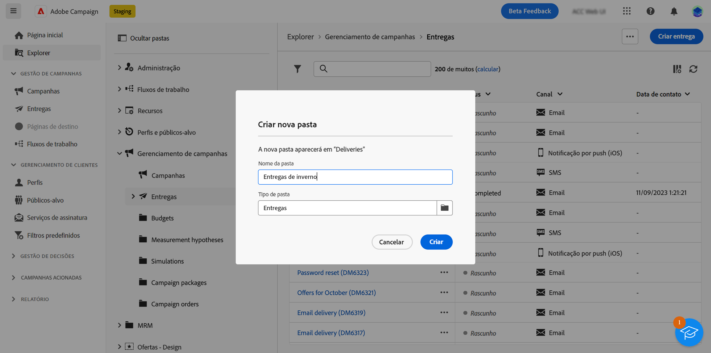
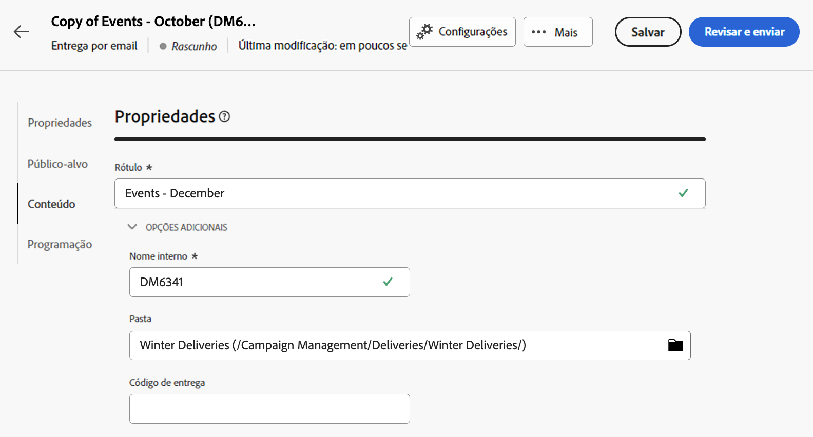

# Acesso e permissões {#access-and-permissions}

>[!CONTEXTUALHELP]
>id="acw_explorer_permissions_create"
>title="Permissão necessária"
>abstract="A administração precisa conceder a permissão para que você possa criar este objeto."

>[!CONTEXTUALHELP]
>id="acw_audiences_read_only"
>title="Este público-alvo é somente de leitura"
>abstract="Você não tem permissões para editar este público-alvo. Se necessário, entre em contato com o administrador para obter acesso."

>[!CONTEXTUALHELP]
>id="acw_subscription_services_read_only"
>title="Este serviço é somente de leitura."
>abstract="Você não tem permissões para editar este serviço. Se necessário, entre em contato com o administrador para obter acesso."

>[!CONTEXTUALHELP]
>id="acw_campaign_read_only"
>title="Esta campanha é somente de leitura"
>abstract="Você não tem permissões para editar esta campanha. Se necessário, entre em contato com o administrador para obter acesso."

>[!CONTEXTUALHELP]
>id="acw_deliveries_read_only"
>title="Esta entrega é somente de leitura"
>abstract="Você não tem permissões para editar esta entrega. Se necessário, entre em contato com o administrador para obter acesso."

>[!CONTEXTUALHELP]
>id="acw_wf_read_only"
>title="Este workflow é de somente leitura"
>abstract="Você não tem permissões para editar este fluxo de trabalho. Se necessário, entre em contato com o administrador para obter acesso."

>[!CONTEXTUALHELP]
>id="acw_wf_read_only_canvas"
>title="Este workflow é de somente leitura"
>abstract="Não é possível editar esse workflow devido a uma tela incompatível."

O controle de acesso pode restringir o acesso a objetos e dados de listas principais, como entregas, destinatários ou fluxos de trabalho. Estas restrições aplicam-se também à árvore de navegação do **Explorer**. Além disso, você precisa de permissões para criar, excluir, duplicar e editar objetos na interface.

O controle de acesso é gerenciado no console do cliente do Campaign. Todas as permissões no Campaign Web são sincronizadas com as permissões do console do cliente do Campaign. Somente admins do Campaign podem definir e modificar permissões de usuário. Saiba mais sobre permissões de usuário na [documentação do Campaign v8 (console do cliente)](https://experienceleague.adobe.com/docs/campaign/campaign-v8/admin/permissions/gs-permissions.html?lang=pt-BR){target="_blank"}.

Ao navegar pela interface do Campaign Web, você pode acessar dados, objetos e recursos, dependendo das suas permissões. Por exemplo, caso não possua permissões de acesso a uma pasta, você não poderá vê-la. Suas permissões também afetam objetos e o gerenciamento de dados. Sem permissões de gravação para uma pasta específica, não é possível criar uma entrega nessa pasta, mesmo que você possa vê-la na interface.

## Exibir permissões {#view-permissions}

No **Explorer**, você pode procurar as permissões para cada pasta. Essas permissões são definidas no console do cliente e usadas para organizar e controlar o acesso aos dados do Campaign.

Para exibir as permissões de uma pasta, siga estas etapas:

1. No menu de navegação esquerdo do **Explorer**, selecione uma pasta.
1. Clique nos três pontos no canto superior direito e selecione **Permissões da pasta**.

   {width="70%" align="left" zoomable="yes"}

1. Verifique os detalhes na tela, conforme abaixo:

   {width="70%" align="left" zoomable="yes"}

   Um grupo ou operador(a) pode ter permissões de Leitura, Gravação e/ou Exclusão para dados armazenados na pasta selecionada.

   Se a opção **Propagar** estiver habilitada, todas as permissões definidas para uma pasta serão aplicadas às suas subpastas. Essas permissões podem ser sobrecarregadas para cada subpasta.

   Se a opção **Pasta do sistema** estiver habilitada, o acesso será permitido a todos os operadores, independentemente das permissões.

Saiba mais sobre permissões de pasta na [documentação do Campaign v8 (console do cliente)](https://experienceleague.adobe.com/docs/campaign/campaign-v8/admin/permissions/folder-permissions.html?lang=pt-BR){target="_blank"}.

## Trabalhar com pastas {#folders}

Você pode criar, renomear, reordenar e mover pastas para organizar seus componentes e dados. Também é possível excluir pastas no mesmo menu.

>[!CAUTION]
>
>Ao excluir uma pasta, todos os dados armazenados nela também são excluídos.

Para criar uma pasta, siga estas etapas:

1. No menu de navegação esquerdo do **Explorer**, selecione uma pasta.
1. Clique nos três pontos no canto superior direito e escolha **Criar nova subpasta**.
1. Insira o nome da pasta e salve.

   {width="70%" align="left" zoomable="yes"}

   A pasta é adicionada como uma subpasta da pasta atual. Navegue até essa nova pasta para criar componentes diretamente a partir dela. Você também pode criar um componente a partir de qualquer pasta e salvá-lo nessa nova pasta, por meio da seção **Opções adicionais** das propriedades, conforme o exemplo de entrega abaixo:

   {width="70%" align="left" zoomable="yes"}
