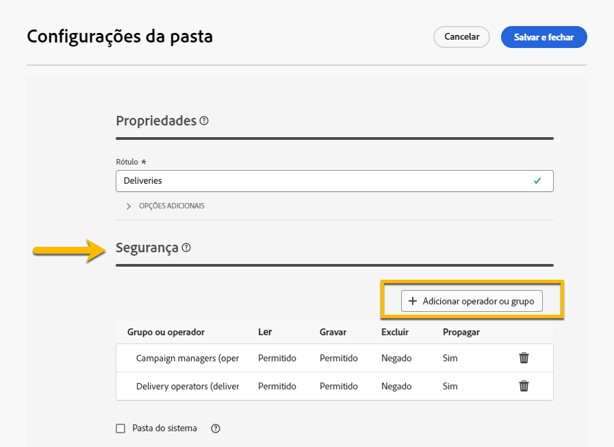

# Permissões {#permissions}

Cada usuário no Adobe Campaign tem suas próprias permissões e restrições no aplicativo. O usuário pode fazer parte de um grupo de operadores e herdar as permissões do grupo.

De acordo com as permissões, um(a) operador(a) pode:

* Acessar certas funcionalidades
* Acessar certos dados
* Acessar certas ações (criar, modificar, excluir)

O procedimento detalhado para configurar permissões no Adobe Campaign está disponível na [documentação do Adobe Campaign v8 (console)](https://experienceleague.adobe.com/pt/docs/campaign/campaign-v8/admin/permissions/gs-permissions){target="_blank"}.

## Permissões de pastas {#folder-permissions}

De acordo com os direitos, existe a possibilidade de exibir e gerenciar as permissões de pastas nas **[!UICONTROL Configurações de pasta]**.

Veja abaixo um exemplo de uma pasta de entrega:

{zoomable="yes"}

Na seção **[!UICONTROL Segurança]** das **[!UICONTROL Configurações de pasta]**, é possível exibir e gerenciar (adicionar ou excluir) operadores ou grupos que podem acessar a pasta.

{zoomable="yes"}

É possível clicar diretamente nas permissões e alterá-las para **[!UICONTROL Permitir]** ou **[!UICONTROL Negar]**.

{zoomable="yes"}

Se a opção **[!UICONTROL Propagar]** estiver habilitada, todas as permissões definidas para uma pasta serão aplicadas às suas subpastas. Essas permissões podem ser sobrecarregadas para cada subpasta.

Se a opção **[!UICONTROL Pasta do sistema]** estiver habilitada, o acesso será permitido a todos os operadores, independentemente das permissões.

Também é possível [gerenciar as permissões nas pastas do console do Adobe Campaign](https://experienceleague.adobe.com/pt/docs/campaign/campaign-v8/admin/permissions/folder-permissions){target="_blank"}.

Todas as permissões na interface do Campaign Web são sincronizadas com as permissões do console do cliente do Campaign. 
