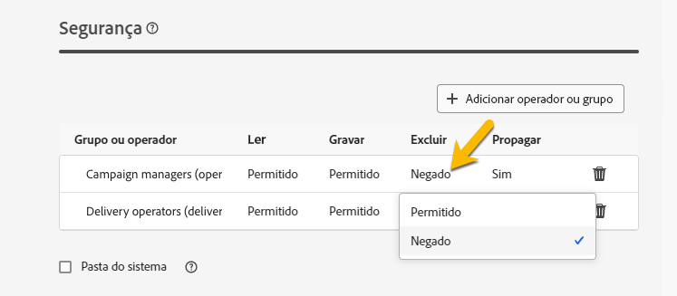

# Permissões {#permissions}

Cada usuário no Adobe Campaign tem suas próprias permissões e restrições no aplicativo.

O usuário pode fazer parte de um grupo de operadores e herdará as permissões do grupo.

De acordo com suas permissões, um operador pode:

* Acesso a determinados recursos
* Acesso a determinados dados
* Acesso a determinadas ações (criar, modificar, excluir)

## Permissões em pastas {#folder-permissions}

De acordo com seus direitos, você tem a possibilidade de exibir e gerenciar as permissões em pastas nas **[!UICONTROL Configurações de pasta]**.
Abaixo há um exemplo em uma pasta de delivery.

{zoomable="yes"}

Na seção **[!UICONTROL Segurança]** das **[!UICONTROL Configurações de pasta]**, você pode exibir e gerenciar (adicionar ou excluir) operadores ou grupos que podem acessar a pasta.

{zoomable="yes"}

Você pode clicar diretamente nas permissões e alterá-las **[!UICONTROL Permitidas]** ou **[!UICONTROL Negadas]**.

{zoomable="yes"}

Se a opção **[!UICONTROL Propagar]** estiver habilitada, todas as permissões definidas para uma pasta serão aplicadas às suas subpastas. Essas permissões podem ser sobrecarregadas para cada subpasta.

Se a opção **[!UICONTROL Pasta do sistema]** estiver marcada, o acesso será permitido para todos os operadores, independentemente de suas permissões.

Você também pode [gerenciar as permissões em pastas no console do Adobe Campaign](https://experienceleague.adobe.com/en/docs/campaign/campaign-v8/admin/permissions/folder-permissions).
Todas as permissões na interface da Web do Campaign são sincronizadas com as permissões do Console do cliente do Campaign.
