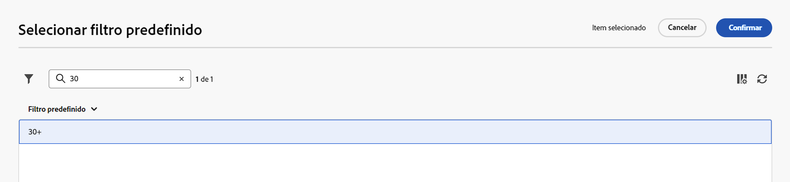

# Trabalhar com filtros predefinidos {#predefined-filters}

>[!CONTEXTUALHELP]
>id="acw_homepage_learning_card4"
>title="Gerenciamento de filtro predefinido"
>abstract="A interface da Web do Campaign oferece uma interface fácil de usar para gerenciar e personalizar facilmente filtros predefinidos para atender às suas necessidades específicas. Crie uma vez e salve para uso futuro."

>[!CONTEXTUALHELP]
>id="acw_predefined-filters-dashboard"
>title="Filtros predefinidos"
>abstract="A interface da Web do Campaign oferece uma interface fácil de usar para gerenciar e personalizar facilmente filtros predefinidos para atender às suas necessidades específicas. Crie uma vez e salve para uso futuro."

Filtros predefinidos são filtros personalizados criados e salvos para uso futuro. Eles atuam como atalhos durante as operações de filtragem com o modelador de consultas. Por exemplo, elas podem ser usadas ao filtrar uma lista de dados ou criar o público-alvo de um delivery.

Você pode usar filtros incorporados existentes para acessar um subconjunto específico de seus dados ou criar seus próprios filtros predefinidos e salvá-los.

{zoomable="yes"}

## Criar um filtro predefinido {#create-predefined-filter}

>[!CONTEXTUALHELP]
>id="acw_predefined-filters-creation"
>title="Criar um filtro predefinido"
>abstract="Insira um rótulo para o filtro predefinido e selecione a tabela à qual ele se aplica. Abra as opções adicionais para adicionar uma descrição e definir este filtro como favorito. Em seguida, use o botão “Criar regra” para definir as condições de filtragem."

>[!CONTEXTUALHELP]
>id="acw_predefined-filters-rules"
>title="Criar as regras de filtro predefinidas"
>abstract="Para definir as condições de filtragem do filtro personalizado, clique no botão “Criar regra”."

### Criar um filtro no modelador de consulta {#create-from-rule-builder}

Salve um filtro personalizado do [modelador de consultas](../query/query-modeler-overview.md) para disponibilizá-lo para uso futuro. Siga estas etapas:

1. Abra o modelador de consulta e defina as condições de filtragem. No exemplo abaixo, os recipients que vivem em Madri e assinaram um boletim informativo são filtrados.
1. Clique em **Selecionar ou salvar filtro** e selecione **Salvar como um filtro**.

   {zoomable="yes"}

1. Selecione **Criar um novo filtro** e insira um nome e uma descrição para esse filtro.

   {zoomable="yes"}

   Você pode salvar o filtro como favorito, se necessário. Saiba mais [nesta seção](#fav-filter).

1. Clique em **Confirmar** para salvar as alterações.

Seu filtro personalizado agora está disponível na lista **Filtros predefinidos** e acessível a todos os usuários e usuárias do Campaign.

### Criar um filtro na lista de filtros {#create-filter-from-list}

Crie um filtro a partir da entrada **Filtros predefinidos** do menu à esquerda. Siga estas etapas:

1. Navegue até a entrada **Filtros predefinidos** no menu esquerdo.
1. Clique em **Criar filtro**.
1. Insira o nome do filtro e, no campo **Tipo de documento**, selecione o esquema ao qual se aplica. O esquema padrão é `Recipients(nms)`.

1. Defina a regra para o filtro. Por exemplo, perfis com mais de 30 anos.

   {zoomable="yes"}

1. Salve as alterações.

   {zoomable="yes"}

O filtro é adicionado à lista de filtros predefinidos. Você pode salvar o filtro como favorito, se necessário. Saiba mais [nesta seção](#fav-filter).

## Salvar o filtro como favorito {#fav-filter}

Ao criar um filtro predefinido, habilite a opção **Salvar como favorito** para ver esse filtro predefinido em seus favoritos.

Ao ser salvo como favorito, o filtro fica disponível a todos na seção **Filtros favoritos** da lista de criação de filtros, conforme mostrado abaixo:

{zoomable="yes"}{width="30%" align="left"}

## Usar um filtro predefinido {#use-predefined-filter}

Filtros predefinidos estão disponíveis ao definir propriedades da regra. Para acessar filtros predefinidos, escolha a opção **Selecionar filtro personalizado** no menu suspenso do modelador de consultas.

Acesse a lista completa de filtros predefinidos disponíveis para o contexto atual e use atalhos na seção **Filtros favoritos** do menu suspenso. Saiba mais sobre favoritos [nesta seção](#fav-filter).

Por exemplo, para criar um público-alvo a partir de um filtro predefinido, siga estas etapas:

1. Navegue até a entrada **Públicos-alvo** no menu esquerdo e clique no botão **Criar público-alvo** no canto superior esquerdo da lista de públicos-alvo.
1. Insira o nome do público-alvo e clique em **Criar público-alvo**.
1. Selecione a atividade **Consulta** e, no painel direito, clique no botão **Criar público-alvo**.

   {zoomable="yes"}

1. No botão **Selecionar ou salvar filtro**, escolha a opção **Selecionar filtro personalizado**.

   {zoomable="yes"}

1. Navegue até o filtro predefinido que será usado para criar o público-alvo, selecione-o e confirme.

   {zoomable="yes"}

1. Verifique as propriedades da regra desse filtro e confirme.

   Agora o filtro é usado como uma consulta na atividade de **Consulta**.

   {zoomable="yes"}

1. Salve as alterações e clique em **Iniciar** para criar o público-alvo e disponibilizá-lo na lista de públicos-alvo.

## Gerenciar filtros predefinidos {#manage-predefined-filter}

Os filtros predefinidos estão agrupados na entrada dedicada do menu de navegação esquerdo.

{zoomable="yes"}

Nessa lista, é possível criar um novo filtro conforme detalhado acima e executar as ações listadas abaixo:

* Edite um filtro existente e altere suas regras e propriedades.
* Duplicar um filtro predefinido.
* Excluir um filtro predefinido.

Você também pode adicionar um filtro predefinido como um favorito para acesso rápido ao criar seus públicos. Saiba mais [nesta seção](#fav-filter).

<!--
## Built-in predefined filters {#ootb-predefined-filter}

Campaign comes with a set of predefined filters, built from the client console. These filters can be used to define your audiences, and rules. They must not be modified.
-->