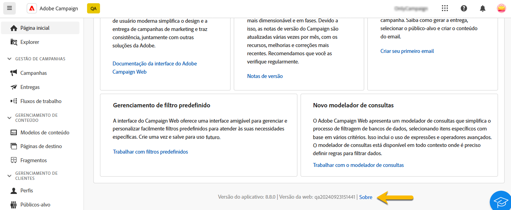
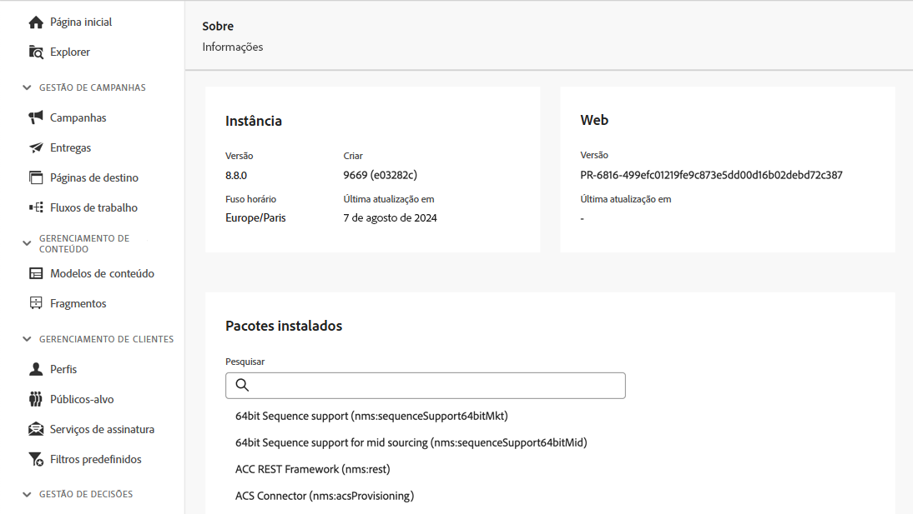

# Conheça a interface {#user-interface}

A nova interface do Adobe Campaign Web oferece uma experiência de usuário moderna e intuitiva para simplificar o design e a entrega da campanha de marketing. A nova interface é integrada aos aplicativos e soluções da Adobe Experience Cloud.

Saiba como se conectar ao Adobe Campaign e conheça as noções básicas de navegação da Experience Cloud [neste artigo](connect-to-campaign.md).

>[!NOTE]
>
>Esta documentação é atualizada com frequência para refletir as alterações recentes na interface do produto. Entretanto, algumas capturas de tela podem diferir ligeiramente da sua interface.

## Página inicial do Campaign {#user-interface-home}

>[!CONTEXTUALHELP]
>id="acw_homepage_recent"
>title="Recentes"
>abstract="A lista **Recentes** fornece atalhos para as entregas criadas e modificadas recentemente. Esta lista mostra o canal, status, proprietário, datas de criação e modificação."

A página inicial do Campaign permite uma navegação rápida e fácil pelos principais recursos, indicadores e componentes.

A seção superior da página inicial fornece detalhes sobre as atualizações mais recentes e os novos recursos disponíveis no produto, com links para as notas de versão e a documentação detalhada. Use a seta esquerda para rolar pelos cartões de recursos.

{zoomable="yes"}

Os **indicadores principais de desempenho** permitem verificar a eficácia da plataforma por meio de KPIs comuns. Saiba mais sobre esses KPIs [nesta página](../reporting/kpis.md).

A lista **Recentes** fornece atalhos para as entregas criadas e modificadas recentemente. Esta lista mostra o canal, status, proprietário, datas de criação e modificação. Clique no link **Mostrar mais** para carregar mais entregas.

Você também pode acessar as principais páginas de ajuda do Adobe Campaign Web na seção **Aprendizado** da página.

### Link Sobre {#user-interface-about}

>[!CONTEXTUALHELP]
>id="acw_about"
>title="Página Sobre"
>abstract="A página Sobre fornece detalhes sobre a instância do Adobe Campaign"

>[!CONTEXTUALHELP]
>id="acw_about_instance"
>title="Sobre a Instância "
>abstract="A seção Instância fornece informações importantes sobre o cliente de console, incluindo a versão e o número de build associado"

>[!CONTEXTUALHELP]
>id="acw_about_web"
>title="Sobre a Web"
>abstract="A seção Web exibe a versão da interface do Campaign Web, com a data da última atualização, se disponível."

>[!CONTEXTUALHELP]
>id="acw_about_packages"
>title="Sobre pacotes instalados"
>abstract="A seção Pacotes instalados lista todos os módulos, recursos e integrações presentes na instância."

Na parte inferior da página, o link **[!UICONTROL Sobre]** fornece detalhes sobre a instância do Adobe Campaign. essas informações estão no modo de somente leitura.

{zoomable="yes"}

A seção **Instância** fornece informações importantes sobre o cliente de console, incluindo a **versão** e o número de **build** associado.

* A **versão** se refere à versão oficial que você está usando,
* A **build** se refere a uma iteração específica dessa versão.

Os números de versão e de build são cruciais para a solução de problemas, pois ajudam a determinar exatamente quais recursos e correções estão presentes em seu ambiente.

A seção **Web** exibe a versão da interface do Campaign Web, com a data da última atualização, se disponível. Isso ajuda a rastrear alterações ou melhorias feitas na interface do Campaign Web.

A seção **Pacotes instalados** lista todos os módulos, recursos e integrações presentes na sua instância. Esses pacotes estendem a funcionalidade do Adobe Campaign, permitindo que ele execute tarefas especializadas, como a integração com outras soluções da Adobe ou a ativação de fluxos de trabalho específicos. Dado o grande número de pacotes, você pode fazer uma pesquisa nesta seção para verificar rapidamente se um módulo específico está instalado em sua instância.

{zoomable="yes"}

## Menu de navegação esquerdo {#user-interface-left-nav}

Navegue pelos links à esquerda para acessar os recursos do Adobe Campaign Web. Vários links exibem listas de objetos que podem ser classificados e filtrados. Você também pode configurar colunas para exibir todas as informações necessárias. Consulte esta [seção](#list-screens). Algumas telas de lista são do tipo somente leitura. Os itens exibidos no menu de navegação esquerdo e nas listas dependem das permissões de usuário. Saiba mais sobre permissões [nesta seção](permissions.md).

### Explorer {#user-interface-explorer}

>[!CONTEXTUALHELP]
>id="acw_explorer"
>title="Explorer"
>abstract="O menu **Explorer** exibe todos os componentes e objetos do Campaign com a mesma hierarquia de pastas que a do console do cliente. Navegue por todos os componentes, pastas e esquemas do Campaign v8, verifique as permissões associadas e crie pastas e subpastas neste menu."

O menu **Explorer** exibe todos os recursos e objetos do Campaign com a mesma hierarquia de pastas que a do console do cliente. Navegue por todos os componentes, pastas e esquemas do Campaign v8 e crie entregas, fluxos de trabalhos e campanhas.

Os itens exibidos no **Explorer** dependem das permissões de usuário. Também é possível adicionar pastas e subpastas, caso você tenha os direitos adequados. Saiba mais sobre permissões [nesta seção](permissions.md).

Você pode configurar colunas para personalizar a exibição e visualizar todas as informações necessárias. Consulte esta [seção](#list-screens). Também é possível adicionar pastas e subpastas, conforme detalhado [nesta seção](permissions.md#folders).

Para obter mais informações sobre o Explorer do Campaign, a hierarquia de pastas e os recursos, consulte a [documentação do Campaign v8 (console)](https://experienceleague.adobe.com/docs/campaign/campaign-v8/new/campaign-ui.html?lang=pt-BR#ac-explorer-ui){target="_blank"}.

### Gerenciamento de campanhas {#user-interface-campaign-management}

Na seção GERENCIAMENTO DE CAMPANHA, é possível acessar campanhas de marketing, entregas e workflows.

* **Campanhas** - Esta é a lista de suas campanhas e modelos de campanha. Por padrão, para cada campanha, é possível visualizar as datas de início/término/criação/última modificação, o status atual e o nome do operador de campanha que a criou. É possível filtrar a lista por status, datas de início/término, pasta ou criar um filtro avançado para definir seus próprios critérios de filtragem. Saiba mais sobre campanhas [nesta seção](../campaigns/gs-campaigns.md).

* **Entregas**: navegue pela lista de entregas. Você pode visualizar o estado, a data da última modificação, bem como os principais KPIs. É possível filtrar a lista por status, data de contato ou canal. Clique em uma entrega de email para abrir o painel e obter uma visão geral dos detalhes da entrega. As entregas em outros canais são do tipo somente leitura. Saiba mais sobre entregas [nesta seção](../msg/gs-messages.md).

  Use o botão **Mais ações** para excluir ou duplicar uma entrega.

  {zoomable="yes"}{width="70%" align="left"}

* **Workflows** - Nessa tela, é possível acessar a lista completa de workflows e modelos de workflows. É possível verificar o status, as datas da última/próxima execução e criar um novo workflow ou um novo modelo de workflow. É possível filtrar a lista com os mesmos critérios de outros objetos. Além disso, é possível filtrar os workflows que pertencem ou não a uma campanha. Saiba mais sobre fluxos de trabalho [nesta seção](../workflows/gs-workflows.md).

### Gerenciamento de conteúdo {#user-interface-content-management}

Na seção GERENCIAMENTO DE COUNTEÚDO, você pode visualizar os modelos e fragmentos de conteúdo.

* **Modelos de conteúdo**: para um processo de design acelerado e aprimorado, você pode criar modelos independentes e reutilizar facilmente o conteúdo personalizado no [!DNL Adobe Campaign]. Disponível apenas para emails, essa funcionalidade permite que os usuários orientados por conteúdo trabalhem em modelos independentes para que a equipe de marketing possa reutilizá-los e adaptá-los em suas próprias campanhas de email. Saiba mais [nesta seção](../email/create-email-templates.md).

* **Fragmentos** - Um fragmento é um componente reutilizável que pode ser referenciado em uma ou mais entregas em campanhas. Ao modificar um fragmento, todos os conteúdos que o usam serão atualizados. [Saiba como trabalhar com fragmentos](../content/fragments.md)

Essa funcionalidade permite pré-construir vários blocos de conteúdo personalizados que usuários de marketing podem utilizar para preparar rapidamente o conteúdo de mensagens em um processo de design aprimorado.

### Gerenciamento de clientes {#user-interface-customer-management}

Na seção GERENCIAMENTO DE CLIENTES, é possível visualizar perfis, públicos-alvo e assinaturas. Essas listas são do tipo somente leitura.

* **Perfis**: crie e gerencie perfis e acesse o banco de dados do destinatário. Por padrão, você pode ver o endereço de email, o nome e o sobrenome. Saiba mais sobre perfis [nesta seção](../audience/about-recipients.md).
* **Públicos-alvos**: esta é a lista de públicos. Por padrão, é possível ver o tipo, a origem, as datas de criação/última modificação e o rótulo. É possível filtrar a lista por origem. Saiba mais sobre públicos-alvo e listas [nesta seção](../audience/about-recipients.md).
* **Serviços de assinatura**: navegue pelas listas de assinaturas. Por padrão, é possível ver o tipo, o modo e o rótulo. Saiba mais sobre como gerenciar assinaturas e seus cancelamentos na [documentação do Adobe Campaign v8 (console)](https://experienceleague.adobe.com/docs/campaign/campaign-v8/campaigns/send/subscriptions.html?lang=pt-BR){target="_blank"}.
* **Filtros predefinidos**: filtros personalizados que são criados e salvos para uso futuro. Eles podem ser usados como atalhos durante qualquer operação de filtragem com o modelador de consultas, por exemplo, ao filtrar uma lista de dados ou criar o público-alvo de uma entrega. Saiba mais [nesta seção](predefined-filters.md).

### Gestão de decisões {#decision-management}

>[!CONTEXTUALHELP]
>id="acw_offers_list"
>title="Ofertas"
>abstract="Navegue pelas listas de ofertas e modelos de ofertas que foram criados no console usando o módulo **Interação**. Essas listas são do tipo somente leitura."
>additional-url="https://experienceleague.adobe.com/docs/campaign-web/v8/msg/offers.html?lang=pt-BR" text="Adicionar ofertas à uma entrega"

Na seção GESTÃO DE DECISÕES, é possível visualizar as ofertas e os modelos de oferta. Essas listas são do tipo somente leitura.

* **Ofertas**: navegue pela lista de ofertas e modelos de ofertas que foram criados no console usando o módulo **Interação**. Por padrão, é possível exibir o status, a data inicial/final e o ambiente. É possível filtrar a lista por status e datas de início/término. Os modelos de oferta também estão disponíveis.

Saiba como criar e enviar ofertas por email e SMS [nesta seção](../msg/offers.md).

### Relatórios {#left-nav-reporting}

* **Relatórios**: a entrada **Relatório** oferece um resumo geral consolidado das métricas de tráfego e engajamento de cada canal no ambiente do Campaign. Esses relatórios consistem em vários dispositivos, cada um oferecendo uma perspectiva distinta sobre a campanha ou o desempenho de entrega. Saiba mais [nesta seção](../reporting/global-reports.md).

### Administração {#left-nav-admin}

* **Trilha de auditoria**: o registro **Trilha de auditoria** fornece visibilidade total de todas as modificações feitas em entidades importantes dentro da sua instância, normalmente aquelas que afetam bastante a operação da instância. [Saiba mais](../reporting/audit-trail.md)

* **Contas externas**: crie novas contas externas usando a Interface da Web para atender às suas necessidades específicas e garantir transferências de dados perfeitas. [Saiba mais](../administration/external-account.md)

* **Esquemas**: campos personalizados são outros atributos adicionados aos esquemas prontos para uso por meio do console do Adobe Campaign. [Saiba mais](../administration/custom-fields.md)

* **Alertas de entrega**: é um sistema de gerenciamento de alertas que permite que grupos de usuários recebam automaticamente notificações por email com informações sobre suas execuções de entrega. [Saiba mais](../msg/delivery-alerting.md)

<!--
## Contextual Help {#user-interface-help} 

A contextual help is available in the interface. When available, click on the `?` icon to display help information and related documentation links. 

{zoomable="yes"}{width="40%" align="left"}

Currently released as a Beta version within the new Campaign Web user interface, the **AI-powered Knowledge Assistant** embedded within contextual help revolutionizes documentation searching and answering how-to questions with effortlessly sifting through vast documentation repositories, instantly pinpointing the precise information you need.

Thanks to Campaign Gen AI's capabilities, this assistant transforms your experience, making information retrieval and problem-solving a breeze. Whether you're seeking guidance in a complex task or navigating extensive documents, our AI-powered Knowledge Assistant is your ultimate companion, providing unmatched efficiency and accuracy in every interaction.

Learn more in [this section](using-ai.md).

-->

## Saiba mais {#learn-more}

Saiba como procurar, pesquisar e filtrar listas disponíveis no ambiente do Campaign [nesta página](list-filters.md).

<!--
######## This part stores the contextualHelp definition for WebUI BETA ###########
######## These blocks should be dispatched in the appropriate pages when available ###########
######## PLEASE DO NOT DELETE ###########
REFER TO 
https://wiki.corp.adobe.com/pages/viewpage.action?spaceKey=neolane&title=v8+WebUI+Contextual+Help+%3CALPHA%3E-+Official+list
-->

>[!CONTEXTUALHELP]
>id="acw_push_permission_for_segment"
>title="Permissão necessária"
>abstract="Seu administrador precisa lhe conceder permissão para que você possa criar um segmento."

>[!CONTEXTUALHELP]
>id="acw_push_overview_edit"
>title="Permissão necessária"
>abstract="Seu administrador precisa lhe conceder permissão para que você possa criar um segmento."

<!-- delivery template settings-->

>[!CONTEXTUALHELP]
>id="acw_global_reporting_sending"
>title="Envio de relatórios globais"
>abstract="As métricas dos relatórios de rastreamento podem ser vistas nesta tela"

>[!CONTEXTUALHELP]
>id="acw_global_reporting_tracking"
>title="Rastreamento de relatórios globais"
>abstract="As métricas dos relatórios de rastreamento podem ser vistas nesta tela"

<!-- FOR BETA (alignment) -->
<!--https://wiki.corp.adobe.com/display/neolane/v8+WebUI+Contextual+Help+%3CBETA%3E-+Official+list-->

<!-- FOR GA -->
<!-- Aligned with https://wiki.corp.adobe.com/display/neolane/v8+WebUI+Contextual+Help+%3CGA%3E-+Official+list -->

>[!CONTEXTUALHELP]
>id="acw_recipients_creation_cardoverview"
>title="Visão geral do cartão dos destinatários"
>abstract="Visão geral do cartão dos destinatários"

>[!CONTEXTUALHELP]
>id="acw_recipients_creation_touchpoints"
>title="Touchpoints dos destinatários"
>abstract="Touchpoints dos destinatários"

>[!CONTEXTUALHELP]
>id="acw_recipients_subscription_selection"
>title="Seleção de assinaturas dos destinatários"
>abstract="Seleção de assinaturas dos destinatários"

>[!CONTEXTUALHELP]
>id="acw_recipients_offers_eligible_list"
>title="Lista qualificada de ofertas dos destinatários"
>abstract="Lista qualificada de ofertas dos destinatários"

>[!CONTEXTUALHELP]
>id="acw_recipients_offers_preview_proposition"
>title="Visualização de ofertas dos destinatários"
>abstract="Visualização de ofertas dos destinatários"

>[!CONTEXTUALHELP]
>id="acw_conditionalcontent_savefilter"
>title="Filtro de salvamento de conteúdo condicional"
>abstract="Filtro de salvamento de conteúdo condicional"

>[!CONTEXTUALHELP]
>id="acw_conditionalcontent_selectfilter"
>title="Filtro de seleção de conteúdo condicional"
>abstract="Filtro de seleção de conteúdo condicional"

>[!CONTEXTUALHELP]
>id="acw_conditionalcontent_subjectline"
>title="Conteúdo condicional na linha de assunto"
>abstract="Conteúdo condicional na linha de assunto"

>[!CONTEXTUALHELP]
>id="acw_conditionalcontent_subjectlinecondition"
>title="Condição da linha de assunto do conteúdo condicional"
>abstract="Condição da linha de assunto do conteúdo condicional"

>[!CONTEXTUALHELP]
>id="acw_deliveries_simulate_testprofiles"
>title="Simular perfis de teste"
>abstract="Simular perfis de teste"

<!--ML: not visible in UI-->

>[!CONTEXTUALHELP]
>id="acw_deliveries_simulate_profiles_selection"
>title="Simular seleção de perfis de teste"
>abstract="Simular seleção de perfis de teste"

<!-- ML: beta wiki page - not visible in UI-->

>[!CONTEXTUALHELP]
>id="acw_deliveries_simulate_send_testprofiles"
>title="Simular envio de perfis de teste"
>abstract="Simular envio de perfis de teste"

<!-- ML: beta wiki page - not visible in UI-->

>[!CONTEXTUALHELP]
>id="acw_deliveries_simulate_email_log"
>title="Simular log de email"
>abstract="Simular log de email"

<!-- ML: beta wiki page - not visible in UI-->

<!-- FOR POST-GA -->

<!--Update file-->

>[!CONTEXTUALHELP]
>id="acw_orchestration_updatedata"
>title="Atualizar dados"
>abstract="A atividade **Atualizar dados** realiza uma atualização em massa dos campos no banco de dados."

>[!CONTEXTUALHELP]
>id="acw_orchestration_updatedata_operationtype"
>title="Selecione como atualizar os dados"
>abstract="O campo **Tipo de operação** permite escolher o processo que deve ser executado nos dados do banco de dados: Selecione a primeira opção para adicionar os dados ou atualizá-los (se já tiverem sido adicionados). Você também pode apenas adicionar, apenas atualizar ou excluir dados. Selecione a opção **Atualizar e mesclar coleções** para selecionar um registro principal ao qual vincular duplicatas e excluí-las com segurança."

>[!CONTEXTUALHELP]
>id="acw_orchestration_updatedata_recordid"
>title="Identificação de registro"
>abstract="Especifique como identificar os registros no banco de dados: se os dados se relacionarem a uma dimensão de direcionamento já existente, selecione a opção **Uso da dimensão de direcionamento** e selecione a dimensão de direcionamento e os campos a serem atualizados. Caso contrário, especifique um ou mais links personalizados para identificar os dados no banco de dados ou o uso direto das chaves de reconciliação."

>[!CONTEXTUALHELP]
>id="acw_orchestration_updatedata_fieldsupdate"
>title="Selecionar campos para atualizar"
>abstract="Selecione os campos para atualizar e as configurações de reconciliação. É possível usar a opção **Mapeamento automático** para identificar automaticamente os campos que serão atualizados."

>[!CONTEXTUALHELP]
>id="acw_orchestration_updatedata_advancedoptions"
>title="Opções avançadas para atualizar dados"
>abstract="A seção **Opções avançadas** permite especificar configurações adicionais para gerenciar dados e duplicatas."

>[!CONTEXTUALHELP]
>id="acw_orchestration_updatedata_outboundtransition"
>title="Gerar uma transição de saída"
>abstract="Ative a opção **Gerar uma transição de saída** para adicionar uma transição de saída que será ativada no final da execução da atividade **Atualizar dados**. A atualização geralmente marca o final de um fluxo de trabalho de direcionamento e, portanto, a opção não é ativada por padrão."

>[!CONTEXTUALHELP]
>id="acw_orchestration_updatedata_outboundtransition_rejects"
>title="Gerar uma transição de saída para rejeições."
>abstract="Ative a opção **Gerar uma transição de saída para rejeições** para adicionar uma transição de saída contendo registros que não foram processados corretamente após a atualização (por exemplo, se houver uma duplicata). A atualização geralmente marca o final de um fluxo de trabalho de direcionamento e, portanto, a opção não é ativada por padrão."

<!-- Workflow settings -->

>[!CONTEXTUALHELP]
>id="acw_workflow_settings_initscript"
>title="Script de inicialização"
>abstract="Script de inicialização"

>[!CONTEXTUALHELP]
>id="acw_workflow_settings_execution_properties"
>title="Propriedades de execução"
>abstract="Propriedades de execução"

>[!CONTEXTUALHELP]
>id="acw_workflow_settings_execution_error"
>title="Erro de execução"
>abstract="Erro de execução"

>[!CONTEXTUALHELP]
>id="acw_workflow_settings_execution_initscript"
>title="Script de inicialização de execução"
>abstract="Script de inicialização de execução"

<!-- Schema edit custom fields -->

>[!CONTEXTUALHELP]
>id="acw_schema_editcustomfields"
>title="Editar detalhes personalizados"
>abstract="Editar detalhes personalizados"

>[!CONTEXTUALHELP]
>id="acw_schema_editcustomfields_separatorproperties"
>title="Propriedades do separador"
>abstract="Propriedades do separador"

>[!CONTEXTUALHELP]
>id="acw_schema_editcustomfields_settings"
>title="Configurações de atributo"
>abstract="Configurações de atributo"

>[!CONTEXTUALHELP]
>id="acw_schema_editcustomfields_settings_general"
>title="Geral"
>abstract="Geral"

>[!CONTEXTUALHELP]
>id="acw_schema_editcustomfields_settings_link"
>title="Propriedades do link"
>abstract="Propriedades LaLink"

>[!CONTEXTUALHELP]
>id="acw_schema_editcustomfields_settings_layout"
>title="Layout"
>abstract="Layout"

<!--Schema-->

>[!CONTEXTUALHELP]
>id="acw_schema"
>title="Esquema"
>abstract="Esquema"

>[!CONTEXTUALHELP]
>id="acw_schema_type"
>title="Tipos de esquema"
>abstract="Tipos de esquema"

>[!CONTEXTUALHELP]
>id="acw_schema_properties"
>title="Propriedades do esquema"
>abstract="Esquema"

>[!CONTEXTUALHELP]
>id="acw_schema_existing"
>title="Selecionar esquema existente"
>abstract="Esquema"

>[!CONTEXTUALHELP]
>id="acw_schema_external"
>title="Selecionar banco de dados externo"
>abstract="Esquema"

>[!CONTEXTUALHELP]
>id="acw_schema_add_tables"
>title="Adicionar tabelas"
>abstract="Esquema"

>[!CONTEXTUALHELP]
>id="acw_schema_logs_tasks"
>title="Logs e tarefas de fluxo de trabalho"
>abstract="Esquema"

>[!CONTEXTUALHELP]
>id="acw_schema_update"
>title="Atualizar banco de dados"
>abstract="Esquema"

>[!CONTEXTUALHELP]
>id="acw_schema_update_script"
>title="Atualizar script"
>abstract="Esquema"

>[!CONTEXTUALHELP]
>id="acw_schema_start_update"
>title="Iniciar atualização do banco de dados"
>abstract="Esquema"

<!-- Target Mapping -->

>[!CONTEXTUALHELP]
>id="acw_targetmapping_properties"
>title="Propriedades do target mapping"
>abstract="Propriedades do target mapping"

>[!CONTEXTUALHELP]
>id="acw_targetmapping_mapping"
>title="Mapeamento do target mapping"
>abstract="Mapeamento do target mapping"

>[!CONTEXTUALHELP]
>id="acw_targetmapping_denylist"
>title="Lista de bloqueios do target mapping"
>abstract="Lista de bloqueios do target mapping"

>[!CONTEXTUALHELP]
>id="acw_targetmapping_storage"
>title="Armazenamento do target mapping"
>abstract="Armazenamento de bloqueios do target mapping"

<!-- Favorites & recents -->

>[!CONTEXTUALHELP]
>id="acw_attribute_picker_favorites_recents"
>title="Favoritos e recentes"
>abstract="Favoritos e recentes"

<!-- Options -->

>[!CONTEXTUALHELP]
>id="acw_options_list"
>title="Opções"
>abstract="Opções"

>[!CONTEXTUALHELP]
>id="acw_options_create"
>title="Criar opção"
>abstract="Criar opção"

<!-- JavaScript codes -->

>[!CONTEXTUALHELP]
>id="acw_javascript_codes_list"
>title="Códigos em JavaScript"
>abstract="Códigos em JavaScript"

>[!CONTEXTUALHELP]
>id="acw_javascript_codes_create"
>title="Criar código em JavaScript"
>abstract="Criar código em JavaScript"

<!-- Enumerations -->

>[!CONTEXTUALHELP]
>id="acw_enumerations_list"
>title="Enumerações"
>abstract="Enumerações"

>[!CONTEXTUALHELP]
>id="acw_enumerations_properties"
>title="Propriedades"
>abstract="Propriedades"

>[!CONTEXTUALHELP]
>id="acw_enumerations_values"
>title="Lista de valores de enumeração"
>abstract="Lista de valores de enumeração"

<!-- Typology rules -->

>[!CONTEXTUALHELP]
>id="acw_business_rules"
>title="Regras de negócios"
>abstract="Regras de negócios"

>[!CONTEXTUALHELP]
>id="acw_business_rules_rule_set_properties"
>title="Propriedades do conjunto de regras"
>abstract="Propriedades do conjunto de regras"

>[!CONTEXTUALHELP]
>id="acw_business_rules_rule_set_ip_affinity"
>title="Afinidade de IP"
>abstract="Afinidade de IP"

>[!CONTEXTUALHELP]
>id="acw_business_rules_rule_properties"
>title="Propriedades da regra"
>abstract="Propriedades da regra"

>[!CONTEXTUALHELP]
>id="acw_business_rules_rule_filtering"
>title="Filtragem"
>abstract="Filtragem"

>[!CONTEXTUALHELP]
>id="acw_business_rules_rule_code"
>title="Código"
>abstract="Código"
