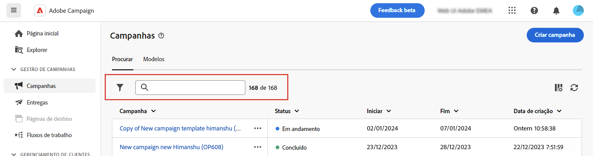
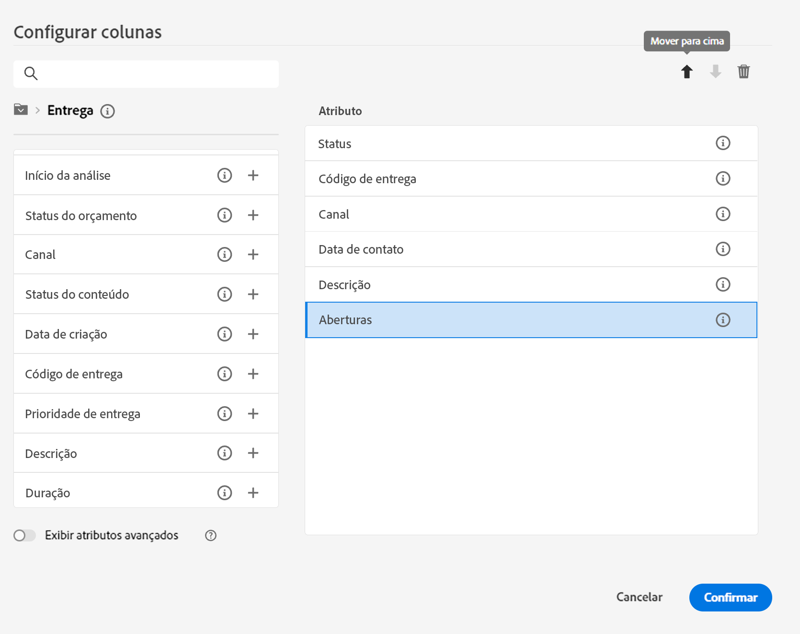

# Descubra a interface {#user-interface}

>[!CONTEXTUALHELP]
>id="acw_homepage_learnmore"
>title="Descubra a interface"
>abstract="A nova interface da Web do Campaign v8 oferece uma experiência do usuário integrada, intuitiva e consistente."

A nova interface da Web do Campaign v8 oferece uma experiência de usuário moderna e intuitiva para simplificar o design e a entrega da campanha de marketing. Essa nova interface é integrada à Adobe Experience Platform.

<!--
Key concepts when browsing the user interface are common with Adobe Experience Platform. Refer to [Adobe Experience Platform documentation](https://experienceleague.adobe.com/docs/experience-platform/landing/platform-ui/ui-guide.html#adobe-experience-platform-ui-guide) for more details.
-->

>[!NOTE]
>
>Esta documentação é atualizada com frequência para refletir as alterações recentes na interface do produto. Entretanto, algumas capturas de tela podem diferir ligeiramente da sua interface.

<!--
* console + web interface (overview, why use each of them)
* web UI made up of read-only lists that can be configured, show how to add columns
-->

## Menu de navegação esquerdo

Navegue pelos links à esquerda para acessar os recursos do Campaign Web v8. Vários links exibem listas de objetos que podem ser classificados e filtrados. Você também pode configurar colunas para exibir todas as informações necessárias. Consulte esta [seção](#list-screens). Todas as telas de lista são do tipo somente leitura, exceto a lista de entrega de email. A opção de clicar em qualquer item de lista para editar/visualizar não está disponível na versão Alfa. Todas as listas serão editáveis em versões futuras. Os itens exibidos no menu de navegação esquerdo dependem das permissões do usuário.

### Página inicial

Esta tela inclui links e elementos importantes para um acesso rápido aos principais recursos do Campaign Web v8. A lista **Recentes** fornece atalhos para as entregas criadas e modificadas recentemente. Esta lista mostra as datas de criação, modificação e o status.

<!--
* Banner
* KPIs on email channel (cross-deliveries): open rate, delivery rate, etc
* Recent items
* Learning cards
-->

Acesse as principais páginas de ajuda do Campaign Web v8 na parte inferior da página inicial.

<!--
show global KPIs, recent items + left menu to access features)
CONTROL PANEL not alpha
Global report not alpha
-->

### Explorer

>[!CONTEXTUALHELP]
>id="acw_explorer"
>title="Explorer"
>abstract="O menu **Explorer** exibe a mesma hierarquia de pastas do console do cliente. Navegue por todos os componentes, pastas e esquemas do Campaign v8. Todas as telas de lista são do tipo somente leitura, exceto a lista de entrega de email."

O menu **Explorer** exibe a mesma hierarquia de pastas do console do cliente. Navegue por todos os componentes, pastas e esquemas do Campaign v8. Todas as telas de lista são do tipo somente leitura, exceto a lista de entrega de email.

Os itens exibidos no explorador dependem das permissões do usuário.

Como em qualquer tela de lista, você pode configurar as colunas para personalizar a exibição e mostrar todas as informações necessárias. Consulte esta [seção](#list-screens).

Para obter mais informações sobre o explorador do Campaign, consulte esta [documentação](https://experienceleague.adobe.com/docs/campaign/campaign-v8/new/ac-ui/campaign-ui.html?lang=pt-BR#ac-explorer-ui){target="_blank"}.
<!--
Explorer' menu in web UI to navigate through console content: console navtree second view in addition to the left menu lists with filters. The Explorer gives the real folder hierarchy from the console. Make sure you find your deliveries in sub-folders. All lists can be accessed in read-only. No Create/Edit. You can configure lists (colums). All schema fields, linked tables are available. 

If you need to view your lists of recipients (age, gender), transactions or live transactional messages. To view each/edit -> console.

Navtree view depends on permissions (same as console).
-->

### Gerenciamento de campanhas

>[!CONTEXTUALHELP]
>id="acw_campaigns_list"
>title="Campanhas"
>abstract="É a lista das suas campanhas. É possível exibir informações úteis, como datas de início/término/última modificação e status. Você pode filtrar a lista por status ou datas iniciais/finais. Os modelos de campanha também estão disponíveis. Essas listas são do tipo somente leitura."

>[!CONTEXTUALHELP]
>id="acw_deliveries_list"
>title="Entregas"
>abstract="Navegue pela lista de entregas. Você pode visualizar o estado, a última data de modificação e as principais KPIs. Você pode filtrar a lista por estado, data de contato ou canal. Clique numa entrega de email para abrir seu painel. Os outros itens são do tipo somente leitura. Os templates de entrega também estão disponíveis."

* **Campanhas**: é a lista das suas campanhas. Por padrão, você pode ver suas datas de início/término/última modificação, bem como o status. Você pode filtrar a lista por status ou datas iniciais/finais. Os modelos de campanha também estão disponíveis. Essas listas são do tipo somente leitura.

* **Entregas**: navegue pela lista de entregas. Você pode visualizar o estado, a data da última modificação, bem como os principais KPIs. Você pode filtrar a lista por estado, data de contato ou canal. Clique em uma entrega de email para abrir o painel e obter uma visão geral dos detalhes da entrega. As entregas em outros canais são do tipo somente leitura. Os templates de entrega também estão disponíveis no modo somente leitura. Você pode usar o Console do cliente para editá-los. Consulte esta [documentação](https://experienceleague.adobe.com/docs/campaign/campaign-v8/campaigns/send/create-templates.html?lang=pt-BR){target="_blank"}.

   Use o botão **Mais ações** para excluir ou duplicar uma entrega.

   {width="70%" align="left"}

### Gerenciamento de clientes

>[!CONTEXTUALHELP]
>id="acw_recipients_list"
>title="Recipients"
>abstract="Acesse o banco de dados de recipients. É possível visualizar informações úteis, como endereço de email, nome e sobrenome. Essa lista é do tipo somente leitura."

>[!CONTEXTUALHELP]
>id="acw_audiences_list"
>title="Públicos"
>abstract="É a sua lista de públicos. É possível exibir o tipo, a origem, as datas de criação/última modificação e o rótulo. É possível filtrar a lista por origem. Essa lista é do tipo somente leitura."

>[!CONTEXTUALHELP]
>id="acw_subscriptions_list"
>title="Listas de assinaturas"
>abstract="Navegar pelas listas de assinaturas. É possível exibir o tipo, o modo e o rótulo. Essa lista é do tipo somente leitura."

* **Recipients**: acessa o banco de dados de recipients. Por padrão, você pode ver o endereço de email, o nome e o sobrenome. Essa lista é do tipo somente leitura.
* **Públicos**: esta é a lista de públicos. Por padrão, é possível ver o tipo, a origem, as datas de criação/última modificação e o rótulo. É possível filtrar a lista por origem. Essa lista é do tipo somente leitura.
* **Listas de assinaturas**: navegue pelas listas de assinaturas. Por padrão, é possível ver o tipo, o modo e o rótulo. Essa lista é do tipo somente leitura.
* **Workflows para direcionamento** acessa a lista de fluxos de trabalho da campanha. Por padrão, é possível ver o estado, as datas do último/próximo processamento e o ambiente. É possível filtrar a lista por estado, data do último processamento e tipo de fluxo de trabalho. Os modelos de fluxo de trabalho também estão disponíveis. Essas listas são do tipo somente leitura.

### Gestão de decisões

>[!CONTEXTUALHELP]
>id="acw_offers_list"
>title="Ofertas"
>abstract="Você pode navegar pela lista de ofertas de interação. Por padrão, é possível exibir o status, a data inicial/final e o ambiente. É possível filtrar a lista por estado e data inicial/final. Os modelos de oferta também estão disponíveis. Essas listas são do tipo somente leitura."

* **Ofertas**: navegue pela lista de ofertas de interação. Por padrão, é possível exibir o status, a data inicial/final e o ambiente. É possível filtrar a lista por estado e data inicial/final. Os modelos de oferta também estão disponíveis. Essas listas são do tipo somente leitura.

## Barra superior

A barra superior da interface permite:

* compartilhar seu feedback como um testador Alfa
* alternar entre organizações e instâncias
* alternar entre os aplicativos da Adobe Experience Cloud
* acessar páginas de ajuda, entrar em contato com o suporte e compartilhar feedback. Você pode pesquisar artigos e vídeos de ajuda no campo de pesquisa.

{width="70%" align="left"}
<!--
Org / Sub-org switcher to switch between instances. Only one for Alpha. Later: intermerdiate screen with Control Panel (beta). if v8 + ACS with one card per ACS instance. Maybe quickly explain the menu for Alpha?
-->

## Configurar telas de lista {#list-screens}

Vários links no menu de navegação esquerdo (por exemplo, **Entregas** ou **Campanhas**) exibem listas de objetos. Essas telas de lista são do tipo somente leitura, exceto a lista de entrega de email.

Para localizar itens mais rapidamente, você pode usar a barra de pesquisa ou filtrar a lista com base em critérios contextuais.

{width="70%" align="left"}

As listas são exibidas em colunas. É possível exibir informações adicionais alterando a configuração da coluna. Para fazer isso, clique no ícone no canto superior direito da lista. Você pode adicionar ou remover colunas e alterar a ordem em que são exibidas.

{width="70%" align="left"}

Você pode classificar itens na lista clicando em qualquer cabeçalho de coluna. Uma seta é exibida (para cima ou para baixo) indicando que a lista está classificada nessa coluna. Para colunas numéricas ou de datas, a seta para cima indica que a lista está classificada em ordem crescente, enquanto a seta para baixo indica uma ordem decrescente. Para strings ou colunas alfanuméricas, os valores são listados em ordem alfabética.

## Ajuda contextual e guia de integração

Uma ajuda contextual está disponível na interface. Quando disponível, clique no botão **?Ícone** para exibir informações de ajuda e links de documentação relacionados.

{width="70%" align="left"}

Um guia de integração também está disponível para ajudá-lo a começar a usar o Campaign Web v8. Clique no ícone no canto inferior direito, escolha um dos cenários passo a passo disponíveis e siga as instruções.

{width="70%" align="left"}

## Navegadores compatíveis {#browsers}

O Campaign Web v8 foi desenvolvido para funcionar de maneira ideal na versão mais recente do Google Chrome, Safari e Microsoft Edge. Você pode ter problemas ao usar determinados recursos em versões mais antigas ou em outros navegadores.

## Preferências de idioma {#language-pref}

Atualmente, o Campaign Web v8 está disponível nos seguintes idiomas:

<table>
<tr>
<td>

Inglês (EUA) - EN-US

Francês - FR

Alemão - DE

Italiano - IT

</td>
<td>

Espanhol - ES

Português (Brasil) - PTBR

Japonês - JP

</td>
<td>

Coreano - KR

Chinês simplificado - CHS

Chinês tradicional - CHT

</td>
</tr>
</table>

O idioma padrão da interface é determinado pelo idioma preferencial especificado no perfil do usuário.

Para alterar o idioma:

1. Clique no ícone do perfil, na parte superior direita, e selecione **Preferências**.

   {width="70%" align="left"}

1. Em seguida, clique no idioma exibido sob o seu endereço de email.

   

1. Selecione o idioma de sua preferência e clique em **Salvar**. Você pode selecionar um segundo idioma caso o componente que está usando não esteja localizado em seu primeiro idioma.

   

<!--
## Supported browsers {#browsers}

Adobe Campaign interface is designed to work optimally in the latest version of Google Chrome. You might have trouble using certain features on older versions or other browsers.
-->

<!--
######## This part stores the contextualHelp definition for WebUI BETA ###########
######## These blocks should be dispatched in the appropriate pages when available ###########
######## PLEASE DO NOT DELETE ###########
REFER TO 
https://wiki.corp.adobe.com/pages/viewpage.action?spaceKey=neolane&title=v8+WebUI+Contextual+Help+%3CALPHA%3E-+Official+list
-->

>[!CONTEXTUALHELP]
>id="acw_sms_report_overview"
>title="Resumo do relatório de SMS"
>abstract="A confirmar"

>[!CONTEXTUALHELP]
>id="acw_push_report_overview"
>title="Resumo do relatório de push"
>abstract="A confirmar"

>[!CONTEXTUALHELP]
>id="acw_push_notification_template"
>title="Template de notificação por push"
>abstract="A confirmar"

>[!CONTEXTUALHELP]
>id="acw_campaign_creation_properties"
>title="Propriedades de criação de campanha"
>abstract="Defina as propriedades e os metadados para a campanha."

>[!CONTEXTUALHELP]
>id="acw_campaign_creation_schedule"
>title="Cronograma de criação de campanha"
>abstract="Defina o cronograma da campanha."

>[!CONTEXTUALHELP]
>id="acw_rulebuilder_properties_advanced"
>title="Atributos avançados do Construtor de regras"
>abstract="A confirmar"

>[!CONTEXTUALHELP]
>id="acw_deliveries_email_metrics_sent"
>title="Métricas enviadas"
>abstract="Número de emails entregues."

>[!CONTEXTUALHELP]
>id="acw_deliveries_email_metrics_errors"
>title="Métricas de erros"
>abstract="Número de emails com status de erro."

>[!CONTEXTUALHELP]
>id="acw_deliveries_push_android_content"
>title="Conteúdo de push para Android"
>abstract="A confirmar"

>[!CONTEXTUALHELP]
>id="acw_deliveries_push_ios_content"
>title="Conteúdo de push para iOS"
>abstract="A confirmar"

>[!CONTEXTUALHELP]
>id="acw_deliveries_sms_content"
>title="Conteúdo de SMS"
>abstract="Definir o conteúdo do SMS."

>[!CONTEXTUALHELP]
>id="acw_sms_preview_option_app_target"
>title="Assinantes do aplicativo"
>abstract="Visualize e teste a mensagem adicionando assinantes de aplicativo ao público-alvo principal. "

>[!CONTEXTUALHELP]
>id="acw_email_preview_option_test_target"
>title="População de teste"
>abstract="Selecione um modo de população de teste."

>[!CONTEXTUALHELP]
>id="acw_email_preview_mode"
>title="Modo de visualização"
>abstract="Pré-visualize e teste a mensagem incluindo a população de teste ao público-alvo principal."

>[!CONTEXTUALHELP]
>id="acw_targetdata_personalization_enrichmentdata"
>title="Dados de enriquecimento"
>abstract="A confirmar"

>[!CONTEXTUALHELP]
>id="acw_targetdata_personalization_dashboard"
>title="Personalização"
>abstract="A confirmar"

>[!CONTEXTUALHELP]
>id="acw_audience_fromfile_select"
>title="Seleção de arquivo"
>abstract="A confirmar"

>[!CONTEXTUALHELP]
>id="acw_audience_fromfile_columns"
>title="Definição de colunas"
>abstract="A confirmar"

>[!CONTEXTUALHELP]
>id="acw_audience_fromfile_formatting"
>title="Parâmetros de formatação"
>abstract="A confirmar"

>[!CONTEXTUALHELP]
>id="acw_campaign_reporting_sending"
>title="Envio de relatórios"
>abstract="A confirmar"

>[!CONTEXTUALHELP]
>id="acw_campaign_reporting_tracking"
>title="Rastreamento de relatórios"
>abstract="A confirmar"

>[!CONTEXTUALHELP]
>id="acw_campaign_reporting_deliveries_overview"
>title="Visão geral dos relatórios"
>abstract="A confirmar"

>[!CONTEXTUALHELP]
>id="acw_campaign_reporting_deliveries_target"
>title="Relatório de estatísticas do público alvo"
>abstract="A confirmar"

>[!CONTEXTUALHELP]
>id="acw_campaign_reporting_deliveries_selection"
>title="Relatório agregado de seleção de entregas"
>abstract="A confirmar"

>[!CONTEXTUALHELP]
>id="acw_campaign_properties"
>title="Propriedades da campanha"
>abstract="A confirmar"

>[!CONTEXTUALHELP]
>id="acw_campaign_creation_workflow"
>title="Lista de fluxos de trabalho"
>abstract="A confirmar"

>[!CONTEXTUALHELP]
>id="acw_orchestration_deduplication_fields"
>title="Campos de desduplicação"
>abstract="A confirmar"

>[!CONTEXTUALHELP]
>id="acw_orchestration_deduplication_settings"
>title="Configurações de desduplicação"
>abstract="A confirmar"

>[!CONTEXTUALHELP]
>id="acw_orchestration_deduplication_complement"
>title="Complemento de desduplicação"
>abstract="A confirmar"

>[!CONTEXTUALHELP]
>id="acw_orchestration_dimension_complement"
>title="Complemento de dimensão"
>abstract="A confirmar"

>[!CONTEXTUALHELP]
>id="acw_push_permission_for_segment"
>title="Permissão necessária"
>abstract="A confirmar"

>[!CONTEXTUALHELP]
>id="acw_push_overview_edit"
>title="Permissão necessária"
>abstract="A confirmar"

>[!CONTEXTUALHELP]
>id="acw_attributepicker_advancedfields"
>title="Campos avançados do seletor de atributos"
>abstract="A confirmar"

>[!CONTEXTUALHELP]
>id="acw_rulebuilder_advancedfields"
>title="Campos avançados do construtor de regras"
>abstract="A confirmar"

>[!CONTEXTUALHELP]
>id="acw_deliveries_sms_properties"
>title="Propriedades do delivery de SMS"
>abstract="A confirmar"

>[!CONTEXTUALHELP]
>id="acw_deliveries_push_properties"
>title="Propriedades do delivery por push"
>abstract="A confirmar"

>[!CONTEXTUALHELP]
>id="acw_deliveries_metrics_newquarantines"
>title="Nova métrica em quarentena"
>abstract="A confirmar"

