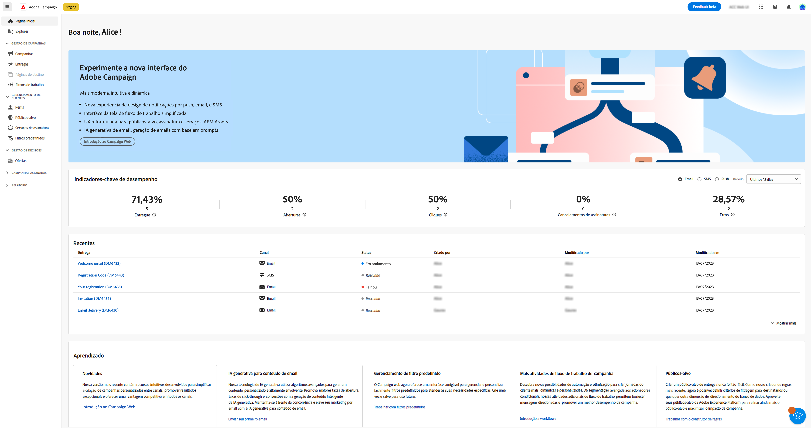
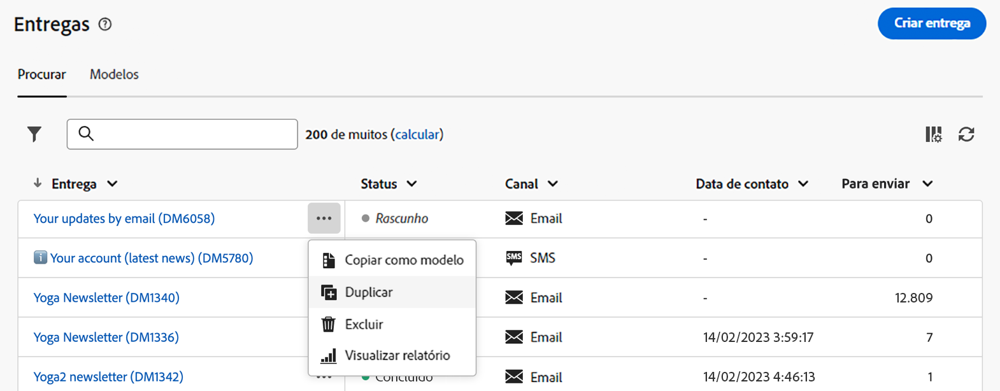
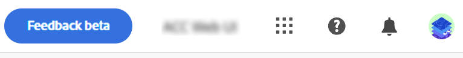
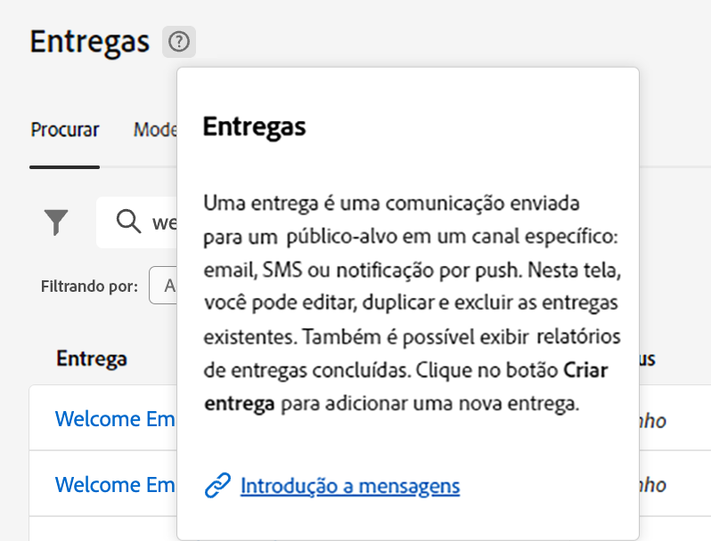

# Conheça a interface {#user-interface}

>[!CONTEXTUALHELP]
>id="acw_homepage_learnmore"
>title="Conheça a interface"
>abstract="A nova interface da Campaign Web v8 oferece ao usuário uma experiência integrada, intuitiva e consistente."

A nova interface da Web do Campaign v8 oferece uma experiência de usuário moderna e intuitiva para simplificar o design e a entrega da campanha de marketing. Essa nova interface é integrada aos aplicativos e soluções da Adobe Experience Cloud.

>[!NOTE]
>
>Esta documentação é atualizada com frequência para refletir as alterações recentes na interface do produto. Entretanto, algumas capturas de tela podem diferir ligeiramente da sua interface.

## Menu de navegação esquerdo {#user-interface-left-nav}

Navegue pelos links à esquerda para acessar os recursos do Campaign Web v8. Vários links exibem listas de objetos que podem ser classificados e filtrados. Você também pode configurar colunas para exibir todas as informações necessárias. Consulte esta [seção](#list-screens). Algumas telas de lista são somente leitura. Os itens exibidos no menu de navegação esquerdo e nas listas dependem das permissões do usuário. Saiba mais sobre permissões no [nesta seção](permissions.md).

### Página inicial {#user-interface-home}

Esta tela inclui links e recursos importantes para um acesso rápido aos principais recursos do Campaign Web v8.

A lista **Recentes** fornece atalhos para as entregas criadas e modificadas recentemente. Esta lista mostra o canal, status, proprietário, datas de criação e modificação.

Os **Indicadores principais de desempenho** permitem verificar a eficácia da plataforma por meio de KPIs comuns. Saiba mais sobre esses KPIs em [esta página](../reporting/kpis.md).

Acesse as principais páginas de ajuda do Campaign Web v8 na seção **Aprendizado** na página inicial.

### Explorer {#user-interface-explorer}

>[!CONTEXTUALHELP]
>id="acw_explorer"
>title="Explorer"
>abstract="O menu **Explorer** exibe todos os componentes e objetos do Campaign com a mesma hierarquia de pastas que a do console do cliente. Navegue por todos os componentes, pastas e esquemas do Campaign v8, verifique as permissões associadas e crie pastas e subpastas neste menu."

O menu **Explorer** exibe todos os recursos e objetos do Campaign com a mesma hierarquia de pastas que a do console do cliente. Navegue por todos os componentes, pastas e esquemas do Campaign v8 e crie entregas, workflows e campanhas.

Os itens exibidos no **Explorer** depende das suas permissões de usuário. Também é possível adicionar pastas e subpastas, se você tiver os direitos apropriados. Saiba mais sobre permissões no [nesta seção](permissions.md).

Como em qualquer tela de lista, você pode configurar as colunas para personalizar a exibição e mostrar todas as informações necessárias. Consulte esta [seção](#list-screens).

Para obter mais informações sobre o Explorer do Campaign, a hierarquia de pastas e os recursos, consulte a [documentação do Campaign v8 (console)](https://experienceleague.adobe.com/docs/campaign/campaign-v8/new/campaign-ui.html?lang=pt-BR#ac-explorer-ui){target="_blank"}.

### Gerenciamento de campanhas {#user-interface-campaign-management}

Na seção GERENCIAMENTO DE CAMPANHA, é possível acessar campanhas de marketing, entregas e workflows.

* **Campanhas** - Esta é a lista de suas campanhas e modelos de campanha. Por padrão, para cada campanha, é possível visualizar as datas de início/término/criação/última modificação, o status atual e o nome do operador de campanha que a criou. É possível filtrar a lista por status, datas de início/término, pasta ou criar um filtro avançado para definir seus próprios critérios de filtragem. Saiba mais sobre campanhas [nesta seção](../campaigns/gs-campaigns.md).

* **Entregas**: navegue pela lista de entregas. Você pode visualizar o estado, a data da última modificação, bem como os principais KPIs. É possível filtrar a lista por status, data de contato ou canal. Clique em uma entrega de email para abrir o painel e obter uma visão geral dos detalhes da entrega. As entregas em outros canais são do tipo somente leitura. Saiba mais sobre entregas [nesta seção](../msg/gs-messages.md).

  Use o botão **Mais ações** para excluir ou duplicar uma entrega.

  {width="70%" align="left"}

* **Workflows** - Nessa tela, é possível acessar a lista completa de workflows e modelos de workflows. É possível verificar o status, as datas da última/próxima execução e criar um novo workflow ou um novo modelo de workflow. É possível filtrar a lista com os mesmos critérios de outros objetos. Além disso, é possível filtrar os workflows que pertencem ou não a uma campanha. Saiba mais sobre fluxos de trabalho [nesta seção](../workflows/gs-workflows.md).

### Gerenciamento de clientes {#user-interface-customer-management}

Na seção GERENCIAMENTO DE CLIENTES, você pode visualizar os destinatários, públicos-alvo e assinaturas. Essas listas são do tipo somente leitura.

* **Recipients**: acessa o banco de dados de recipients. Por padrão, você pode ver o endereço de email, o nome e o sobrenome. Saiba mais sobre recipients em [nesta seção](../audience/about-recipients.md).
* **Públicos**: esta é a lista de públicos. Por padrão, é possível ver o tipo, a origem, as datas de criação/última modificação e o rótulo. É possível filtrar a lista por origem. Saiba mais sobre públicos-alvo e listas em [nesta seção](../audience/about-recipients.md).
* **Assinaturas**: navegue pelas listas de assinaturas. Por padrão, é possível ver o tipo, o modo e o rótulo. Saiba mais sobre como gerenciar assinaturas e seus cancelamentos na [documentação do Adobe Campaign v8 (console)](https://experienceleague.adobe.com/docs/campaign/campaign-v8/campaigns/send/subscriptions.html?lang=pt-BR){target="_blank"}.

### Gestão de decisões {#decision-management}

>[!CONTEXTUALHELP]
>id="acw_offers_list"
>title="Ofertas"
>abstract="Navegue pelas listas de ofertas e modelos de ofertas que foram criados no console usando o **Interação** módulo. Essas listas são do tipo somente leitura."
>additional-url="https://experienceleague.adobe.com/docs/campaign-web/v8/msg/offers.html?lang=pt-BR" text="Adicionar ofertas a um delivery"

Na seção GERENCIAMENTO DE DECISÃO, é possível exibir as ofertas e os templates de oferta. Essas listas são do tipo somente leitura.

* **Ofertas** - Navegue pela lista de ofertas e modelos de ofertas que foram criados no console usando o **Interação** módulo. Por padrão, é possível exibir o status, a data inicial/final e o ambiente. É possível filtrar a lista por status e datas de início/término. Os modelos de oferta também estão disponíveis.

Saiba como criar e enviar ofertas por email e SMS no [nesta seção](../content/offers.md).

## Barra superior {#top-bar}

Use a barra superior da interface para:

* compartilhar seu feedback como testador beta
* alternar entre organizações e instâncias
* alternar entre os aplicativos da Adobe Experience Cloud
* acessar páginas de ajuda, entrar em contato com o suporte e compartilhar feedback. Você pode pesquisar artigos e vídeos de ajuda no campo de pesquisa.

{width="50%" align="left"}
<!--
Org / Sub-org switcher to switch between instances. Only one for Alpha. Later: intermerdiate screen with Control Panel (beta). if v8 + ACS with one card per ACS instance. Maybe quickly explain the menu for Alpha?
-->

## Ajuda contextual {#user-interface-help}

Uma ajuda contextual está disponível na interface. Quando disponível, clique no ícone `?` para exibir informações de ajuda e links de documentações relacionadas.

{width="40%" align="left"}

Com a nova versão Beta, o **Assistente de conhecimento habilitado para IA** incorporado na ajuda contextual revoluciona a pesquisa de documentação e a resposta a perguntas &quot;como&quot;, com uma verificação fácil através de vastos repositórios de documentação, localizando instantaneamente as informações precisas de que você precisa.

Graças aos recursos do Campaign Gen AI, esse assistente transforma sua experiência, facilitando a recuperação de informações e a solução de problemas. Quer você esteja buscando orientação em uma tarefa complexa ou ao navegar por documentos extensos, nosso Assistente de conhecimento alimentado por IA é seu companheiro perfeito, fornecendo eficiência e precisão incomparáveis em todas as interações.

Saiba mais [nesta seção](using-ai.md).

## Navegadores compatíveis {#browsers}

O Campaign Web v8 foi desenvolvido para funcionar de maneira ideal na versão mais recente do Google Chrome, Safari e Microsoft Edge. Você pode ter problemas ao usar determinados recursos em versões mais antigas ou em outros navegadores.

## Preferências de idioma {#language-pref}

Atualmente, o Campaign Web v8 está disponível nos seguintes idiomas:

* Inglês (EUA) - EN-US
* Francês - FR
* Alemão - DE
* Italiano - IT
* Espanhol - ES
* Português (Brasil) - PTBR
* Japonês - JP
* Coreano - KR
* Chinês simplificado - CHS
* Chinês tradicional - CHT

O idioma padrão do Campaign Web é determinado pelo idioma preferencial especificado no perfil do usuário. Não está relacionado ao idioma do servidor do Campaign e do console do cliente.

Para alterar o idioma:

1. Clique no ícone do perfil, na parte superior direita, e selecione **Preferências**.
1. Em seguida, clique no link de idioma exibido sob o seu endereço de email.
1. Selecione o idioma de sua preferência e clique em **Salvar**. Você pode selecionar um segundo idioma caso o componente que está usando não esteja localizado em seu primeiro idioma.

## Tema escuro {#dark-theme}

Você pode alternar para o tema escuro a partir do ícone do perfil. Use o **Tema escuro** para ativá-la/desativá-la.

## Saiba mais {#learn-more}

Saiba como procurar, pesquisar e filtrar listas disponíveis no ambiente do Campaign [nesta página](list-filters.md).

<!--
######## This part stores the contextualHelp definition for WebUI BETA ###########
######## These blocks should be dispatched in the appropriate pages when available ###########
######## PLEASE DO NOT DELETE ###########
REFER TO 
https://wiki.corp.adobe.com/pages/viewpage.action?spaceKey=neolane&title=v8+WebUI+Contextual+Help+%3CALPHA%3E-+Official+list
-->

>[!CONTEXTUALHELP]
>id="acw_push_permission_for_segment"
>title="Permissão necessária"
>abstract="Seu administrador precisa lhe conceder permissão para que você possa criar um segmento."

>[!CONTEXTUALHELP]
>id="acw_push_overview_edit"
>title="Permissão necessária"
>abstract="Seu administrador precisa lhe conceder permissão para que você possa criar um segmento."

<!-- Workflows-->

<!-- delivery template settings-->

>[!CONTEXTUALHELP]
>id="acw_global_reporting_sending"
>title="Envio de relatórios globais"
>abstract="As métricas de relatórios de rastreamento são visíveis nesta tela"

>[!CONTEXTUALHELP]
>id="acw_global_reporting_tracking"
>title="Rastreamento de relatórios globais"
>abstract="As métricas de relatórios de rastreamento são visíveis nesta tela"

>[!CONTEXTUALHELP]
>id="acw_campaign_workflow_list"
>title="Lista de workflows em uma campanha"
>abstract="Lista de workflows em uma campanha"

<!-- delivery settings-->

